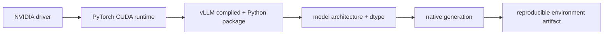

# Lesson 06 — 安装可复现的 vLLM 环境

> **谜题：** 什么证据表明 Python、PyTorch、CUDA、驱动程序和 vLLM 一致？

[← 第 03 章](../README.md) · [项目主页](../../../README_ZH.md) · [执行的笔记本](../../../chapters/03-vllm-inference-serving/06-installation-compatibility/lab.ipynb) · [RTX 5090 结果](../../../chapters/03-vllm-inference-serving/06-installation-compatibility/artifacts/rtx5090-result.json)

## 为什么这个谜题重要

一个成功的包安装并不意味着GPU运行时的成功。vLLM 随附了与平台和 PyTorch 选择相关的编译组件，因此环境记录必须包括导入项、二进制版本、CUDA 可用性、GPU能力以及基本的本地操作。

## 阅读结果前，先做出预测

1. 预测计算能力并报告远程的 CUDA 运行时。
2. 检查 vLLM CLI是否暴露了serve和bench。
3. 命名在导入之后所需的最小步骤以获得发布信心。

## 1. 从具体的请求开始并陈述

兼容性探针导入 vLLM 和 PyTorch，捕获确切版本，定位CLI，检查选定引擎参数，并执行 CUDA 张量操作。它将缺失功能记录为数据。

### 三个推理锚点

| # | 本课需要牢记的判断 |
|---:|---|
| 1 | 驱动程序、轮子运行时和编译工具包是不同的版本字段。 |
| 2 | 导入成功不如本地引擎执行。 |
| 3 | 固定环境是每个基准身份的一部分。 |

## 2. 推导机制

NVIDIA驱动程序提供了面向kernel的 CUDA 功能；PyTorch 轮子携带其 CUDA 运行时；vLLM 添加了编译扩展和生成kernel。这些版本的标签不必相同，但安装的组合必须支持GPU架构并导入而无未解决的符号。干净的环境可以防止无关的包在不被察觉的情况下替换该组合。

### 机制概览



### 逐步拆解

1. **将解释器固定。**创建一个隔离的 Python 环境。
2. **安装一个一致的堆栈。**请让所选 vLLM 轮子解决其兼容性 PyTorch 构建
3. **检查可执行文件路径。**验证导入项、命令行界面、GPU 身份以及 CUDA 操作。
4.**证明模型执行。**将后续的本地生成视为最终的兼容性链接。

## 3. 把理论转化为实验**实验：**收集完整的堆栈身份并运行一个真实的 CUDA 在隔离环境中进行的验证操作。

| 实验角色 | 固定定义 |
|---|---|
| 基准 | 单独的元数据包 |
| 候选方案 | 导入、CLI 表面、编译扩展可见性以及 CUDA 执行 |
| 保持不变 | 孤立环境和一个 RTX 5090 |
| 测量 | 版本号、可执行文件路径、CLI子命令、张量校验和以及功能标志 |
| 证据标签 | `compatibility-probe` |

### 代码导读

探针避免网络下载和特定于 shell 的环境假设。每个字段都来自将执行剩余实验室的 Python 进程。

## 4. 解读仓库内的 RTX 5090 实测结果

**录制环境：**NVIDIA GeForce RTX 5090 计算能力12.0; PyTorch 2.13.0+cu130;CUDA 运行时13.0; vLLM 0.27.1.

| 实测字段 | 已提交值 |
|---|---:|
| vLLM 版本 | 0.27.1 |
| Python | 3.12.3 |
| PyTorch | 2.13.0+cu130 |
| CUDA 运行时 | 13.0 |
| 命令行界面找到 | 是的 |
| 服务命令 | 是的 |
| CUDA 校验和 | 0.352565 |

### 这些数字说明了什么

孤立环境导入了 vLLM 0.27.1，并使用了 PyTorch 2.13.0+cu130 / CUDA 13.0，发现serve/bench=True/True，并完成了 CUDA 的校验和0.352565。原生模型生成是更强的最终环节。

## 5. 解答谜题并做出决策

> 兼容性是一系列可执行的检查；此探针确定本地栈身份和 CUDA 路径，而非每个模型功能。

### 验收与回滚门槛

只有当固定解释器导入堆栈，看到GPU，并完成 CUDA 操作时，才能进行模型实验。

### 这个结论可能如何失效

一个小型张量操作仅针对 PyTorch，而非每个 vLLMkernel。后续模型加载仍可能因架构、dtype、内存或编译问题而失败。

## 复现

仓库内记录的固定版本为 vLLM 和 0.27.1，以及本地 Qwen2.5-1.5B-Instruct 检查点。在 Linux CUDA 主机上，创建一个干净的环境，并将 `CH3_MODEL` 指向你的本地检查点：

```bash
uv venv .venv --python 3.12
source .venv/bin/activate
uv pip install vllm==0.27.1 nbclient nbformat ipykernel requests pyyaml --torch-backend=auto
export CH3_MODEL=/path/to/Qwen2.5-1.5B-Instruct
jupyter lab chapters/03-vllm-inference-serving/06-installation-compatibility/lab.ipynb
```

## 扩展实验

归档 `pip freeze`，vLLM 收集环境输出、驱动信息、模型哈希以及一个完成的模型生成产物，并在发布时一并提交。

## 证据边界

**证据标签:** [`compatibility-probe`](../../../chapters/03-vllm-inference-serving/README.md#evidence-labels). 已安装的包/API/配置表面进行了检查。可用性或lint成功并不等同于原生功能执行。

## 参考资料

- [vLLMGPU 安装](https://docs.vllm.ai/en/latest/getting_started/installation/gpu/)
- [vLLM 引擎参数](https://docs.vllm.ai/en/latest/configuration/engine_args/)
