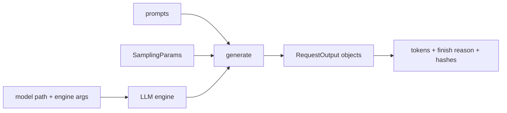

<!-- ai-infra-puzzles-header:start -->
<p align="center">
  
</p>

<h1 align="center">AI Infra Puzzles</h1>

<p align="center">
  <strong>Learn CUDA optimization and LLM inference through hands-on puzzles.</strong>
</p>
<!-- ai-infra-puzzles-header:end -->

# Lesson 07 — Offline Inference with LLM and SamplingParams

> **谜题：** 最小的可复现 vLLM 生成程序是什么？

[← 第 03 章](../README.md) · [项目主页](../../../README_ZH.md) · [执行的笔记本](../../../chapters/03-vllm-inference-serving/07-offline-llm-api/lab.ipynb) · [RTX 5090 结果](../../../chapters/03-vllm-inference-serving/07-offline-llm-api/artifacts/rtx5090-result.json)

## 为什么这个谜题重要

离线推理从第一个功能测试中移除了HTTP和队列操作。这是在诊断服务层之前，将模型身份、分词、采样、请求排序和输出序列化固定下来的最佳位置。

## 阅读结果前，先做出预测

1. 在小的最大token限制下预测完成原因。
2. 确定哪些请求字段必须锁定。
3. 解释为什么文本哈希不能建立语义质量。

## 1. 从具体的请求开始并陈述

该笔记本初始化`LLM`，构建显式`SamplingParams`，一次调用提交三个提示，保存提示/输出的tokenID、完成原因、文本哈希和耗时。

### 三个推理锚点

| # | 本课需要牢记的判断 |
|---:|---|
| 1 | 模型配置和采样配置是分开的输入。 |
| 2 | Token IDs 是比渲染后的空白字符更稳定的审计证据。 |
| 3 | 离线生成验证模型路径而不测量HTTP行为。 |

## 2. 推导机制

`LLM.generate` 接受一批提示并通过引擎进行调度。`SamplingParams` 是输出合同的一部分：温度、top-p、停止规则、最大token数、种子和logprobs 都可以改变可观察结果。因此，可再现性需要引擎和请求配置的双重支持。

### 机制概览



### 逐步拆解

1. **冻结引擎身份。**Pin model path, dtype, maximum length, andvLLM 版本
2. **明确采样。**避免使用可能会随版本更新而改变的默认值。
3. **读取结构化输出。**保留 API 对象中的 token ID 和 finish reason。
4. **分别添加质量。**功能生成只是第一个接受层。

## 3. 把理论转化为实验**实验:**通过原生离线API生成一个包含三个提示的批次，并保留结构化的请求/输出记录。

| 实验角色 | 固定定义 |
|---|---|
| 基准 | 隐式默认值和打印文本 |
| 候选方案 | 显式 SamplingParams 和标记级别元数据 |
| 保持不变 | 模型、分词器、提示、种子、最大token数和GPU |
| 测量 | token计数，完成原因，输出哈希值，耗时，以及吞吐量 |
| 证据标签 | `native-backend` |

### 代码导读

代码使用贪婪解码来使第一条路径易于审计。它读取每个输出对象，而不是解析控制台日志，并仅保留紧凑的哈希和简短的预览在元数据中。

## 4. 解读仓库内的 RTX 5090 实测结果**录制环境：**NVIDIA GeForce RTX 5090 计算能力12.0; PyTorch 2.13.0+cu130;CUDA 运行时13.0; vLLM 0.27.1.

| 实测字段 | 已提交值 |
|---|---:|
| 请求 | 3 |
| 提示词 | 22 |
| output tokens | 84 |
| 已用时 | 0.254779 |
| 吞吐量 | 329.7/s |
| 独特的输出哈希 | 3 |

### 这些数字说明了什么

明确的离线调用3请求以3个不同的哈希值完成329.7输出的token/s。功能生成不是任务质量或HTTP证据。

## 5. 解答谜题并做出决策

> 一个明确的离线程序是后续服务实验的功能基准；它证明的是本地生成，而不是在线性能。

### 验收与回滚门槛

将离线路径视为就绪状态，当所有请求完成、身份匹配，并且重跑满足声明的token级别容差时。

### 这个结论可能如何失效

GPU归约和批量处理可能会在不同版本之间引入微小的数值差异。贪婪输出在接近平局后可能会发散，而token相等性并不能证明任务的正确性。

## 复现

仓库内记录的固定版本为 vLLM 和 0.27.1，以及本地 Qwen2.5-1.5B-Instruct 检查点。在 Linux CUDA 主机上，创建一个干净的环境，并将 `CH3_MODEL` 指向你的本地检查点：

```bash
uv venv .venv --python 3.12
source .venv/bin/activate
uv pip install vllm==0.27.1 nbclient nbformat ipykernel requests pyyaml --torch-backend=auto
export CH3_MODEL=/path/to/Qwen2.5-1.5B-Instruct
jupyter lab chapters/03-vllm-inference-serving/07-offline-llm-api/lab.ipynb
```

## 扩展实验

添加任务特定的评估，多种提示长度，流式服务器比较，以及模型/分词器修订哈希。

## 证据边界

**证据标签:** [`native-backend`](../../../chapters/03-vllm-inference-serving/README.md#evidence-labels). 命名的 vLLM 运行时在记录的GPU/模型/工作负载上执行。结果不会转移到另一个版本、模型、端点或流量分布。

## 参考资料

- [vLLM 快速入门](https://docs.vllm.ai/en/latest/getting_started/quickstart/)
- [vLLM SamplingParams API](https://docs.vllm.ai/en/latest/api/vllm/sampling_params/)
