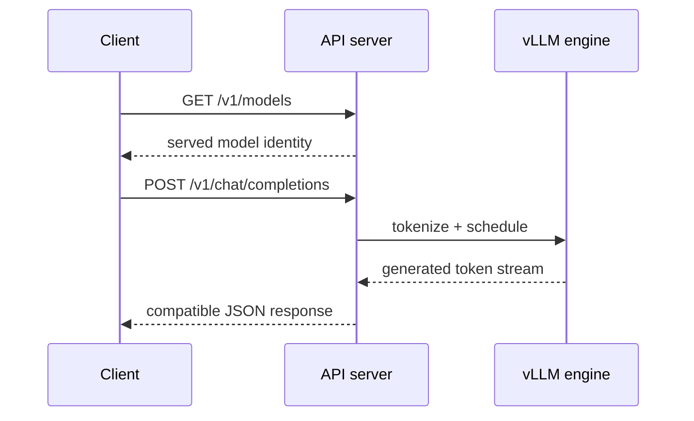

<!-- ai-infra-puzzles-header:start -->
<p align="center">
  
</p>

<h1 align="center">AI Infra Puzzles</h1>

<p align="center">
  <strong>Learn CUDA optimization and LLM inference through hands-on puzzles.</strong>
</p>
<!-- ai-infra-puzzles-header:end -->

# Lesson 08 — OpenAI兼容的HTTP服务

> **谜题：**API兼容性是否意味着每个端点和字段的行为完全相同？

[← 第 03 章](../README.md) · [项目主页](../../../README_ZH.md) · [执行的笔记本](../../../chapters/03-vllm-inference-serving/08-openai-compatible-service/lab.ipynb) · [RTX 5090 结果](../../../chapters/03-vllm-inference-serving/08-openai-compatible-service/artifacts/rtx5090-result.json)

## 为什么这个谜题重要

兼容的端点可以降低客户端迁移成本，但不会消除模型能力、服务器特定字段、解析器要求或发布差异。合同必须针对确切的服务器构建和模型进行测试。

## 阅读结果前，先做出预测

1. 预测哪个端点将识别提供的模型。
2. 列出所需的聊天响应字段。
3. 请列举一个必须探测而不是假设的OpenAI功能。

## 1. 从具体的请求开始并陈述

实验室以子进程方式启动`vllm serve`，等待就绪，调用`/v1/models`和`/v1/chat/completions`，捕获状态和时间，然后干净地终止服务器。不支持的探针保持明确。

### 三个推理锚点

| # | 本课需要牢记的判断 |
|---:|---|
| 1 | HTTP 200 不意味着语义正确性。 |
| 2 | 端点可用性取决于模型任务和服务器配置。 |
| 3 | 服务器启动、请求延迟和引擎执行需要单独的证据。 |

## 2. 推导机制

服务器将HTTP请求转换为分词器、调度器、采样和流式操作。兼容性在端点和字段级别：一个模型可能支持聊天但不支持嵌入，一个工具解析器可能需要标志，额外的 vLLM 参数可以扩展模式。就绪性、请求成功和响应结构是分开检查的。

### 机制概览



### 逐步拆解

1. **等待就绪状态。**不要将服务器启动时间与请求失败混淆。
2.**探针模型身份。**确认客户端必须发送的名称。
3.**验证必填字段。**检查选择、消息内容、完成原因和使用情况。
4. **测试生产路径。**重复通过身份验证、TLS、网关和流媒体层。

## 3. 把理论转化为实验

**实验：**在本地主机上启动真实服务器，发出模型和Chat请求，验证其JSON形状，并保存日志尾部。

| 实验角色 | 固定定义 |
|---|---|
| 基准 | 离线生成仅 |
| 候选方案 | 本地主机 OpenAI 兼容的 HTTP 服务 |
| 保持不变 | 模型、端口、采样、提示、超时和服务器参数 |
| 测量 | 启动时间，状态码，响应模式，token使用，请求延迟，以及关闭 |
| 证据标签 | `native-backend` |

### 代码导读

子进程接收一个参数列表而不是一个 shell 命令。代码在指定的截止时间内检查就绪状态，记录一个有界的日志尾部，并在 `finally` 块中始终终止进程。

## 4. 解读仓库内的 RTX 5090 实测结果

**录制环境：**NVIDIA GeForce RTX 5090 计算能力12.0; PyTorch 2.13.0+cu130;CUDA 运行时13.0; vLLM 0.27.1.

| 实测字段 | 已提交值 |
|---|---:|
| 服务器已准备好 | 是的 |
| 启动 | 20.045628 |
| 模型状态 | 200 |
| 聊天状态 | 200 |
| 聊天延迟 | 0.100528 |
| 完成token | 7 |
| 模式有效 | 是的 |

### 这些数字说明了什么

服务器在20.05秒后就绪；models/chat返回HTTP 200/200状态码，且schema valid=True。这覆盖了一个非流式本地主机路由。

## 5. 解答谜题并做出决策

> 本地测试证明了选定的聊天路由和此模型/服务器对的响应模式；超出该矩阵的兼容性尚未测量。

### 验收与回滚门槛

仅当所需的端点、字段、流行为、错误和身份验证控制通过合同测试时，启用客户端路由。

### 这个结论可能如何失效

回环测试排除代理、TLS、网络抖动、负载均衡和多租户控制。单个响应无法验证所有兼容性或解析器组合。

## 复现

仓库内记录的固定版本为 vLLM 和 0.27.1，以及本地 Qwen2.5-1.5B-Instruct 检查点。在 Linux CUDA 主机上，创建一个干净的环境，并将 `CH3_MODEL` 指向你的本地检查点：

```bash
uv venv .venv --python 3.12
source .venv/bin/activate
uv pip install vllm==0.27.1 nbclient nbformat ipykernel requests pyyaml --torch-backend=auto
export CH3_MODEL=/path/to/Qwen2.5-1.5B-Instruct
jupyter lab chapters/03-vllm-inference-serving/08-openai-compatible-service/lab.ipynb
```

## 扩展实验

通过生产网关运行一个版本化的合同套件，包括聊天、响应、嵌入式、流式传输、错误处理、取消、工具和使用计费。

## 证据边界

**证据标签:** [`native-backend`](../../../chapters/03-vllm-inference-serving/README.md#evidence-labels). 命名的 vLLM 运行时在记录的GPU/模型/工作负载上执行。结果不会转移到另一个版本、模型、端点或流量分布。

## 参考资料

- [兼容OpenAI的服务器](https://docs.vllm.ai/en/latest/serving/openai_compatible_server/)
- [vLLM 快速入门](https://docs.vllm.ai/en/latest/getting_started/quickstart/)
