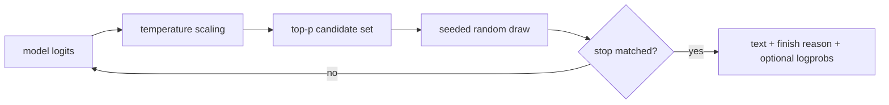

<!-- ai-infra-puzzles-header:start -->
<p align="center">
  
</p>

<h1 align="center">AI Infra Puzzles</h1>

<p align="center">
  <strong>Learn CUDA optimization and LLM inference through hands-on puzzles.</strong>
</p>
<!-- ai-infra-puzzles-header:end -->

# Lesson 09 — 抽样与输出控制

> **谜题：** 当两个请求使用相同的模型时，哪个参数改变了答案？

[← 第 03 章](../README.md) · [项目主页](../../../README_ZH.md) · [执行的笔记本](../../../chapters/03-vllm-inference-serving/09-sampling-output-control/lab.ipynb) · [RTX 5090 结果](../../../chapters/03-vllm-inference-serving/09-sampling-output-control/artifacts/rtx5090-result.json)

## 为什么这个谜题重要

采样参数是公共API的一部分，不是无害的展示选项。温度改变对数概率尺度；top-p截断候选质量；停止规则可以移除后缀；logprobs改变响应体积和可观测性。

## 阅读结果前，先做出预测

1. 预测哪些案例在一次运行中是确定性的。
2. 识别输出中是否包含停止文本。
3. 说明 logprobs 的额外负载成本。

## 1. 从具体的请求开始并陈述

一个本地引擎执行贪婪、种子随机、top-p、停止字符串和logprob案例。结果记录了标记的哈希值和选择的logprob元数据，而不将变化视为模型质量。

### 三个推理锚点

| # | 本课需要牢记的判断 |
|---:|---|
| 1 | 温度和 top-p 在采样不同阶段起作用。 |
| 2 | 固定种子是必要的，但不是跨版本保证。 |
| 3 | 停用规则影响可见文本和完成元数据。 |

## 2. 推导机制

贪婪解码选择最大对数概率。温度在归一化前对对数概率进行划分，而核采样保持累积概率达到`top_p`的最小集合。种子范围伪随机选择，但数值和调度变化仍可能影响接近的概率。终止条件根据API语义在匹配的标记或字符串后终止生成。

### 机制概览



### 逐步拆解

1. **冻结原始请求设置。**保留所有采样字段在输出旁边。
2. **分离选择阶段。**温度缩放；top-p过滤；随机数生成器抽样。
3. **检查终止。**读取停止行为和完成原因。
4. **在其他地方评估质量。**变异不等于改进。

## 3. 把理论转化为实验

**实验：**运行五个明确的SamplingParams比较token序列、完成原因和logprob可用性。

| 实验角色 | 固定定义 |
|---|---|
| 基准 | 贪心解码，无停止规则 |
| 候选方案 | 种子采样，top-p，停止和logprob变体 |
| 保持不变 | 模型，提示，最大token数，引擎，和GPU |
| 测量 | token hashes, token counts, finish reasons, stop inclusion, and logprob presence |
| 证据标签 | `native-backend` |

### 代码导读

代码为每个案例构建一个新的SamplingParams对象，并将其有效的设置存储在其输出旁边。如果没有评估器，它从不将不同的样本标记为更好。

## 4. 解读仓库内的 RTX 5090 实测结果

**录制环境：**NVIDIA GeForce RTX 5090 计算能力12.0; PyTorch 2.13.0+cu130;CUDA 运行时13.0; vLLM 0.27.1.

| 实测字段 | 已提交值 |
|---|---:|
| 案例 | 5 |
| 唯一token散列 | 5 |
| 贪婪token | 24 |
| 采样token | 24 |
| 停止完成原因 | 停止 |
| 返回了logprobs | 是的 |

### 这些数字说明了什么

五个明确的配置生成了 5 哈希值。停止完成，因为 stop 和 logprobs 返回为 True。变异仅限于请求参数，不作为质量排名。

## 5. 解答谜题并做出决策

> 采样参数定义可观察行为；实验将输出变化定位到明确的请求配置中。

### 验收与回滚门槛

在确定性、随机性、停止和可观测性案例与产品合同匹配后，再推广API配置。

### 这个结论可能如何失效

分词边界可以使字符串停止行为不同于标记停止。对数概率结构和可再现性保证可能会在不同版本之间发生变化。

## 复现

仓库内记录的固定版本为 vLLM 和 0.27.1，以及本地 Qwen2.5-1.5B-Instruct 检查点。在 Linux CUDA 主机上，创建一个干净的环境，并将 `CH3_MODEL` 指向你的本地检查点：

```bash
uv venv .venv --python 3.12
source .venv/bin/activate
uv pip install vllm==0.27.1 nbclient nbformat ipykernel requests pyyaml --torch-backend=auto
export CH3_MODEL=/path/to/Qwen2.5-1.5B-Instruct
jupyter lab chapters/03-vllm-inference-serving/09-sampling-output-control/lab.ipynb
```

## 扩展实验

添加流式停止、脏词过滤、最小值（min-p）、重复控制以及在多个种子上进行的统计分布检查。

## 证据边界

**证据标签:** [`native-backend`](../../../chapters/03-vllm-inference-serving/README.md#evidence-labels). 命名的 vLLM 运行时在记录的GPU/模型/工作负载上执行。结果不会转移到另一个版本、模型、端点或流量分布。

## 参考资料

- [vLLM SamplingParams API](https://docs.vllm.ai/en/latest/api/vllm/sampling_params/)
- [兼容OpenAI的服务器](https://docs.vllm.ai/en/latest/serving/openai_compatible_server/)
