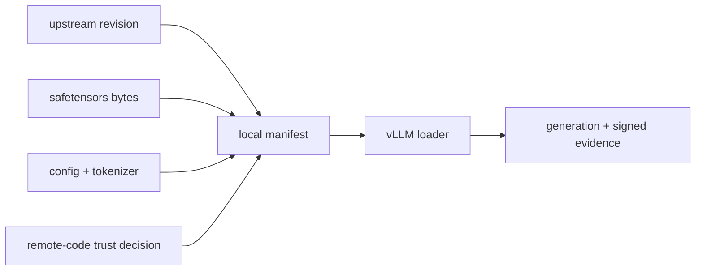

<!-- ai-infra-puzzles-header:start -->
<p align="center">
  
</p>

<h1 align="center">AI Infra Puzzles</h1>

<p align="center">
  <strong>Learn CUDA optimization and LLM inference through hands-on puzzles.</strong>
</p>
<!-- ai-infra-puzzles-header:end -->

# Lesson 10 — 模型加载、格式和来源

> **谜题：** 一个模型名称在远程仓库更改后能否再现部署？

[← 第 03 章](../README.md) · [项目主页](../../../README_ZH.md) · [执行的笔记本](../../../chapters/03-vllm-inference-serving/10-model-loading-provenance/lab.ipynb) · [RTX 5090 结果](../../../chapters/03-vllm-inference-serving/10-model-loading-provenance/artifacts/rtx5090-result.json)

## 为什么这个谜题重要

服务清单必须标识权重文件、配置、分词器、代码信任和修订版本。方便的仓库名称是可变的，除非被解析为不可变内容。

## 阅读结果前，先做出预测

1. 列出本地检查点所需的所有文件。
2. 预测是否存在一个或多个safetensors碎片。
3. 选择发布清单中的不可变标识符。

## 1. 从具体的请求开始并陈述

实验室在无网络访问的情况下审计本地检查点：所需文件、safetensors头部、配置字段、分词器元数据、文件大小和SHA-256摘要。然后确认固定引擎中的本地加载。

### 三个推理锚点

| # | 本课需要牢记的判断 |
|---:|---|
| 1 | 模型权重和分词器是分开的版本化文件。 |
| 2 | 格式安全属性不是来源记录。 |
| 3 | 远程代码改变了供应链边界。 |

## 2. 推导机制

vLLM 结合了一个模型配置、分词器、权重加载器、架构实现以及可选的远程代码。Safetensors 避免了 pickle 执行，但不建立模型的许可或语义身份。内容哈希使本地字节不可变；上游提交修订使远程检索可重复。`trust_remote_code` 扩展了可执行的信任边界，必须是一个明确的决定。

### 机制概览



### 逐步拆解

1. **库存artifact。**分离权重、配置、分词器和可选代码。
2. **解决不可变的身份。**使用提交修订和内容哈希。
3.**声明信任。**使远程代码和许可证决策透明。
4. **执行元数据。**证明目标引擎加载的确切字节数。

## 3. 把理论转化为实验

**实验：**对本地模型/配置/分词器文件进行哈希处理，检查格式元数据，并执行本地加载/生成检查。

| 实验角色 | 固定定义 |
|---|---|
| 基准 | 一个可变的模型名称，带有隐含默认值 |
| 候选方案 | 一个内容寻址的本地清单加上本地加载 |
| 保持不变 | 检查点路径，文件字节，离线模式，引擎参数，和提示 |
| 测量 | 哈希值，大小，架构，dtype，分词器类，信任设置，以及加载成功 |
| 证据标签 | `native-backend` |

### 代码导读

代码读取 JSON 和 safetensors 元数据而不反序列化任意 Python 对象。哈希值以流式方式读取，因此 3 GB 重量文件不会一次性进入主机内存。

## 4. 解读仓库内的 RTX 5090 实测结果

**录制环境：**NVIDIA GeForce RTX 5090 计算能力12.0; PyTorch 2.13.0+cu130;CUDA 运行时13.0; vLLM 0.27.1.

| 实测字段 | 已提交值 |
|---|---:|
| 权重文件 | 1 |
| 重量字节 | 3,087,467,144 字节 |
| 配置哈希 | `98d2ff8cc474` |
| 分词器哈希 | `c0382117ea32` |
| 权重哈希 | `dd924a11b4c2` |
| 架构 | Qwen2ForCausalLM |
| 本地加载 | 是的 |

### 这些数字说明了什么

清单包括 1 安全张量文件，3,087,467,144 字节，三个哈希值，以及架构 Qwen2ForCausalLM。完成的字节数为本地生成。

## 5. 解答谜题并做出决策

> 可重现加载需要不可变字节和明确的信任决策；模型别名本身是不够的。

### 验收与回滚门槛

只有在模型、分词器、配置、代码信任、许可证审查和本地加载绑定到不可变标识符后，才能发布。

### 这个结论可能如何失效

本地哈希无法揭示上游提交，如果目录丢失了仓库元数据。成功的生成不验证许可证、培训来源或每个架构特性。

## 复现

仓库内记录的固定版本为 vLLM 和 0.27.1，以及本地 Qwen2.5-1.5B-Instruct 检查点。在 Linux CUDA 主机上，创建一个干净的环境，并将 `CH3_MODEL` 指向你的本地检查点：

```bash
uv venv .venv --python 3.12
source .venv/bin/activate
uv pip install vllm==0.27.1 nbclient nbformat ipykernel requests pyyaml --torch-backend=auto
export CH3_MODEL=/path/to/Qwen2.5-1.5B-Instruct
jupyter lab chapters/03-vllm-inference-serving/10-model-loading-provenance/lab.ipynb
```

## 扩展实验

解决上游提交，签署元数据，验证其在镜像构建和启动过程中的有效性，并在每次加载器更改后测试一个代表性的提示套件。

## 证据边界

**证据标签:** [`native-backend`](../../../chapters/03-vllm-inference-serving/README.md#evidence-labels). 命名的 vLLM 运行时在记录的GPU/模型/工作负载上执行。结果不会转移到另一个版本、模型、端点或流量分布。

## 参考资料

- [Transformer 模型配置](https://huggingface.co/docs/transformers/main_classes/configuration)
- [支持的模型](https://docs.vllm.ai/en/latest/models/supported_models/)
