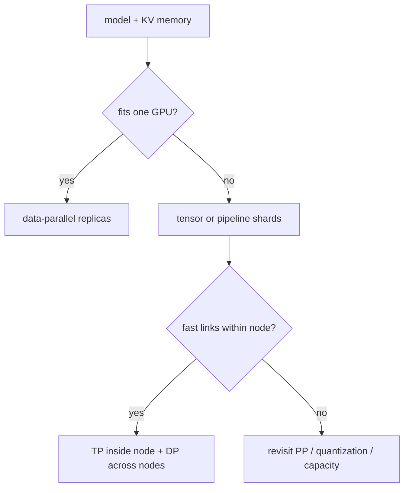

# 第 11 课 — 张量、管道、数据和专家并行

> **谜题：**如何将一个70B的服务映射到八个GPU上，当一个 RTX 5090 无法重现那个拓扑结构吗？

[← 第 03 章](../README.md) · [项目主页](../../../README_ZH.md) · [执行的笔记本](../../../chapters/03-vllm-inference-serving/11-multi-gpu-parallelism/lab.ipynb) · [RTX 5090 结果](../../../chapters/03-vllm-inference-serving/11-multi-gpu-parallelism/artifacts/rtx5090-result.json)

## 为什么这个谜题重要

并行处理是一个受模型大小、通信、请求隔离和集群拓扑限制的放置决策。选择`tensor_parallel_size=8`是因为存在八个设备，这会导致集体流量跨越缓慢边界，并减少有用的吞吐量。

## 阅读结果前，先做出预测

1. 删除无法容纳 70B BF16 权重的布局。
2. 比较TP8和TP4×DP2的估计跨节点字节数。
3. 在本地声明之前，命名所需的 NCCL 跟踪。

## 1. 从具体的请求开始并陈述

实验室记录了真实的单 GPU环境，读取了安装的 vLLM 并行CLI表面，并评估了TP、PP、DP和混合布局下两个四GPU节点上的透明八 GPU放置模型。

### 三个推理锚点

| # | 本课需要牢记的判断 |
|---:|---|
| 1 | 模型拟合是吞吐量优化前的硬约束。 |
| 2 | TP通信发生在模型步骤中，并且是拓扑敏感的。 |
| 3 | DP仅在每个副本都能容纳模型时增加副本并发性。 |

## 2. 推导机制

张量并行将层操作分片并在多层上通信。管道并行分配层阶段并引入气泡或微批调度。数据并行副本拥有独立的请求批次，通常复制权重。专家并行将路由专家分片，同时保留密集/共享组件。通信频率和链路带宽必须与拓扑结构匹配。

### 机制概览



### 逐步拆解

1. **解决内存适配问题。**移除无法容纳权重、KV和余量的布局。
2. **Map通信。**标记哪些集合跨越NVLink、PCIe或网络。
3. **选择复制。**仅在完整副本完全就绪后使用DP。
4. **本机证明。**在实际拓扑结构中收集每轮次的跟踪数据和吞吐量。

## 3. 把理论转化为实验**实验：**评估候选位置，明确权重、KV、链接和集体假设；探索可用引擎参数。

| 实验角色 | 固定定义 |
|---|---|
| 基准 | TP8 跨越两个节点 |
| 候选方案 | TP4在每个节点加上DP2，以及PP替代方案 |
| 保持不变 | 八 GPU拓扑结构，模型字节，每GPU 内存，链路假设，以及批次 |
| 测量 | fit, 复制节点数, 跨节点通信估计值, 以及暴露的命令行标志 |
| 证据标签 | `capacity-model` |

### 代码导读

每个公式和假设的带宽都会在生成的文件中发出。实验没有初始化分布式进程，因此所有多GPU性能行仍为规划估计。

## 4. 解读仓库内的 RTX 5090 实测结果

**录制环境：**NVIDIA GeForce RTX 5090 计算能力12.0; PyTorch 2.13.0+cu130;CUDA 运行时13.0; vLLM 0.27.1.

| 实测字段 | 已提交值 |
|---|---:|
| GPU数量 | 8 |
| 每个节点的GPU数量 | 4 |
| TP8 符合 | 是的 |
| TP4-DP2 符合 | 否 |
| TP8 跨节点字节 | 1.500000 |
| TP4-DP2 复制体 | 2 |
| TP 标记可用 | 否 |

### 这些数字说明了什么

账本估计 130.4 GiB BF16 权重。TP8/TP4×DP2 fit=True/False；只有建模的 TP8 集体跨越节点。没有分布式运行发生。

## 5. 解答谜题并做出决策

> 该容量模型拒绝接受不可能或拓扑不友好的布局；它不衡量多GPU vLLM 性能。

### 验收与回滚门槛

选择仅与可用空间相匹配的布局，保持频繁的集体活动在快速链接上，然后通过原生多节点基准测试。

### 这个结论可能如何失效

集体算法、重叠、量化权重、专家路由、不均匀层以及调度器行为可能主导简化估计。一个 RTX 5090 无法验证NCCL拓扑。

## 复现

仓库内记录的固定版本为 vLLM 和 0.27.1，以及本地 Qwen2.5-1.5B-Instruct 检查点。在 Linux CUDA 主机上，创建一个干净的环境，并将 `CH3_MODEL` 指向你的本地检查点：

```bash
uv venv .venv --python 3.12
source .venv/bin/activate
uv pip install vllm==0.27.1 nbclient nbformat ipykernel requests pyyaml --torch-backend=auto
export CH3_MODEL=/path/to/Qwen2.5-1.5B-Instruct
jupyter lab chapters/03-vllm-inference-serving/11-multi-gpu-parallelism/lab.ipynb
```

## 扩展实验

运行选定的双节点布局，带有NCCL跟踪、每排名内存、故障注入和相同的请求重放；并与最佳单节点基线进行比较。

## 证据边界

**证据标签:** [`capacity-model`](../../../chapters/03-vllm-inference-serving/README.md#evidence-labels). 测量环境事实提供明确的规划算术。假设的拓扑、需求、带宽和预留字段在本地部署测试之前仍为假设。

## 参考资料

- [vLLM 并行处理和扩展](https://docs.vllm.ai/en/latest/serving/parallelism_scaling/)
- [vLLM 引擎参数](https://docs.vllm.ai/en/latest/configuration/engine_args/)
