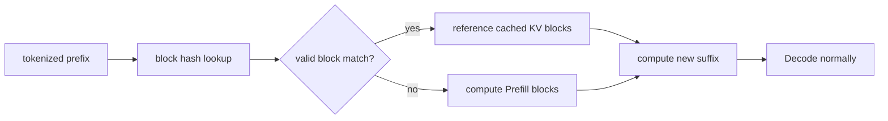

# Lesson 12 — 自动前缀缓存

> **谜题：** 共享系统提示何时可以跳过Prefill工作，以及何时缓存键不同？

[← 第 03 章](../README.md) · [项目主页](../../../README_ZH.md) · [执行的笔记本](../../../chapters/03-vllm-inference-serving/12-automatic-prefix-caching/lab.ipynb) · [RTX 5090 结果](../../../chapters/03-vllm-inference-serving/12-automatic-prefix-caching/artifacts/rtx5090-result.json)

## 为什么这个谜题重要

聊天、文档分析和少量示例工作负载通常会重复一个很长的前缀。自动前缀缓存可以重用KV块以匹配确切的token前缀，但它不能重用新的后缀计算，并且它不是一个语义相似度缓存。

## 阅读结果前，先做出预测

1. 预测哪些请求报告缓存的token。
2. 解释为什么改变一个早期的token会破坏下游的前缀匹配。
3. 选择一个不需要仅因速度而启用APC的工作负载。

## 1. 从具体的请求开始并陈述

启用前缀缓存的本地引擎提供冷共享前缀、热精确前缀和一个单词变异前缀。实验室保留了由 RequestOutput 显示的缓存token字段以及每种情况的耗时。

### 三个推理锚点

| # | 本课需要牢记的判断 |
|---:|---|
| 1 | 重用需要token精确的前缀身份。 |
| 2 | 只有缓存的Prefill块被跳过；Decode保持不变。 |
| 3 | 命中率指标需要请求分布和淘汰窗口。 |

## 2. 推导机制

缓存键覆盖了token内容以及影响KV有效性的一些额外因素。匹配完整的块可以被另一个请求引用；最终的部分块和新的后缀仍然需要工作。哈希查找改变了调度成本，但不会改变输出语义。淘汰策略和缓存容量决定了一个理论上的命中是否仍然驻留。

### 机制概览



### 逐步拆解

1. **确定性地进行分词。**缓存身份从确切的分词块开始。
2. **查找完整的块。**只有有效的居民匹配才能被引用。
3. **计算余数。**未匹配的后缀和部分块仍然运行Prefill.
4. **测量命中值。**将缓存token计数器与延迟和淘汰行为关联起来。

## 3. 把理论转化为实验

**实验：**运行冷请求、精确温热请求和突变前缀请求通过一个启用APC的原生引擎。

| 实验角色 | 固定定义 |
|---|---|
| 基准 | 冷共享前缀 |
| 候选方案 | 温精确重用和近似匹配控制 |
| 保持不变 | 引擎实例，前缀长度，后缀，采样，最大输出，和GPU |
| 测量 | 缓存token、提示token、耗时、输出身份和缓存配置 |
| 证据标签 | `native-backend` |

### 代码导读

代码保持一个引擎运行，以便第二个请求可以重用驻留块。它会检查缓存相关的指标，并在安装的API不暴露字段时记录`None`。

## 4. 解读仓库内的 RTX 5090 实测结果

**录制环境：**NVIDIA GeForce RTX 5090 计算能力12.0; PyTorch 2.13.0+cu130;CUDA 运行时13.0; vLLM 0.27.1.

| 实测字段 | 已提交值 |
|---|---:|
| 冷缓存token | 0 |
| warmup缓存token | 1,520 |
| 变异缓存token | 0 |
| 冷启动时间 | 0.161883 |
| 温停机时间 | 0.079997 |
| 温暖output tokens | 8 |

### 这些数字说明了什么

冷/温/变异请求报告了 0/1520/0 缓存的token；温/冷的持续时间为 0.0800/0.1619 秒。缓存token字段是命中证据。

## 5. 解答谜题并做出决策

> APC 重用精确且有效的KV块；保留的原生元数据区分观察到的命中与时间猜测。

### 验收与回滚门槛

仅在生产前缀重复时启用APC，正确性不变，并且命中率/延迟提高且无有害缓存压力时才启用。

### 这个结论可能如何失效

非常短的前缀、低重复率、淘汰、多模态哈希、LoRA 身份或非确定性提示构造可以消除重用。仅凭时间流逝无法证明缓存命中。

## 复现

仓库内记录的固定版本为 vLLM 和 0.27.1，以及本地 Qwen2.5-1.5B-Instruct 检查点。在 Linux CUDA 主机上，创建一个干净的环境，并将 `CH3_MODEL` 指向你的本地检查点：

```bash
uv venv .venv --python 3.12
source .venv/bin/activate
uv pip install vllm==0.27.1 nbclient nbformat ipykernel requests pyyaml --torch-backend=auto
export CH3_MODEL=/path/to/Qwen2.5-1.5B-Instruct
jupyter lab chapters/03-vllm-inference-serving/12-automatic-prefix-caching/lab.ipynb
```

## 扩展实验

在真实跟踪下查询/命中前缀缓存指标，然后按前缀家族、块对齐、淘汰年龄和租户边界对结果进行分段。

## 证据边界

**证据标签:** [`native-backend`](../../../chapters/03-vllm-inference-serving/README.md#evidence-labels). 命名的 vLLM 运行时在记录的GPU/模型/工作负载上执行。结果不会转移到另一个版本、模型、端点或流量分布。

## 参考资料

- [自动前缀缓存](https://docs.vllm.ai/en/latest/features/automatic_prefix_caching/)
- [PagedAttention 论文](https://arxiv.org/abs/2309.06180)
