# Lesson 13 — 分块 Prefill 和 Decode 干扰

> **谜题：**一个长提示是否应该垄断一个调度迭代，而短请求等待？

[← 第 03 章](../README.md) · [项目主页](../../../README_ZH.md) · [执行的笔记本](../../../chapters/03-vllm-inference-serving/13-chunked-prefill/lab.ipynb) · [RTX 5090 结果](../../../chapters/03-vllm-inference-serving/13-chunked-prefill/artifacts/rtx5090-result.json)

## 为什么这个谜题重要

大批次Prefill可以提高计算利用率，但可能会延迟活跃的Decode序列。分块将提示工作分成token预算，以便调度器可以将其与敏感延迟的生成任务交错。

## 阅读结果前，先做出预测

1. 预测不进行分块的短请求最大延迟。
2. 计算512-token块的数量。
3. 命名所需的本地跟踪以选择预算。

## 1. 从具体的请求开始并陈述

实验室重放一个测量成本的调度模型，并探查安装的分块预填充参数。它在短的Decode任务到达时，比较一个未分块的4096token提示与512token分块。

### 三个推理锚点

| # | 本课需要牢记的判断 |
|---:|---|
| 1 | 分块变化取决于工作安排，而非总提示词数。 |
| 2 | 较小的块可以降低阻塞时间，同时增加启动/调度开销。 |
| 3 | TTFT 和 ITL 可能会向相反的方向移动。 |

## 2. 推导机制

一个最大批次token预算为`B`的调度器可以以`ceil(L/B)`块消耗提示。较小的块会产生更多的Decode调度机会，但可能会增加开销并降低Prefill效率。因此，正确的块大小是一个SLO权衡，而不是一个普遍的最低值。

### 机制概览

```mermaid
gantt
  title Mixed prompt and Decode work
  dateFormat X
  axisFormat %L
  section Unchunked
  Long Prefill :0, 8
  Short Decode :8, 11
  section Chunked
  Prefill chunk 1 :0, 2
  Short Decode :2, 3
  Prefill chunk 2 :3, 5
```



### 逐步拆解

1. **设置token预算。**限制一次调度迭代中提示工作量的多少。
2. **将长提示语分割。**创建多个可续传Prefill块。
3. **在块之间接受Decode。**给活跃请求机会前进。
4. **评估权衡。**同时在原生引擎上测量 TTFT、ITL 和吞吐量。

## 3. 把理论转化为实验**实验：**交错一个长Prefill与短Decode在成本校准调度器模型中安排工作，并检查CLI支持。

| 实验角色 | 固定定义 |
|---|---|
| 基准 | 一个单一的长Prefill |
| 候选方案 | 固定大小的分块 Prefill 与 Decode 交错 |
| 保持不变 | token需求，每个token的成本假设，到达时间，优先级，以及GPU身份 |
| 测量 | 长代理TTFT，95%延迟短，调度轮次，以及CLI功能存在 |
| 证据标签 | `numerical-model` |

### 代码导读

该模拟暴露了其成本系数和完整的事件时间线。它与原生 vLLM 定时保持独立，因为一个GPUkernel的成本不是恒定的。

## 4. 解读仓库内的 RTX 5090 实测结果

**录制环境：**NVIDIA GeForce RTX 5090 计算能力12.0; PyTorch 2.13.0+cu130;CUDA 运行时13.0; vLLM 0.27.1.

| 实测字段 | 已提交值 |
|---|---:|
| 未分块的短p95 | 8.224000 |
| 分块短p95 | 1.136000 |
| 未分块的长完成 | 12.812000 |
| 分块长完成 | 13.452000 |
| 块 | 8 |
| CLI 支持 | 否 |

### 这些数字说明了什么

512-token chunking 创建了 8 个片段，并将短任务的 p95 延迟从 8.224 更改为 1.136 模型单位。本地流量仍然需要。

## 5. 解答谜题并做出决策

> 分块的Prefill创造了调度机会；其生产价值必须从原生混合流量权衡中选择。

### 验收与回滚门槛

选择片段预算仅当本地混合流量重放同时满足长提示TTFT和活动请求ITL门时。

### 这个结论可能如何失效

注意，kernel的缩放与sequence length不成线性关系；CUDA、图形、批处理、前缀命中和编译改变步骤持续时间。模型结果仅具有方向性。

## 复现

仓库内记录的固定版本为 vLLM 和 0.27.1，以及本地 Qwen2.5-1.5B-Instruct 检查点。在 Linux CUDA 主机上，创建一个干净的环境，并将 `CH3_MODEL` 指向你的本地检查点：

```bash
uv venv .venv --python 3.12
source .venv/bin/activate
uv pip install vllm==0.27.1 nbclient nbformat ipykernel requests pyyaml --torch-backend=auto
export CH3_MODEL=/path/to/Qwen2.5-1.5B-Instruct
jupyter lab chapters/03-vllm-inference-serving/13-chunked-prefill/lab.ipynb
```

## 扩展实验

在真实引擎上对 `max_num_batched_tokens` 进行扫查，同时使用并发流式客户端，并保留调度器指标 TTFT、ITL、吞吐量和 GPU 利用率。

## 证据边界

**证据标签:** [`numerical-model`](../../../chapters/03-vllm-inference-serving/README.md#evidence-labels). 一个透明的分配器、调度器、网关或策略模型被执行。它建立了声明的不变量，而不是原生的。vLLM 性能

## 参考资料

- [vLLM 引擎参数](https://docs.vllm.ai/en/latest/configuration/engine_args/)
- [vLLM 文档](https://docs.vllm.ai/en/latest/)
