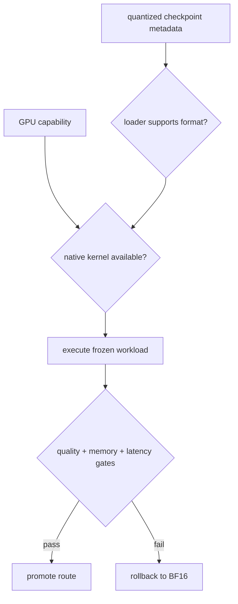

# Lesson 14 — 重量量化部署合约

> **谜题：** 为什么AWQ、GPTQ或 FP8 的检查点会失败，即使 vLLM 支持该方法？

[← 第 03 章](../README.md) · [项目主页](../../../README_ZH.md) · [执行的笔记本](../../../chapters/03-vllm-inference-serving/14-weight-quantization-deployment/lab.ipynb) · [RTX 5090 结果](../../../chapters/03-vllm-inference-serving/14-weight-quantization-deployment/artifacts/rtx5090-result.json)

## 为什么这个谜题重要

量化标签只是部署合约的一个字段。GPU能力、权重布局、组大小、激活dtype、模型架构、加载器元数据和kernel可用性必须一致。

## 阅读结果前，先做出预测

1. 识别本地检查点声明的量化配置。
2. 检查AWQ、GPTQ和 FP8 名称是否已注册。
3. 本课不进行延迟比较的原因是什么？

## 1. 从具体的请求开始并陈述

兼容性实验室检查 vLLM 注册的量化方法和引擎CLI，读取未量化本地检查点元数据，并在不下载替代模型的情况下评估声明的 RTX 5090 兼容性矩阵。

### 三个推理锚点

| # | 本课需要牢记的判断 |
|---:|---|
| 1 | 加载器识别弱于kernel调度。 |
| 2 | 硬件支持不验证检查点元数据。 |
| 3 | 内存、质量和延迟需要单独的门控。 |

## 2. 推导机制

仅权重的 AWQ 和 GPTQ 存储代码加上缩放元数据，并依赖于理解其打包的kernel。FP8 可能针对权重和/或激活值进行硬件特定的执行。加载器可以识别格式但退回到默认模式，拒绝架构，或者在测试形状下以无加速的方式执行。性能证据需要原生模型文件。

### 机制概览



### 逐步拆解

1. **检查检查点。**读取格式、分组、缩放和架构元数据。
2. **匹配平台。**验证GPU和编译kernel的先决条件。
3. **证明调度。**使用原生日志或跟踪，而非配置标签。
4.**阻塞产品结果。**分别评估质量、内存和服务延迟。

## 3. 把理论转化为实验**实验：**安装探针，检查量化注册，并评估检查点/硬件先决条件以确定三个部署路径。

| 实验角色 | 固定定义 |
|---|---|
| 基准 | 本地 BF16 检查点 |
| 候选方案 | AWQ, GPTQ 和 FP8 候选合同 |
| 保持不变 | vLLM 构建，GPU，本地配置，不下载网络 |
| 测量 | 注册方法、检查点声明、硬件能力、就绪字段和缺失证据 |
| 证据标签 | `compatibility-probe` |

### 代码导读

该笔记本在导入注册表时采取了防御性措施，因为内部模块路径可能会发生变化。失败的探测保留作为兼容性证据，而不是转换为成功声明。

## 4. 解读仓库内的 RTX 5090 实测结果

**录制环境：**NVIDIA GeForce RTX 5090 计算能力12.0; PyTorch 2.13.0+cu130;CUDA 运行时13.0; vLLM 0.27.1.

| 实测字段 | 已提交值 |
|---|---:|
| 声明局部量化 | none |
| AWQ 已注册 | 是的 |
| GPTQ 已注册 | 是的 |
| FP8 已注册 | 是的 |
| 计算能力 | 12.0 |
| 本地量化基准 | 未测量 |

### 这些数字说明了什么

本地量化=none；安装了AWQ/GPTQ/FP8 词汇表=True/True/True。在没有匹配量化字节的情况下，内存、质量和延迟无法测量。

## 5. 解答谜题并做出决策

> 该探针映射可用的软件词汇和缺失的先决条件；它故意不提出量化性能声明。

### 验收与回滚门槛

在精确的检查点加载后、原生跟踪识别出预期路径、输出质量通过后，再对量化路由进行基准测试。

### 这个结论可能如何失效

注册表的存在可能超过一个废弃路径或省略平台特定的约束。这个实验室没有AWQ/GPTQ/FP8 的权重文件，因此无法测量它们的内存或速度。

## 重现

仓库内记录的固定版本为 vLLM 和 0.27.1，以及本地 Qwen2.5-1.5B-Instruct 检查点。在 Linux CUDA 主机上，创建一个干净的环境，并将 `CH3_MODEL` 指向你的本地检查点：

```bash
uv venv .venv --python 3.12
source .venv/bin/activate
uv pip install vllm==0.27.1 nbclient nbformat ipykernel requests pyyaml --torch-backend=auto
export CH3_MODEL=/path/to/Qwen2.5-1.5B-Instruct
jupyter lab chapters/03-vllm-inference-serving/14-weight-quantization-deployment/lab.ipynb
```

## 扩展实验

为每条路线保存一个量化检查点，对其进行哈希处理，运行相同的提示网格，捕获kernel跟踪，并与 BF16 比较质量与内存。

## 证据边界

**证据标签:** [`compatibility-probe`](../../../chapters/03-vllm-inference-serving/README.md#evidence-labels). 已安装的包/API/配置表面进行了检查。可用性或lint成功并不等同于原生功能执行。

## 参考资料

- [vLLM 量化](https://docs.vllm.ai/en/latest/features/quantization/)
- [vLLM 引擎参数](https://docs.vllm.ai/en/latest/configuration/engine_args/)
