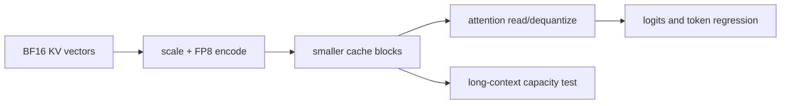

# 第 15 课 — FP8 KV Cache：容量与忠实度

> **谜题：**将KV元素宽度减半是否会在不改变答案的情况下将安全的长上下文并发性翻倍？

[← 第 03 章](../README.md) · [项目主页](../../../README_ZH.md) · [执行的笔记本](../../../chapters/03-vllm-inference-serving/15-fp8-kv-cache/lab.ipynb) · [RTX 5090 结果](../../../chapters/03-vllm-inference-serving/15-fp8-kv-cache/artifacts/rtx5090-result.json)

## 为什么这个谜题重要

KV量化目标是指随着上下文增长而不是模型权重增长的状态。它可以显著扩展容量，但规模校准、数值漂移、kernel支持和非KV储备阻止了免费两倍服务的声明。

## 阅读结果前，先做出预测

1. 预测 RTX 5090 构建是否接受 FP8 KV。
2. 比较理论字节每词。
3. 选择长上下文路径的回滚证据。

## 1. 从具体的请求开始并陈述

本地实验使用相同的确定性提示，并自动和 FP8 KV 缓存dtype，记录成功或确切的失败，比较tokenID，并将结果与第一阶字节比率配对。

### 三个推理锚点

| # | 本课需要牢记的判断 |
|---:|---|
| 1 | KV dtype 与 weight dtype 独立。 |
| 2 | 理论上的KV字节可以减半，而总VRAM减少的幅度较小。 |
| 3 | Token equality on a small suite is a regression check, not a quality proof. |

## 2. 推导机制

FP8 将每个缓存的键/值元素存储在一个字节，而不是 BF16 的两个字节，同时包含缩放元数据。必须通过支持的路径进行去量化或消费该表示。静态或动态缩放决定范围和误差。即使完美的两倍 KV 压缩也无法减半重量或工作区内存。

### 机制概览



### 逐步拆解

1. **分离权重和缓存dtype。**在比较过程中保持模型权重固定。
2.**考虑比例。**记录 FP8 值如何校准或动态缩放。
3.**测试原生执行。**保留初始化、token、延迟和内存证据。
4. **清扫长上下文。**容量值仅在 KV 为材料预算术语时出现。

## 3. 把理论转化为实验**实验：**运行匹配的原生代数 BF16/自动和 FP8KV 配置，保留成功、token和时间。

| 实验角色 | 固定定义 |
|---|---|
| 基准 | 自动 KV dtype |
| 候选方案 | FP8KV dtype with the sameBF16 权重 |
| 保持不变 | 模型、提示、贪婪采样、最大长度、GPU 和引擎版本 |
| 测量 | 初始化成功，输出token相等性、耗时以及理论上的KV字节比率。 |
| 证据标签 | `native-backend` |

### 代码导读

代码在创建第二个引擎之前销毁第一个引擎，并原封不动地记录配置失败。它避免将初始化失败作为性能测量。

## 4. 解读仓库内的 RTX 5090 实测结果

**录制环境：**NVIDIA GeForce RTX 5090 计算能力12.0; PyTorch 2.13.0+cu130;CUDA 运行时13.0; vLLM 0.27.1.

| 实测字段 | 已提交值 |
|---|---:|
| 自动成功 | 是的 |
| FP8 成功 | 否 |
| 理论 KV 比例 | 2.000x |
| Token sequences equal | 否 |
| 自动耗时 | 0.182354 |
| FP8 用时 | 未测量 |

### 这些数字说明了什么

Auto/FP8 成功=True/False；领先KV容量比为2×，匹配贪婪token相等=False。简短提示无法证明长上下文容量或任务质量。

## 5. 解答谜题并做出决策

> FP8 可以将领先的 KV 载荷减半；原生 A/B 仅建立此模型/构建的执行和小型套件token行为。

### 验收与回滚门槛

采用 FP8 KV 只有在本地长上下文容量提升、任务切片通过，并且 TTFT/ITL 不违反门限的情况下。

### 这个结论可能如何失效

简短的提示几乎不锻炼缓存容量。缺失校准比例或不同的后端可以改变准确性和速度，而分配器保留防止精确的2×并发。

## 复现

仓库内记录的固定版本为 vLLM 和 0.27.1，以及本地 Qwen2.5-1.5B-Instruct 检查点。在 Linux CUDA 主机上，创建一个干净的环境，并将 `CH3_MODEL` 指向你的本地检查点：

```bash
uv venv .venv --python 3.12
source .venv/bin/activate
uv pip install vllm==0.27.1 nbclient nbformat ipykernel requests pyyaml --torch-backend=auto
export CH3_MODEL=/path/to/Qwen2.5-1.5B-Instruct
jupyter lab chapters/03-vllm-inference-serving/15-fp8-kv-cache/lab.ipynb
```

## 扩展实验

在代表性场景中校准秤，扫掠长度至准入限制，比较输出分布，并检查缓存块容量及引擎指标。

## 证据边界

**证据标签:** [`native-backend`](../../../chapters/03-vllm-inference-serving/README.md#evidence-labels). 命名的 vLLM 运行时在记录的GPU/模型/工作负载上执行。结果不会转移到另一个版本、模型、端点或流量分布。

## 参考资料

- [量化 KV 缓存](https://docs.vllm.ai/en/latest/features/quantization/quantized_kvcache/)
- [vLLM 引擎参数](https://docs.vllm.ai/en/latest/configuration/engine_args/)
