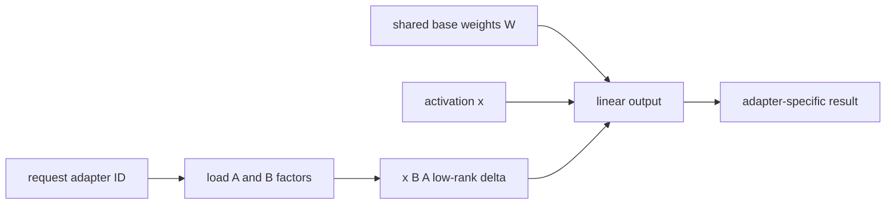

<!-- ai-infra-puzzles-header:start -->
<p align="center">
  
</p>

<h1 align="center">AI Infra Puzzles</h1>

<p align="center">
  <strong>Learn CUDA optimization and LLM inference through hands-on puzzles.</strong>
</p>
<!-- ai-infra-puzzles-header:end -->

# Lesson 16 — 提供 LoRA 适配器

> **谜题：** 一个基础模型是否可以在不复制所有权重的情况下安全地为多个任务适配器服务？

[← 第 03 章](../README.md) · [项目主页](../../../README_ZH.md) · [执行的笔记本](../../../chapters/03-vllm-inference-serving/16-lora-serving/lab.ipynb) · [RTX 5090 结果](../../../chapters/03-vllm-inference-serving/16-lora-serving/artifacts/rtx5090-result.json)

## 为什么这个谜题重要

LoRA 保持一个共享的基础检查点，并在每次请求时应用小的低秩增量。内存优势吸引人，但适配器身份、秩限制、分词器兼容性、调度和动态加载安全成为服务关注的问题。

## 阅读结果前，先做出预测

1. 估计排名16的适配器的字节数。
2. 探测 `--enable-lora` 并排序相关参数。
3. 解释为什么这个实验室不能声称适配器输出的正确性。

## 1. 从具体的请求开始并陈述

实验室测试了 LoRA API和CLI支持，构建了一个透明的低秩内存账本，以适应本地架构，并验证了请求路由的身份。它没有伪造训练过的适配器。

### 三个推理锚点

| # | 本课需要牢记的判断 |
|---:|---|
| 1 | LoRA 共享基础权重但添加了每种适配器的状态。 |
| 2 | 适配器名称和不可变修订应包含在请求合同中。 |
| 3 | 动态加载扩展了文件系统和授权边界。 |

## 2. 推导机制

对于矩阵`W`，LoRA 将`ΔW = B A`与秩`r`相加；存储量与`r(in+out)`而非`in×out`成比例。vLLM 可以批量处理与不同适配器关联的请求，同时共享基础权重，前提是配置了秩和驻留适配器限制。适配器路径和名称成为可执行输入。

### 机制概览



### 逐步拆解

1. **冻结基础。**所有租户引用一个不可变的基本修订版本。
2. **解决授权适配器。**将请求名称映射到已签名的本地 artifact。
3.**应用低秩差分。**在共享权重旁边安排适应器特定的因素。
4.**测试隔离。**验证质量、居住限制、驱逐和授权。

## 3. 把理论转化为实验

**实验：**计算适配器存储并检查已安装 LoRA 请求/配置表面，明确缺少原生证据。

| 实验角色 | 固定定义 |
|---|---|
| 基准 | 每个任务的全基模型复制 |
| 候选方案 | 一个基础模型加上rank-16适配器增量 |
| 保持不变 | 模型几何结构、dtype、目标模块、排名、适配器数量以及安装的 vLLM |
| 测量 | 估计字节数，压缩比，API 符号，CLI 标志，以及原生适配器执行状态 |
| 证据标签 | `compatibility-probe` |

### 代码导读

代码从配置中获取矩阵维度，并仅计算声明的目标投影。它将理论字节数单独记录在包/API可用性之外。

## 4. 解读仓库内的 RTX 5090 实测结果

**录制环境：**NVIDIA GeForce RTX 5090 计算能力12.0; PyTorch 2.13.0+cu130;CUDA 运行时13.0; vLLM 0.27.1.

| 实测字段 | 已提交值 |
|---|---:|
| 估计适配器字节数 | 39,223,296 字节 |
| 基础重量字节 | 3,087,467,144 字节 |
| 存储比例 | 1.27% |
| LoRA 请求 API | 是的 |
| 启用标志 | 否 |
| 本地适配器执行 | 否 |

### 这些数字说明了什么

排名-16的七投影估计是39,223,296 BF16 字节（1.27%的权重）；请求API/启用标志=True/False。没有伪造训练适配器行为。

## 5. 解答谜题并做出决策

> 低秩账本解释了适配器为何较小；原生行为和性能声明在没有真实适配器文件的情况下仍处于待定状态。

### 验收与回滚门槛

启用多适配器服务前，请确保已通过签名适配器文件、任务质量、隔离、加载/卸载、并发以及回滚测试。

### 这个结论可能如何失效

Real PEFT 检查点包含配置，并可能针对不同的模块集。运行时内存包括缓冲区，未经授权的本地路径可能会暴露任意的碎片。

## 复现

仓库内记录的固定版本为 vLLM 和 0.27.1，以及本地 Qwen2.5-1.5B-Instruct 检查点。在 Linux CUDA 主机上，创建一个干净的环境，并将 `CH3_MODEL` 指向你的本地检查点：

```bash
uv venv .venv --python 3.12
source .venv/bin/activate
uv pip install vllm==0.27.1 nbclient nbformat ipykernel requests pyyaml --torch-backend=auto
export CH3_MODEL=/path/to/Qwen2.5-1.5B-Instruct
jupyter lab chapters/03-vllm-inference-serving/16-lora-serving/lab.ipynb
```

## 扩展实验

创建或获取一个版本化的适配器，对其进行哈希处理，通过`LoRARequest`运行基准/适配器请求，并进行同时的适配器驻留和移除压力测试。

## 证据边界

**证据标签:** [`compatibility-probe`](../../../chapters/03-vllm-inference-serving/README.md#evidence-labels). 已安装的包/API/配置表面进行了检查。可用性或lint成功并不等同于原生功能执行。

## 参考资料

- [LoRA 接口](https://docs.vllm.ai/en/latest/features/lora/)
- [vLLM 引擎参数](https://docs.vllm.ai/en/latest/configuration/engine_args/)
