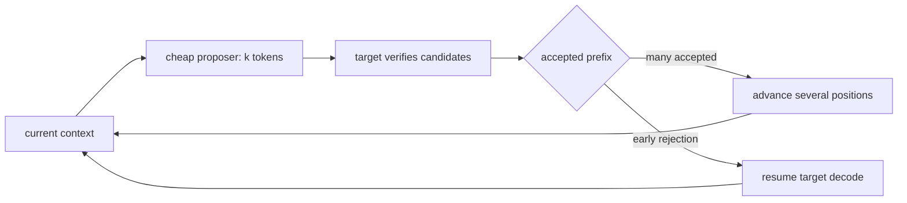

# 第 17 课 — 预测性解码和接受

> **谜题：** 提出多个代币何时会减少 ITL，而不是增加验证开销？

[← 第 03 章](../README.md) · [项目主页](../../../README_ZH.md) · [执行的笔记本](../../../chapters/03-vllm-inference-serving/17-speculative-decoding/lab.ipynb) · [RTX 5090 结果](../../../chapters/03-vllm-inference-serving/17-speculative-decoding/artifacts/rtx5090-result.json)

## 为什么这个谜题重要

推测性解码在廉价提议的代币被足够频繁地接受时，仅能加速内存受限的Decode。方法名称或提议长度无法在没有接受和目标模型时间的情况下预测结果。

## 阅读结果前，先做出预测

1. 预测重复序列提示的接受度。
2. 检查配置之间的贪婪token相等性。
3. 为什么一个耗时样本不足以进行晋升。

## 1. 从具体的请求开始并陈述

本地实验室比较了普通解码与在重复提示下使用提示查找的n-gram推测，使用相同的贪婪采样。它记录了成功、耗时、token相等性和暴露的接受度指标。

### 三个推理锚点

| # | 本课需要牢记的判断 |
|---:|---|
| 1 | 推测改变执行，而不是目标分布合同。 |
| 2 | 接受率取决于工作负载。 |
| 3 | 高QPS批处理可以降低推测性Decode的相对价值。 |

## 2. 推导机制

提案者发出多个候选token。目标在批量验证过程中验证它们，并接受有效的前缀；被拒绝的位置继续目标解码。N-gram查找提出重复的提示续写，而无需草稿模型。预期收益取决于提案成本、验证效率、接受长度以及提供的负载。

### 机制概览



### 逐步拆解

1. **选择一个提案者。**将草稿、n-gram、后缀或MTP与可用的文件关联。
2. **验证目标。**接受保留目标分布合同。
3.**接受进度测量。**计算每次验证有多少目标位置前进。
4.**扫除提供的负载。**比较ITL吞吐量Decode实际上是瓶颈。

## 3. 把理论转化为实验

**实验：**运行匹配的本地基准和n-gram推测引擎，保留标记和时间证据。

| 实验角色 | 固定定义 |
|---|---|
| 基准 | 普通目标模型 Decode |
| 候选方案 | n-gram 提示-查找推测，带有四个提议的标记 |
| 保持不变 | 模型，提示，贪婪采样，最大token数，引擎限制，和GPU |
| 测量 | 成功，耗时，输出token数，token相等性，以及暴露时的接受计数器。 |
| 证据标签 | `native-backend` |

### 代码导读

这两个引擎是按顺序创建的，以避免共享VRAM。推测性配置遵循安装的发布方案，任何不兼容性都以结构化的失败形式保留。

## 4. 解读仓库内的 RTX 5090 实测结果

**录制环境：**NVIDIA GeForce RTX 5090 计算能力12.0; PyTorch 2.13.0+cu130;CUDA 运行时13.0; vLLM 0.27.1.

| 实测字段 | 已提交值 |
|---|---:|
| 基准成功 | 是的 |
| 推测性成功 | 是的 |
| Token数量相等 | 是的 |
| 基线耗时 | 0.347510 |
| 推测延迟 | 1.409890 |
| 速度比 | 0.246x |
| output tokens | 32 |

### 这些数字说明了什么

Baseline/speculative success=True/True, tokens equal=True, elapsed ratio=0.24648057002129478. 重复的提示有利于n-gram查找。

## 5. 解答谜题并做出决策

> 推测只有在目标工作量被接受时才具有价值，以抵消提案者和验证者的成本；这种原生对绑定声明到一个重复的工作量。

### 验收与回滚门槛

启用推测性执行仅在代表性的低/中等 QPS 交通改善 ITL 而不出现质量、吞吐量或内存退化时。

### 这个结论可能如何失效

重复的提示更倾向于n-gram查找，且不具代表性。编译warmup、批处理和版本特定的指标可能会在小规模运行中占据主导地位。

## 复现

仓库内记录的固定版本为 vLLM 和 0.27.1，以及本地 Qwen2.5-1.5B-Instruct 检查点。在 Linux CUDA 主机上，创建一个干净的环境，并将 `CH3_MODEL` 指向你的本地检查点：

```bash
uv venv .venv --python 3.12
source .venv/bin/activate
uv pip install vllm==0.27.1 nbclient nbformat ipykernel requests pyyaml --torch-backend=auto
export CH3_MODEL=/path/to/Qwen2.5-1.5B-Instruct
jupyter lab chapters/03-vllm-inference-serving/17-speculative-decoding/lab.ipynb
```

## 扩展实验

基准测试多个提示族和到达率，收集提案者/接受方计数器，并在热身之后比较 p50/p95 ITL。

## 证据边界

**证据标签:** [`native-backend`](../../../chapters/03-vllm-inference-serving/README.md#evidence-labels). 命名的 vLLM 运行时在记录的GPU/模型/工作负载上执行。结果不会转移到另一个版本、模型、端点或流量分布。

## 参考资料

- [推测性解码](https://docs.vllm.ai/en/latest/features/speculative_decoding/)
- [生产指标](https://docs.vllm.ai/en/latest/usage/metrics/)
