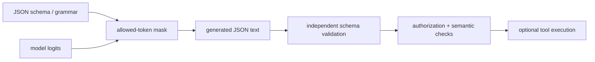

<!-- ai-infra-puzzles-header:start -->
<p align="center">
  
</p>

<h1 align="center">AI Infra Puzzles</h1>

<p align="center">
  <strong>Learn CUDA optimization and LLM inference through hands-on puzzles.</strong>
</p>
<!-- ai-infra-puzzles-header:end -->

# Lesson 18 — 结构化输出和工具合约

> **谜题：**当应用程序需要特定的模式时，仅有效的JSON是否足够？

[← 第 03 章](../README.md) · [项目主页](../../../README_ZH.md) · [执行的笔记本](../../../chapters/03-vllm-inference-serving/18-structured-outputs-tools/lab.ipynb) · [RTX 5090 结果](../../../chapters/03-vllm-inference-serving/18-structured-outputs-tools/artifacts/rtx5090-result.json)

## 为什么这个谜题重要

应用程序需要类型化的字段、枚举和必需的属性，而不是仅仅类似于 JSON 的文本。受限的解码将部分合同移至标记选择，而应用程序验证仍然负责语义和副作用。

## 阅读结果前，先做出预测

1. 预测不受约束的控制是否解析。
2. 检查所有必需字段和枚举。
3. 命名生成与工具执行之间的边界。

## 1. 从具体的请求开始并陈述

实验室通过SamplingParams运行原生JSON模式约束生成，解析文本，本地验证所需字段/类型，并与无约束的对照进行比较。

### 三个推理锚点

| # | 本课需要牢记的判断 |
|---:|---|
| 1 | JSON语法和模式一致性是不同的门。 |
| 2 | 受限解码无法验证现实世界的语义。 |
| 3 | 工具执行必须保持在授权和验证之后。 |

## 2. 推导机制

结构化输出后端会屏蔽那些在语法或模式下会使部分输出无效的标记。这减少了语法重试，但不验证工具是否存在、参数是否安全或值是否事实正确。调用工具之前，应添加解析器和聊天模板要求。

### 机制概览



### 逐步拆解

1. **定义合同。**填写所需的字段、类型、枚举和范围。
2. **限制token。**屏蔽违反语法的续行。
3. **独立验证。**解析并应用相同的模式在生成之外。
4. **防止副作用。**一个有效的参数对象并不等同于执行权限。

## 3. 把理论转化为实验**实验：**生成一个受模式约束的对象，解析它，并应用一个独立的验证器。

| 实验角色 | 固定定义 |
|---|---|
| 基准 | 普通文本生成被提示返回JSON |
| 候选方案 | 本地结构化输出受JSON模式约束 |
| 保持不变 | 模型、模式、提示、采样、最大token数和GPU |
| 测量 | 本地成功，JSON解析，模式验证，必填字段，以及控制解析 |
| 证据标签 | `native-backend` |

### 代码导读

该模式嵌入在元数据中，验证不信任模型的声明。笔记本中不执行任何外部函数。

## 4. 解读仓库内的 RTX 5090 实测结果

**录制环境：**NVIDIA GeForce RTX 5090 计算能力12.0; PyTorch 2.13.0+cu130;CUDA 运行时13.0; vLLM 0.27.1.

| 实测字段 | 已提交值 |
|---|---:|
| 结构化成功 | 是的 |
| JSON 解析 | 是的 |
| 模式有效 | 是的 |
| 必填字段 | 是的 |
| 控制 JSON 解析 | no |
| output tokens | 28 |

### 这些数字说明了什么

结构化成功/JSON/schema=True/True/True；不受限制的JSON解析=False。独立的语义/授权验证仍需进行。

## 5. 解答谜题并做出决策

> 受限解码可以建立语法/模式形式；应用含义和工具安全性仍为独立责任。

### 验收与回滚门槛

允许结构化输出进入应用程序，前提是必须通过模式、语义、授权、超时和副作用控制。

### 这个结论可能如何失效

后端/模式特征在 vLLM 版本之间发生变化，小型模型可能会生成模式有效但无用的值。仅凭JSON解析无法识别枚举和范围约束。

## 复现

仓库内记录的固定版本为 vLLM 和 0.27.1，以及本地 Qwen2.5-1.5B-Instruct 检查点。在 Linux CUDA 主机上，创建一个干净的环境，并将 `CH3_MODEL` 指向你的本地检查点：

```bash
uv venv .venv --python 3.12
source .venv/bin/activate
uv pip install vllm==0.27.1 nbclient nbformat ipykernel requests pyyaml --torch-backend=auto
export CH3_MODEL=/path/to/Qwen2.5-1.5B-Instruct
jupyter lab chapters/03-vllm-inference-serving/18-structured-outputs-tools/lab.ipynb
```

## 扩展实验

添加嵌套模式、流式部分、工具选择策略、对抗性提示、重试以及带有审计日志的沙箱模拟执行器。

## 证据边界

**证据标签:** [`native-backend`](../../../chapters/03-vllm-inference-serving/README.md#evidence-labels). 命名的 vLLM 运行时在记录的GPU/模型/工作负载上执行。结果不会转移到另一个版本、模型、端点或流量分布。

## 参考资料

- [结构化输出](https://docs.vllm.ai/en/latest/features/structured_outputs/)
- [兼容OpenAI的服务器](https://docs.vllm.ai/en/latest/serving/openai_compatible_server/)
