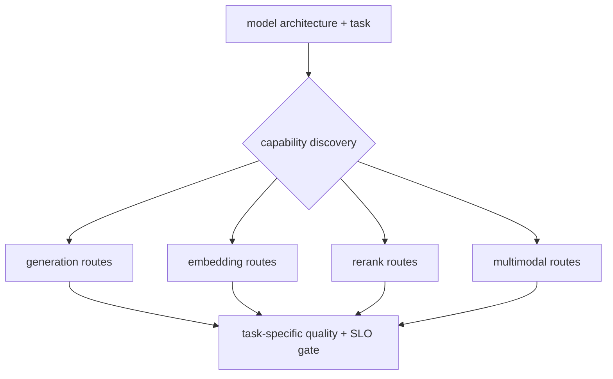

# Lesson 19 — 多模态、嵌入和重排序服务边界

> **谜题：**一个端点是否应该为每个模型暴露生成、图像输入、嵌入和重排序功能？

[← 第 03 章](../README.md) · [项目主页](../../../README_ZH.md) · [执行的笔记本](../../../chapters/03-vllm-inference-serving/19-multimodal-pooling-rerank/lab.ipynb) · [RTX 5090 结果](../../../chapters/03-vllm-inference-serving/19-multimodal-pooling-rerank/artifacts/rtx5090-result.json)

## 为什么这个谜题重要

vLLM 支持多种任务家族，但能力属于模型加上配置，而不是服务器二进制文件。路由不支持的任务可能会在较晚阶段失败或产生合同不匹配。

## 阅读结果前，先做出预测

1. 将本地 Qwen 检查点的主要任务分类。
2. Mark Chat,嵌入式模型，重排序和图像路由已准备好或被阻止。
3. 命名用于评估每个启用任务所需的数据集。

## 1. 从具体的请求开始并陈述

兼容性探针检查本地模型的架构和 vLLM 任务/模型接口，将请求的端点映射到所需的特性，并记录没有在这个文本生成检查点上运行过多模态或池化基准测试。

### 三个推理锚点

| # | 本课需要牢记的判断 |
|---:|---|
| 1 | 服务器能力是引擎和模型支持的交集。 |
| 2 | 聚合质量使用检索/排名指标而非生成token。 |
| 3 | 远程媒体输入扩展了网络和解析器攻击面。 |

## 2. 推导机制

生成模型返回token序列；聚合模型返回嵌入或分数；多模态模型添加处理器和媒体负载。重排序端点需要评分任务和输入对模式。每个家族改变批处理维度、内存、安全性和评估指标。能力发现应作为路由注册的门控。

### 机制概览



### 逐步拆解

1. **识别任务。**读取模型架构和原生任务支持。
2. **只注册有效的路由。**不要暴露模型无法执行的端点。
3. **使用任务指标。**生成、检索、排名和视觉需要不同的评估。
4. **审查输入安全。**媒体和远程URL需要额外的控制。

## 3. 把理论转化为实验

**实验：**从本地配置和安装的接口构建能力矩阵，保留不支持的路由作为明确的阻塞。

| 实验角色 | 固定定义 |
|---|---|
| 基准 | 注册每个端点，因为 vLLM 暴露了它。 |
| 候选方案 | 只注册与任务特定门相关的模型能力路由。 |
| 保持不变 | 本地检查点，安装 vLLM，无替代模型，并声明端点要求。 |
| 测量 | 架构，多模态元数据，聚合指标，路线就绪性，以及缺失的测试文件 |
| 证据标签 | `compatibility-probe` |

### 代码导读

代码不会仅仅为了制造错误而调用不支持的端点。它会推导出一个保守的矩阵，并使所有缺失的模型/评估数据可见。

## 4. 解读仓库内的 RTX 5090 实测结果

**录制环境：**NVIDIA GeForce RTX 5090 计算能力12.0; PyTorch 2.13.0+cu130;CUDA 运行时13.0; vLLM 0.27.1.

| 实测字段 | 已提交值 |
|---|---:|
| 架构 | Qwen2ForCausalLM |
| 文本生成就绪 | 是的 |
| 嵌入式模型准备就绪 | 否 |
| 重排序准备就绪 | 否 |
| 多模态就绪 | 否 |
| 本地非生成测试 | 0 |

### 这些数字说明了什么

架构 Qwen2ForCausalLM 允许 Chat=True 并阻止 embeddings/rerank/multimodal=False/False/False 待匹配原生模型和评估。

## 5. 解答谜题并做出决策

> vLLM 安装具有多能力；此检查点不具备。路由注册必须遵循原生模型/任务证据。

### 验收与回滚门槛

仅在选定的模型原生执行任务并通过特定任务的质量、延迟和安全测试后，才发布该路由。

### 这个结论可能如何失效

仅凭架构名称可能不够明确，vLLM 可能会动态推断任务。保守的探针可能会产生假阴性结果，直到本地模型初始化确认支持。

## 复现

仓库内记录的固定版本为 vLLM 和 0.27.1，以及本地 Qwen2.5-1.5B-Instruct 检查点。在 Linux CUDA 主机上，创建一个干净的环境，并将 `CH3_MODEL` 指向你的本地检查点：

```bash
uv venv .venv --python 3.12
source .venv/bin/activate
uv pip install vllm==0.27.1 nbclient nbformat ipykernel requests pyyaml --torch-backend=auto
export CH3_MODEL=/path/to/Qwen2.5-1.5B-Instruct
jupyter lab chapters/03-vllm-inference-serving/19-multimodal-pooling-rerank/lab.ipynb
```

## 扩展实验

添加一个固定嵌入，重新排序，以及多模态检查点，然后运行检索NDCG/召回率，成对排名，图像验证，以及混合批次内存测试。

## 证据边界

**证据标签:** [`compatibility-probe`](../../../chapters/03-vllm-inference-serving/README.md#evidence-labels). 已安装的包/API/配置表面进行了检查。可用性或lint成功并不等同于原生功能执行。

## 参考资料

- [支持的模型](https://docs.vllm.ai/en/latest/models/supported_models/)
- [兼容OpenAI的服务器](https://docs.vllm.ai/en/latest/serving/openai_compatible_server/)
