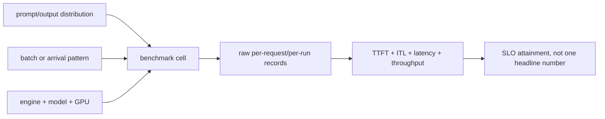

<!-- ai-infra-puzzles-header:start -->
<p align="center">
  
</p>

<h1 align="center">AI Infra Puzzles</h1>

<p align="center">
  <strong>Learn CUDA optimization and LLM inference through hands-on puzzles.</strong>
</p>
<!-- ai-infra-puzzles-header:end -->

# Lesson 20 — 延迟、吞吐量和工作负载基准测试

> **谜题：** 哪个基准结果在提示长度、输出长度或并发量变化后仍然有效？

[← 第 03 章](../README.md) · [项目主页](../../../README_ZH.md) · [执行的笔记本](../../../chapters/03-vllm-inference-serving/20-benchmarking-workloads/lab.ipynb) · [RTX 5090 结果](../../../chapters/03-vllm-inference-serving/20-benchmarking-workloads/artifacts/rtx5090-result.json)

## 为什么这个谜题重要

每秒token数的单一值会压缩工作负载。有用的基准测试保留请求形状、warmup状态、原始样本、成功的token计数以及离线吞吐量与在线延迟的区别。

## 阅读结果前，先做出预测

1. 预测哪个批次的输出token数最多。
2. 检查所有请求是否生成了相同的token限制。
3. 请说明为什么这不是一个并发性能基准测试。

## 1. 从具体的请求开始并陈述

本地实验启动一个引擎并运行batch size为 1、4 和 8 的批次，针对固定提示。它保留每个墙时样本，并报告有用的输出吞吐量和请求吞吐量。

### 三个推理锚点

| # | 本课需要牢记的判断 |
|---:|---|
| 1 | 工作负载身份包括输入和输出长度。 |
| 2 | 原始样本使百分位数和噪声检查可重新计算。 |
| 3 | 吞吐量和尾部延迟可能会相反方向移动。 |

## 2. 推导机制

离线吞吐量衡量完成封闭批次的工作；在线服务添加到达、排队、TTFT、ITL、取消和网络。较大的批次可以提高GPU利用率，同时增加请求的等待时间。提示和输出token必须保持分离，因为它们对Prefill和Decode有不同的影响。

### 机制概览



### 逐步拆解

1. **冻结工作负载。**记录输入/输出token以及到达或批次策略。
2.**warmup。**将冷编译/启动与稳定状态分开。
3. **保留原始记录。**保留样本和成功的token计数。
4. **报告正确的范围。**不要将离线批处理速率转换为在线速率SLO.

## 3. 把理论转化为实验

**实验：**启动一个本地引擎并测量三次重复的封闭批次。

| 实验角色 | 固定定义 |
|---|---|
| 基准 | batch size为一 |
| 候选方案 | batch size为四和八 |
| 保持不变 | 模型，提示模板，最大输出，贪婪采样，warmup，重复，和 GPU |
| 测量 | 原始耗时样本数，提示/输出token数，请求/秒，输出token/秒，以及内存 |
| 证据标签 | `native-backend` |

### 代码导读

引擎在整个扫描过程中保持运行。每个批次使用长度相似但不同的提示，而数据存储库存储样本而不是仅存储四舍五入的平均值。

## 4. 解读仓库内的 RTX 5090 实测结果

**录制环境：**NVIDIA GeForce RTX 5090 计算能力12.0; PyTorch 2.13.0+cu130;CUDA 运行时13.0; vLLM 0.27.1.

| 实测字段 | 已提交值 |
|---|---:|
| 每批次-1 输出 tok/s | 126.2/s |
| 每批次-4 输出 tok/s | 467.4/s |
| 每批次-8 输出 tok/s | 918.3/s |
| 每批-1 请求/秒 | 5.3/s |
| 每批-8 请求/秒 | 38.3/s |
| 峰值分配 | 0.000 MiB |

### 这些数字说明了什么

批量 1/4/8 测量 126.2/467.4/918.3 输出 tokens/s 在warmup的封闭工作负载中。原始样本保留；在线 TTFT/ITL 不在范围之内。

## 5. 解答谜题并做出决策

> 本地扫面为三个冻结单元格设置了离线批处理行为；它不能在没有新证据的情况下应用于在线流量。

### 验收与回滚门槛

只使用命名的工作负载单元的基准行；生产推广还需要开环服务重放和尾部闸门。

### 这个结论可能如何失效

闭环批次不会创建队列，并可能受益于缓存/编译warmup。小样本数量和生成长度的波动可能会偏倚速率。

## 复现

仓库内记录的固定版本为 vLLM 和 0.27.1，以及本地 Qwen2.5-1.5B-Instruct 检查点。在 Linux CUDA 主机上，创建一个干净的环境，并将 `CH3_MODEL` 指向你的本地检查点：

```bash
uv venv .venv --python 3.12
source .venv/bin/activate
uv pip install vllm==0.27.1 nbclient nbformat ipykernel requests pyyaml --torch-backend=auto
export CH3_MODEL=/path/to/Qwen2.5-1.5B-Instruct
jupyter lab chapters/03-vllm-inference-serving/20-benchmarking-workloads/lab.ipynb
```

## 扩展实验

使用`vllm bench serve`或带有时间戳的客户端来扫清请求速率、并发、提示/输出分布、流式传输以及SLO的达成。

## 证据边界

**证据标签:** [`native-backend`](../../../chapters/03-vllm-inference-serving/README.md#evidence-labels). 命名的 vLLM 运行时在记录的GPU/模型/工作负载上执行。结果不会转移到另一个版本、模型、端点或流量分布。

## 参考资料

- [vLLM 基准测试命令行接口](https://docs.vllm.ai/en/latest/cli/bench/)
- [生产指标](https://docs.vllm.ai/en/latest/usage/metrics/)
