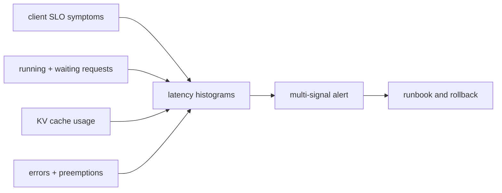

# 第 21 课 — 生产指标与可报警信号

> **谜题：**哪个指标能告诉你用户在等待，即使GPU利用率看起来很健康？

[← 第 03 章](../README.md) · [项目主页](../../../README_ZH.md) · [执行的笔记本](../../../chapters/03-vllm-inference-serving/21-production-metrics/lab.ipynb) · [RTX 5090 结果](../../../chapters/03-vllm-inference-serving/21-production-metrics/artifacts/rtx5090-result.json)

## 为什么这个谜题重要

GPU利用率可能在等待队列、预抢占、缓存压力或TTFT恶化的情况下仍然保持高位。操作需要请求、调度器、缓存和进程级别的信号，标签不应爆炸式增长。

## 阅读结果前，先做出预测

1. 预测在一次请求后出现哪些指标家族。
2. 区分计数器、计时器和直方图的使用。
3. 编写一个多信号队列告警。

## 1. 从具体的请求开始并陈述

实验室启动了一个真实的本地主机 vLLM 服务器，生成流量，抓取`/metrics`，解析Prometheus样本，并验证一个小的必需信号集。它保留名称和选定值，而不是无限制的抓取。

### 三个推理锚点

| # | 本课需要牢记的判断 |
|---:|---|
| 1 | 一个健康的过程不是一个健康的SLO。 |
| 2 | 指标类型决定了正确的查询。 |
| 3 | 低基数标签是生产需求。 |

## 2. 推导机制

计数器累积事件，应转换为速率；仪表表示当前队列/缓存状态；直方图支持时间上的延迟分布。警报应将症状如高TTFT与需求、运行/等待请求、缓存使用、错误和饱和度关联。请求ID和提示应归类于数据策略下的跟踪/日志，而非指标标签。

### 机制概览



### 逐步拆解

1. **从SLO.**选择用户可见的TTFT, ITL, 完成度, 和错误指示器。
2. **添加原因。**观察队列、缓存、抢占和进程饱和。
3. **尊重度量类型。**在窗口内计数器和聚合直方图。
4. **测试警报。**已知故障状态，请遵循运行手册。

## 3. 把理论转化为实验

**实验：**运行本地模型，发布流量，抓取Prometheus暴露信息，并验证所需的度量家族。

| 实验角色 | 固定定义 |
|---|---|
| 基准 | GPU利用率 |
| 候选方案 | 请求、调度器、缓存、延迟和错误信号 |
| 保持不变 | 同一服务器/模型，回环客户端，一个请求，抓取时间，和解析器 |
| 测量 | HTTP 状态码，指标家族计数，所需名称，选定值，以及不安全标签扫描 |
| 证据标签 | `native-backend` |

### 代码导读

解析器忽略注释，仅保留有限的数值样本。它扫描标签名称，寻找明显的请求内容字段，并存储一个有限的名称列表以供审查。

## 4. 解读仓库内的 RTX 5090 实测结果

**录制环境：**NVIDIA GeForce RTX 5090 计算能力12.0; PyTorch 2.13.0+cu130;CUDA 运行时13.0; vLLM 0.27.1.

| 实测字段 | 已提交值 |
|---|---:|
| 指标状态 | 200 |
| 指标家族 | 86 |
| 所需当前 | 5 |
| 所需总数 | 5 |
| 不安全标签 | 0 |
| 请求成功 | 是的 |

### 这些数字说明了什么

在本地流量之后，`/metrics` 返回 HTTP 200，带有 86 家族；5/5 所需的组被找到，并检测到 0 明显的内容/秘密标签。阈值需要时间序列。

## 5. 解答谜题并做出决策

> 本地抓取验证可观测性布线和可用信号名称；警报阈值需要时间序列工作负载证据。

### 验收与回滚门槛

只有在测试其度量语义、窗口、流量阈值、运行手册和误报行为后，才能创建警报。

### 这个结论可能如何失效

一次抓取无法计算率或分位数，如果没有并发负载，某些指标仍然为零。指标名称在不同版本之间可能会发生变化。

## 复现

仓库内记录的固定版本为 vLLM 和 0.27.1，以及本地 Qwen2.5-1.5B-Instruct 检查点。在 Linux CUDA 主机上，创建一个干净的环境，并将 `CH3_MODEL` 指向你的本地检查点：

```bash
uv venv .venv --python 3.12
source .venv/bin/activate
uv pip install vllm==0.27.1 nbclient nbformat ipykernel requests pyyaml --torch-backend=auto
export CH3_MODEL=/path/to/Qwen2.5-1.5B-Instruct
jupyter lab chapters/03-vllm-inference-serving/21-production-metrics/lab.ipynb
```

## 扩展实验

回放持续和过载流量，评估录制规则，测试警报，并将客户端TTFT与引擎直方图和日志相关联。

## 证据边界

**证据标签:** [`native-backend`](../../../chapters/03-vllm-inference-serving/README.md#evidence-labels). 命名的 vLLM 运行时在记录的GPU/模型/工作负载上执行。结果不会转移到另一个版本、模型、端点或流量分布。

## 参考资料

- [生产指标](https://docs.vllm.ai/en/latest/usage/metrics/)
- [Prometheus度量类型](https://prometheus.io/docs/concepts/metric_types/)
