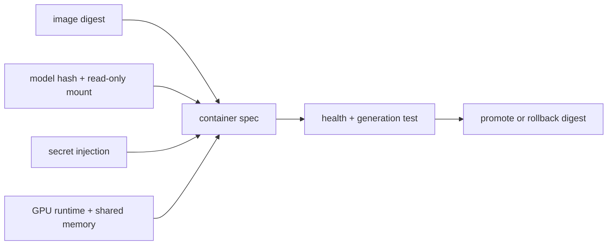

<!-- ai-infra-puzzles-header:start -->
<p align="center">
  
</p>

<h1 align="center">AI Infra Puzzles</h1>

<p align="center">
  <strong>Learn CUDA optimization and LLM inference through hands-on puzzles.</strong>
</p>
<!-- ai-infra-puzzles-header:end -->

# Lesson 22 — 一个可复现的单节点容器

> **谜题：** 容器规范必须在 vLLM 镜像标签之外锁定什么？

[← 第 03 章](../README.md) · [项目主页](../../../README_ZH.md) · [执行的笔记本](../../../chapters/03-vllm-inference-serving/22-docker-deployment/lab.ipynb) · [RTX 5090 结果](../../../chapters/03-vllm-inference-serving/22-docker-deployment/artifacts/rtx5090-result.json)

## 为什么这个谜题重要

容器打包用户空间，但仍然依赖于主机驱动/运行时集成、GPU可见性、共享内存、模型/缓存挂载、密钥、健康探针和回滚镜像摘要。

## 阅读结果前，先做出预测

1. 在草稿规范中找到所有可变标识符。
2. 检查模型文件是否以只读方式挂载。
3. 命名仍需进行的主机级测试。

## 1. 从具体的请求开始并陈述

配置审计构建Docker部署清单，验证摘要锁定、只读模型挂载、缓存分离、IPC/共享内存选择、密钥处理、健康检查和资源限制。Docker执行在远程训练容器中明确不存在。

### 三个推理锚点

| # | 本课需要牢记的判断 |
|---:|---|
| 1 | 这张图片中不包含主机GPU驱动程序。 |
| 2 | 浮动标签不是一个不可变的发布标识。 |
| 3 | 可写缓存、模型、日志和密钥有不同的生命周期规则。 |

## 2. 推导机制

NVIDIA 容器运行时将设备和驱动库传递到镜像中。vLLM 可能使用共享内存进行张量并行通信；模型缓存应保存在可写层之外。不可变的镜像摘要和模型哈希允许回滚，而 API 密钥应通过秘密机制进入，而不是通过命令参数。

### 机制概览



### 逐步拆解

1. **锁定不可变输入。**使用图像摘要、模型哈希和显式参数。
2. **分离挂载。**使模型只读，并有意设置缓存/日志目的地。
3.**注入运行时关注点。**配置 GPU 访问、共享内存、端口和密钥。
4.**在干净的主机上进行测试。**练习健康检查、生成、重启和回滚。

## 3. 把理论转化为实验

**实验：**生成并验证一个单节点容器清单文件，使其符合十二个部署不变量。

| 实验角色 | 固定定义 |
|---|---|
| 基准 | 一个未锁定的`latest`镜像和隐式卷 |
| 候选方案 | 锁定的摘要图像，明确的GPU/运行时，挂载，健康状态，密钥和回滚 |
| 保持不变 | 一个模型元数据，服务参数，端口和安全策略 |
| 测量 | 通过检查，失败检查，图像锁定，挂载模式，健康命令，以及原生Docker状态 |
| 证据标签 | `compatibility-probe` |

### 代码导读

该笔记本表示部署为数据，并评估命名检查。当守护进程不在环境中时，它不会调用Docker，因此不会暗示容器运行时成功。

## 4. 解读仓库内的 RTX 5090 实测结果

**录制环境：**NVIDIA GeForce RTX 5090 计算能力12.0; PyTorch 2.13.0+cu130;CUDA 运行时13.0; vLLM 0.27.1.

| 实测字段 | 已提交值 |
|---|---:|
| 检查通过 | 12 |
| 检查总数 | 12 |
| 图像摘要锁定 | 是的 |
| 模型只读 | 是的 |
| 秘密外部 | 是的 |
| 本地执行了 Docker | 否 |

### 这些数字说明了什么

清单通过了12/12静态不变量，包括摘要锁定、只读模型字节、外部秘密和启动感知的健康检查。没有调用Docker守护进程。

## 5. 解答谜题并做出决策

> 审核后的清单关闭了常见的可重复性和秘密处理的缺口；实际容器执行仍然是一个独立的主机测试。

### 验收与回滚门槛

在lint门禁和冷主机启动完成生成、健康检查、重启和回滚测试后，再推广容器规范。

### 这个结论可能如何失效

静态检查无法验证主机驱动程序兼容性、拉取权限、运行时钩子、实际共享内存需求或冷启动时间。

## 复现

仓库内记录的固定版本为 vLLM 和 0.27.1，以及本地 Qwen2.5-1.5B-Instruct 检查点。在 Linux CUDA 主机上，创建一个干净的环境，并将 `CH3_MODEL` 指向你的本地检查点：

```bash
uv venv .venv --python 3.12
source .venv/bin/activate
uv pip install vllm==0.27.1 nbclient nbformat ipykernel requests pyyaml --torch-backend=auto
export CH3_MODEL=/path/to/Qwen2.5-1.5B-Instruct
jupyter lab chapters/03-vllm-inference-serving/22-docker-deployment/lab.ipynb
```

## 扩展实验

在干净的GPU主机上运行摘要，验证模型哈希，发送流量，在加载期间重启，更换密钥，并回滚到之前的摘要。

## 证据边界

**证据标签:** [`compatibility-probe`](../../../chapters/03-vllm-inference-serving/README.md#evidence-labels). 已安装的包/API/配置表面进行了检查。可用性或lint成功并不等同于原生功能执行。

## 参考资料

- [部署 vLLM 时使用Docker](https://docs.vllm.ai/en/latest/deployment/docker/)
- [vLLM 安全策略](https://github.com/vllm-project/vllm/security/policy)
