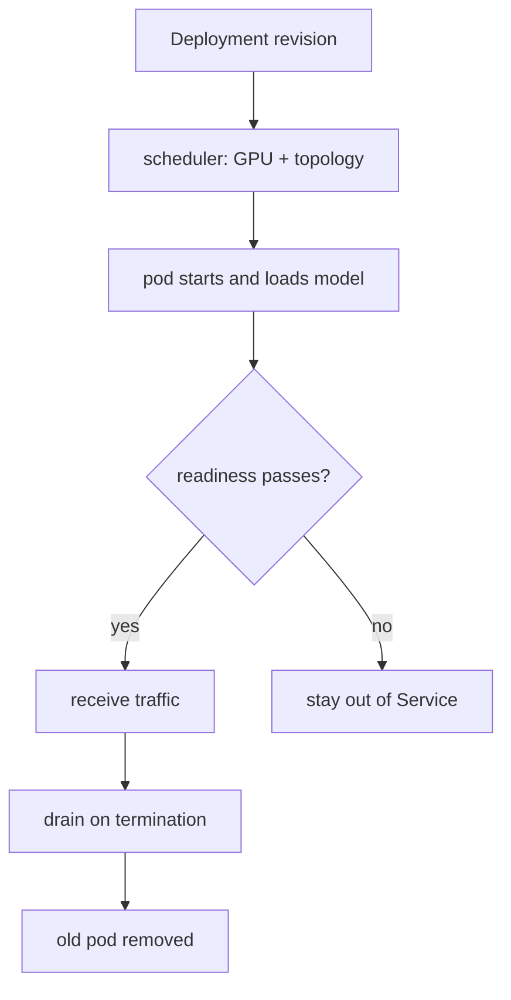

<!-- ai-infra-puzzles-header:start -->
<p align="center">
  
</p>

<h1 align="center">AI Infra Puzzles</h1>

<p align="center">
  <strong>Learn CUDA optimization and LLM inference through hands-on puzzles.</strong>
</p>
<!-- ai-infra-puzzles-header:end -->

# Lesson 23 — Kubernetes GPU Scheduling and Rollouts

> **谜题：**当每个副本都需要稀缺的GPU时，部署是否可以高度可用？30GB of model state?

[← 第 03 章](../README.md) · [项目主页](../../../README_ZH.md) · [执行的笔记本](../../../chapters/03-vllm-inference-serving/23-kubernetes-gpu-rollout/lab.ipynb) · [RTX 5090 结果](../../../chapters/03-vllm-inference-serving/23-kubernetes-gpu-rollout/artifacts/rtx5090-result.json)

## 为什么这个谜题重要

Kubernetes 可以重启进程和放置 pod，但不能创建 GPU 能力、缩短模型加载时间或使单个副本冗余。请求、拓扑、探针、中断预算和滚动升级必须围绕推理生命周期设计。

## 阅读结果前，先做出预测

1. 在进行两次副本最大突发部署时，计算所需的GPU数量。
2. 检查探针角色和宽限期。
3. 在应用manifest之前选择回滚信号。

## 1. 从具体的请求开始并陈述

实验室渲染并解析一个最小的部署/服务/PDB配置，然后检查GPU请求/限制、滚动更新可行性、就绪/启动探针、终止宽限期、缓存策略和反亲和性。没有声明任何集群。

### 三个推理锚点

| # | 本课需要牢记的判断 |
|---:|---|
| 1 | GPU 资源请求是放置合同。 |
| 2 | Liveness must not kill a healthy model during slow startup. |
| 3 | 零停机突发需要一个真正免费的GPU。 |

## 2. 推导机制

设备插件宣传GPU资源，调度器将它们视为不可分割。就绪状态应等待加载模型；启动探针保护缓慢初始化；preStop和Grace期引流流量。`maxSurge`需要备用GPU容量，而`maxUnavailable`以可用性为代价换取就地滚动部署。

### 机制概览



### 逐步拆解

1. **请求设备。**为每个服务Pod声明一个GPU资源。
2. **保护初始化。**使用启动和就绪探针，使用现实的模型负载窗口。
3. **预算部署。**确保存在突发容量，或接受可控的不可用性。
4. **排空并验证。**停止新流量，完成请求，并保留回滚证据。

## 3. 把理论转化为实验**实验：**验证GPU部署、服务和中断策略是否符合滚动部署和生命周期不变量。

| 实验角色 | 固定定义 |
|---|---|
| 基准 | 通用CPU风格部署默认值 |
| 候选方案 | GPU-aware resources, probes, drain, topology, and rollout budget |
| 保持不变 | 副本数量，一个GPU/Pod，模型加载时间，以及声明的集群容量 |
| 测量 | manifest检查，稳定GPU，突发GPU，容量可行性，探针存在性，以及本地集群状态 |
| 证据标签 | `compatibility-probe` |

### 代码导读

YAML被嵌入并解析为普通的字典。每个警告命名了缺失的操作后果，而不仅仅是失败的模式语法。

## 4. 解读仓库内的 RTX 5090 实测结果

**录制环境：**NVIDIA GeForce RTX 5090 计算能力12.0; PyTorch 2.13.0+cu130;CUDA 运行时13.0; vLLM 0.27.1.

| 实测字段 | 已提交值 |
|---|---:|
| 检查通过 | 8 |
| 检查总数 | 8 |
| 稳定的GPU | 2 |
| 部署GPU | 3 |
| 容量可行 | 是的 |
| 启动探针 | 是的 |
| 本地集群执行 | 否 |

### 这些数字说明了什么

清单通过了8/8检查。稳态/突发容量是2/3的3声明的GPU。这是配置可行性，而不是集群部署。

## 5. 解答谜题并做出决策

> 清单审计确定了调度和部署意图；Kubernetes的可用性在进行实际集群测试之前无法测量。

### 验收与回滚门槛

仅在稳定且已展示GPU容量、探针、引流、中断、指标和回滚修订均在预生产环境中验证后才应用。

### 这个结论可能如何失效

静态配置无法验证设备插件的健康状况、镜像/模型拉取时间、调度器碎片化、节点故障，或实际探测行为。

## 复现

仓库内记录的固定版本为 vLLM 和 0.27.1，以及本地 Qwen2.5-1.5B-Instruct 检查点。在 Linux CUDA 主机上，创建一个干净的环境，并将 `CH3_MODEL` 指向你的本地检查点：

```bash
uv venv .venv --python 3.12
source .venv/bin/activate
uv pip install vllm==0.27.1 nbclient nbformat ipykernel requests pyyaml --torch-backend=auto
export CH3_MODEL=/path/to/Qwen2.5-1.5B-Instruct
jupyter lab chapters/03-vllm-inference-serving/23-kubernetes-gpu-rollout/lab.ipynb
```

## 扩展实验

部署到测试集群，在负载期间删除pod/节点，运行金丝雀测试，使用饱和GPU进行滚动发布测试，并测量就绪时间和流量卸载时间。

## 证据边界

**证据标签:** [`compatibility-probe`](../../../chapters/03-vllm-inference-serving/README.md#evidence-labels). 已安装的包/API/配置表面进行了检查。可用性或lint成功并不等同于原生功能执行。

## 参考资料

- [KubernetesGPU 调度](https://kubernetes.io/docs/tasks/manage-gpus/scheduling-gpus/)
- [vLLM 生产堆栈](https://docs.vllm.ai/en/latest/deployment/integrations/production-stack/)
