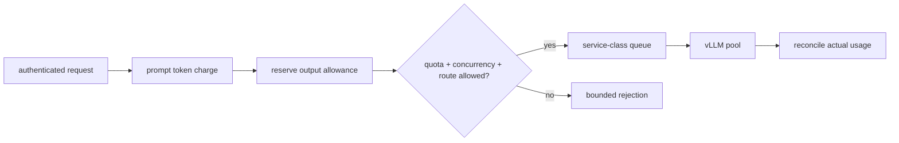

<!-- ai-infra-puzzles-header:start -->
<p align="center">
  
</p>

<h1 align="center">AI Infra Puzzles</h1>

<p align="center">
  <strong>Learn CUDA optimization and LLM inference through hands-on puzzles.</strong>
</p>
<!-- ai-infra-puzzles-header:end -->

# 第 24 课 — 网关准入、速率限制和多租户

> **谜题：**一个廉价的短请求和一个32K批次作业是否应该消耗相同的速率限制单元？

[← 第 03 章](../README.md) · [项目主页](../../../README_ZH.md) · [执行的笔记本](../../../chapters/03-vllm-inference-serving/24-gateway-multi-tenant/lab.ipynb) · [RTX 5090 结果](../../../chapters/03-vllm-inference-serving/24-gateway-multi-tenant/artifacts/rtx5090-result.json)

## 为什么这个谜题重要

请求计数限制忽略提示和输出工作。在共享GPU服务中，一个租户可以在保持每分钟请求数的情况下，用几个大任务填满队列或KV缓存。

## 阅读结果前，先做出预测

1. 预测哪个策略允许更多的超大批次工作。
2. 选择一个安全的输出保留规则。
3. 定义一个公平性门和一个SLO门。

## 1. 从具体的请求开始并陈述

确定性网关模拟比较交互式和批量租户的请求计数和token预算准入。它保留已准入的工作、拒绝、每租户等待时间和公平性指数。

### 三个推理锚点

| # | 本课需要牢记的判断 |
|---:|---|
| 1 | 入场费用应接近稀缺资源。 |
| 2 | 速率、并发和队列限制解决不同的滥用模式。 |
| 3 | 租户身份必须通过指标和审计来保持，而不泄露秘密。 |

## 2. 推导机制

token桶可以立即计费提示token并留出输出额度，然后调整实际使用情况。分离的服务类和并发限制防止大量批量流量占用所有活跃槽位。身份验证确定租户身份；授权将其映射到模型、适配器、预算和日志策略。

### 机制概览



### 逐步拆解

1. **验证身份。**将请求绑定到租户、路由和策略。
2.**估算资源成本。**启动提示工作并预留输出预算。
3. **应用分层限制。**检查速率、并发请求、队列深度和服务类。
4. **调整使用情况。**返回未使用的配额并审核实际的代币数量。

## 3. 把理论转化为实验**实验：**通过请求计数和token预算网关回放两个租户的工作负载。

| 实验角色 | 固定定义 |
|---|---|
| 基准 | 等量请求计数的桶 |
| 候选方案 | 提示/输出token预算加上并发和服务类 |
| 保持不变 | 相同的到达时间、token估计值、引擎容量和租户权重 |
| 测量 | 已接受请求/token，拒绝原因，P95等待时间，类隔离，以及公平性 |
| 证据标签 | `numerical-model` |

### 代码导读

模拟器将接纳与GPU调度分开，并记录每一个决策。其token成本是公开的估计，而不是秘密的模型计算。

## 4. 解读仓库内的 RTX 5090 实测结果

**录制环境：**NVIDIA GeForce RTX 5090 计算能力12.0; PyTorch 2.13.0+cu130;CUDA 运行时13.0; vLLM 0.27.1.

| 实测字段 | 已提交值 |
|---|---:|
| 计数策略允许的token | 21,540 |
| Token-policy 承认的token | 7,540 |
| 计策批处理接受 | 3 |
| Token-policy 批量承认 | 1 |
| Token-policy交互p95 | 0.000000 |
| Token-policy 公平性 | 0.576686 |

### 这些数字说明了什么

计数接受 21,540 token和 3 批次作业；token预算接受 7,540 和 1，同时保留交互式预算。队列成本被建模。

## 5. 解答谜题并做出决策

> Token-aware admission 更好地代表了推理成本，而不是请求数量，但生产限制需要原生流量校准。

### 验收与回滚门槛

只有当高级SLA、批量吞吐量、公平性、抗滥用性和使用对账都达到书面标准时，才采用该策略。

### 这个结论可能如何失效

客户可能会低估输出需求，分词化因模型而异，重试会放大负载。数值队列省略了缓存和实际调度器的交互。

## 复现

仓库内记录的固定版本为 vLLM 和 0.27.1，以及本地 Qwen2.5-1.5B-Instruct 检查点。在 Linux CUDA 主机上，创建一个干净的环境，并将 `CH3_MODEL` 指向你的本地检查点：

```bash
uv venv .venv --python 3.12
source .venv/bin/activate
uv pip install vllm==0.27.1 nbclient nbformat ipykernel requests pyyaml --torch-backend=auto
export CH3_MODEL=/path/to/Qwen2.5-1.5B-Instruct
jupyter lab chapters/03-vllm-inference-serving/24-gateway-multi-tenant/lab.ipynb
```

## 扩展实验

将网关放置在 vLLM warmup池之前，重放已签名的多租户流量，取消请求，耗尽配额，并将服务器使用情况与计费记录进行对账。

## 证据边界

**证据标签:** [`numerical-model`](../../../chapters/03-vllm-inference-serving/README.md#evidence-labels). 一个透明的分配器、调度器、网关或策略模型被执行。它建立了声明的不变量，而不是原生的。vLLM 性能

## 参考资料

- [兼容OpenAI的服务器](https://docs.vllm.ai/en/latest/serving/openai_compatible_server/)
- [生产指标](https://docs.vllm.ai/en/latest/usage/metrics/)
