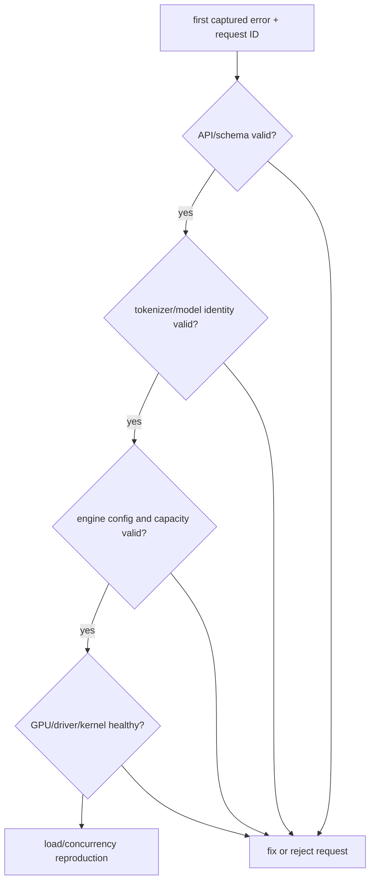

# Lesson 25 — 诊断OOM、CUDA 和Tokenizer失败

> **谜题：**当一个请求返回时，应该从哪里开始调查？500部署似乎很健康后？

[← 第 03 章](../README.md) · [项目主页](../../../README_ZH.md) · [执行的笔记本](../../../chapters/03-vllm-inference-serving/25-reliability-debugging/lab.ipynb) · [RTX 5090 结果](../../../chapters/03-vllm-inference-serving/25-reliability-debugging/artifacts/rtx5090-result.json)

## 为什么这个谜题重要

推理失败跨越API验证、分词器、模型/配置、调度器/缓存、CUDAkernel以及主机资源。随机更改内存使用率或重新安装包会破坏证据并隐藏第一个失败的层。

## 阅读结果前，先做出预测

1. 预测哪些安全无效输入在GPU执行前失败。
2. 列出诊断前捕获的环境事实。
3. 编写一个针对未解释的 CUDA 错误的回滚条件。

## 1. 从具体的请求开始并陈述

实验室对真实环境执行五层诊断检查表，并故意评估安全无效配置，不触发GPU OOM。它捕获通过/失败、版本、空闲内存、模型/分词器文件以及有界异常类。

### 三个推理锚点

| # | 本课需要牢记的判断 |
|---:|---|
| 1 | 在重试前保留第一个错误。 |
| 2 | 分词器/模型漂移可能表现为运行时回归。 |
| 3 | OOM 是预算违规，而不是盲目降低所有限制的理由。 |

## 2. 推导机制

从最早可重现的边界开始：请求模式和token计数，模型/分词器身份，引擎配置，GPU/驱动程序状态，然后是kernel/运行时日志。OOM调查需要自由/使用/保留内存，请求的上下文/并发性，以及缓存策略。CUDA 错误可能异步出现，因此原始操作和先前的日志很重要。

### 机制概览



### 逐步拆解

1. **冻结失败。**保存第一个请求、错误、版本和资源状态。
2.**从外面往里走。**验证API、token化、模型、引擎和GPU，按顺序进行。
3. **测试一个假设。**只修改第一层失败时隐含的变量。
4. **快速做出决定。**使用书面的金丝雀截止日期和回滚条件。

## 3. 把理论转化为实验**实验：**运行分层环境/配置/分词器诊断，并分类安全故障探针。

| 实验角色 | 固定定义 |
|---|---|
| 基准 | 无结构的试错 |
| 候选方案 | 有序请求→分词器→模型→引擎→GPU诊断 |
| 保持不变 | 当前环境，本地检查点，无破坏性OOM，捕获异常 |
| 测量 | 层检查，第一个失败的层，可用内存，分词成功，导入/CUDA 成功，以及安全探针分类 |
| 证据标签 | `compatibility-probe` |

### 代码导读

该笔记本从未分配到耗尽。它使用模式和配置检查来演示本地化，同时保留实际的堆栈身份。

## 4. 解读仓库内的 RTX 5090 实测结果

**录制环境：**NVIDIA GeForce RTX 5090 计算能力12.0; PyTorch 2.13.0+cu130;CUDA 运行时13.0; vLLM 0.27.1.

| 实测字段 | 已提交值 |
|---|---:|
| 检查通过 | 6 |
| 检查总数 | 6 |
| 第一层失败 | none |
| CUDA 可用 | 是的 |
| 空闲GPU 内存 | 31,603.688 MiB |
| 分词文件 | 4 |
| 安全故障分类 | 2 |

### 这些数字说明了什么

有序检查清单通过了 6 和 6 层次，第一次失败为 none；31603.7 MiB 为空闲状态，且 2 安全失败被分类，未导致 OOM。

## 5. 解答谜题并做出决策

> 分层诊断保留因果关系并缩短回滚决策；这个安全实验室验证了检查单而非引发生产故障。

### 验收与回滚门槛

在金丝雀窗口内无法重现并解释第一次失败，或者出现数据损坏/非确定性 CUDA 错误时，进行回滚。

### 这个结论可能如何失效

安全探针不会导致碎片化、NCCL故障、非法内存访问或负载依赖队列错误。通过诊断测试不是压力测试。

## 重现

仓库内记录的固定版本为 vLLM 和 0.27.1，以及本地 Qwen2.5-1.5B-Instruct 检查点。在 Linux CUDA 主机上，创建一个干净的环境，并将 `CH3_MODEL` 指向你的本地检查点：

```bash
uv venv .venv --python 3.12
source .venv/bin/activate
uv pip install vllm==0.27.1 nbclient nbformat ipykernel requests pyyaml --torch-backend=auto
export CH3_MODEL=/path/to/Qwen2.5-1.5B-Instruct
jupyter lab chapters/03-vllm-inference-serving/25-reliability-debugging/lab.ipynb
```

## 扩展实验

在预生产环境中使用相关ID和调试日志重放失败请求，然后添加针对性的并发、上下文、取消和故障注入测试。

## 证据边界

**证据标签:** [`compatibility-probe`](../../../chapters/03-vllm-inference-serving/README.md#evidence-labels). 已安装的包/API/配置表面进行了检查。可用性或lint成功并不等同于原生功能执行。

## 参考资料

- [vLLMGPU 安装](https://docs.vllm.ai/en/latest/getting_started/installation/gpu/)
- [vLLM 引擎参数](https://docs.vllm.ai/en/latest/configuration/engine_args/)
