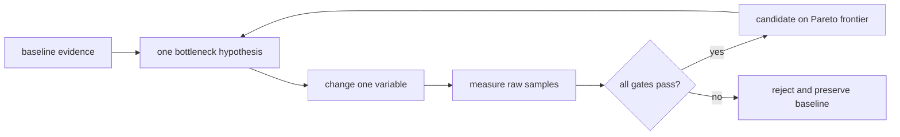

# Lesson 26 — 一个基于假设的调优循环

> **谜题：**当吞吐量低但p95已经接近时，应该首先调整哪个引擎旋钮？SLO?

[← 第 03 章](../README.md) · [项目主页](../../../README_ZH.md) · [执行的笔记本](../../../chapters/03-vllm-inference-serving/26-performance-tuning/lab.ipynb) · [RTX 5090 结果](../../../chapters/03-vllm-inference-serving/26-performance-tuning/artifacts/rtx5090-result.json)

## 为什么这个谜题重要

一次调整许多标志会导致不可重复的最优解。一个严谨的循环从瓶颈假设开始，改变一个因素，记录原始证据，并拒绝违反另一道门的改进。

## 阅读结果前，先做出预测

1. 预测吞吐量开始饱和的位置。
2. 确定保持不变的变量。
3. 在读取候选方案姓名之前应用门控。

## 1. 从具体的请求开始并陈述

本地实验室保持一个引擎和提示家族不变，同时扫过批次大小1、2、4和8。它计算输出吞吐量和一个延迟代理，然后应用声明的吞吐量/p95决策规则。

### 三个推理锚点

| # | 本课需要牢记的判断 |
|---:|---|
| 1 | 一个实验应该检验一个书面假设。 |
| 2 | 每个候选方案都保留所有接受度量。 |
| 3 | 带外的吞吐量增益不是赢家。 |

## 2. 推导机制

批量处理可以摊销权重读取并提高占用率，但封闭批量完成延迟会随着工作量的增加而增长。引擎限制如最大序列、最大批量token、内存利用率、急切执行和编译与工作负载形状相互作用。帕累托前沿比单一指标更有用。

### 机制概览



### 逐步拆解

1. **写出假设。**命名瓶颈并预期指标变动。
2.**冻结比较。**更改一个引擎或工作负载变量。
3. **保留分布。**保留样本、资源数据和错误计数。
4. **应用所有门控。**从可行的帕累托行中选择，并保留回滚。

## 3. 把理论转化为实验**实验：**运行本地批次大小扫查，并仅选择帕累托/门限可行的行。

| 实验角色 | 固定定义 |
|---|---|
| 基准 | batch size为一 |
| 候选方案 | batch size为二、四和八在一个引擎下 |
| 保持不变 | 模型，提示，token限制，采样，warmup，重复，和 GPU |
| 测量 | 原始耗时样本数，输出token/秒，批量完成P95，内存，可行集，以及选定行 |
| 证据标签 | `native-backend` |

### 代码导读

代码存储每个细胞的原始样本，并从数据中计算门限。它在同一实验中不调整引擎构建标志。

## 4. 解读仓库内的 RTX 5090 实测结果

**录制环境：**NVIDIA GeForce RTX 5090 计算能力12.0; PyTorch 2.13.0+cu130;CUDA 运行时13.0; vLLM 0.27.1.

| 实测字段 | 已提交值 |
|---|---:|
| 候选方案 | 4 |
| 可行候选方案 | 4 |
| 选定批次 | 8 |
| 选定吞吐量 | 925.4/s |
| 选定的 p95 | 0.180912 |
| 峰值分配 | 0.000 MiB |

### 这些数字说明了什么

单变量扫描保持了4/4行在0.426的闭合批次p95门限以下。批次8实现了925.4输出token/秒的可行吞吐量；在线延迟未推断。

## 5. 解答谜题并做出决策

> 调优结果是与冻结变量和原始证据的封闭比较，而不是未解释的标志集合。

### 验收与回滚门槛

选择最小复杂度的候选方案，该方案在所有质量、延迟、内存和错误门通过的情况下，实质性地提高目标指标。

### 这个结论可能如何失效

封闭批次不测量TTFT/ITL或到达队列。批次大小效应在编译、前缀缓存、量化或更长的输出后可能会有所不同。

## 复现

仓库内记录的固定版本为 vLLM 和 0.27.1，以及本地 Qwen2.5-1.5B-Instruct 检查点。在 Linux CUDA 主机上，创建一个干净的环境，并将 `CH3_MODEL` 指向你的本地检查点：

```bash
uv venv .venv --python 3.12
source .venv/bin/activate
uv pip install vllm==0.27.1 nbclient nbformat ipykernel requests pyyaml --torch-backend=auto
export CH3_MODEL=/path/to/Qwen2.5-1.5B-Instruct
jupyter lab chapters/03-vllm-inference-serving/26-performance-tuning/lab.ipynb
```

## 扩展实验

从本地配置文件中选择下一个单变量假设，然后重复进行开环服务流量和置信区间测试。

## 证据边界

**证据标签:** [`native-backend`](../../../chapters/03-vllm-inference-serving/README.md#evidence-labels). 命名的 vLLM 运行时在记录的GPU/模型/工作负载上执行。结果不会转移到另一个版本、模型、端点或流量分布。

## 参考资料

- [vLLM 基准测试命令行接口](https://docs.vllm.ai/en/latest/cli/bench/)
- [生产指标](https://docs.vllm.ai/en/latest/usage/metrics/)
