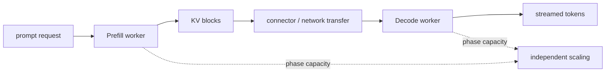

# Lesson 27 — 分散的 Prefill 和 Decode

> **谜题：**When does moving KV state between separatePrefill并且Decode工作者如何帮助尾部延迟？

[← 第 03 章](../README.md) · [项目主页](../../../README_ZH.md) · [执行的笔记本](../../../chapters/03-vllm-inference-serving/27-disaggregated-prefill-decode/lab.ipynb) · [RTX 5090 结果](../../../chapters/03-vllm-inference-serving/27-disaggregated-prefill-decode/artifacts/rtx5090-result.json)

## 为什么这个谜题重要

Prefill 和 Decode 有不同的批次和计算特性。将它们分开可以隔离干扰并独立地扩展阶段，但 KV 转移增加了带宽、序列化、路由和故障成本。

## 阅读结果前，先做出预测

1. 计算8K BF16 上下文的KV传输字节数。
2. 比较25和200的理想传输时间（单位：Gb/s）。
3. 写一份针对 Go 决策所需的本地证据。

## 1. 从具体的请求开始并陈述

单 GPU实验室探针安装KV-connector/NIXL接口，并评估在不同上下文大小和链路带宽下的容量模型。未声称支持双工原生部署。

### 三个推理锚点

| # | 本课需要牢记的判断 |
|---:|---|
| 1 | KV 转移位于请求的第一个token路径上。 |
| 2 | 相分离使独立扩展成为可能，但会复制其他资源。 |
| 3 | 连接器可用性不是工作中的双节点部署。 |

## 2. 推导机制

一个Prefill工作者创建的KV字节与提示token和模型缓存几何体成比例。在Decode可以继续到其他地方之前，该状态或可转移的表示必须变得可用。传输时间大约是字节除以有效带宽加上协调延迟。只有当保存队列/干扰时间超过目标可靠性水平的成本时，分拆才有帮助。

### 机制概览



### 逐步拆解

1. **测量相位干扰。**首先建立共置的TTFT/ITL问题。
2. **考虑 KV 字节。**从上下文和模型几何体推导传输大小。
3.**测试连接器。**测量应用带宽、协调和故障。
4. **比较完整的系统。**包括重复资源和端到端尾延迟。

## 3. 把理论转化为实验

**实验：**探测连接器词汇表并从本地模型几何体中计算传输折损行。

| 实验角色 | 固定定义 |
|---|---|
| 基准 | 共置Prefill/Decode，存在干扰 |
| 候选方案 | 分离工作者并进行KV传输 |
| 保持不变 | 模型几何，KVdtype，上下文长度，带宽假设，以及协调开销 |
| 测量 | KV字节，理想传输时间，平衡节省延迟，连接器符号，以及原生部署状态 |
| 证据标签 | `capacity-model` |

### 代码导读

该模型将带宽标记为假设，并且从不将理想链路速率替换为测量的应用吞吐量。连接器导入是独立记录的。

## 4. 解读仓库内的 RTX 5090 实测结果

**录制环境：**NVIDIA GeForce RTX 5090 计算能力12.0; PyTorch 2.13.0+cu130;CUDA 运行时13.0; vLLM 0.27.1.

| 实测字段 | 已提交值 |
|---|---:|
| BF16 字节/词 | 28,672 字节 |
| 8K KV传输 | 224.000 MiB |
| 8K at 25Gb/s | 75.511928 |
| 8K at 200Gb/s | 9.745241 |
| 连接器探针 | 是的 |
| 本地解耦 | 否 |

### 这些数字说明了什么

BF16KV 是28,672字节/词。一个8K提示符传输224.0MiB: 理想75.51/9.75ms at25/200每秒千兆位，包括声明的协调。没有发生双工运行。

## 5. 解答谜题并做出决策

> 收支平衡模型识别了值得测试的上下文和链接；它不是分散服务更快的证据。

### 验收与回滚门槛

只有在本地端到端p95指标在迁移、故障恢复、冗余容量和运营成本都考虑在内后有所改善时，才进行解耦。

### 这个结论可能如何失效

压缩、RDMA注册、拓扑、缓存重用、反压、故障和调度可以主导理想的传输算术。一个GPU不能独立执行这两个角色。

## 复现

仓库内记录的固定版本为 vLLM 和 0.27.1，以及本地 Qwen2.5-1.5B-Instruct 检查点。在 Linux CUDA 主机上，创建一个干净的环境，并将 `CH3_MODEL` 指向你的本地检查点：

```bash
uv venv .venv --python 3.12
source .venv/bin/activate
uv pip install vllm==0.27.1 nbclient nbformat ipykernel requests pyyaml --torch-backend=auto
export CH3_MODEL=/path/to/Qwen2.5-1.5B-Instruct
jupyter lab chapters/03-vllm-inference-serving/27-disaggregated-prefill-decode/lab.ipynb
```

## 扩展实验

部署两个支持的连接器的工人，跟踪KV事件，限制链接，杀死每个角色，并比较完全的TTFT/ITL分布与共定位。

## 证据边界

**证据标签:** [`capacity-model`](../../../chapters/03-vllm-inference-serving/README.md#evidence-labels). 测量环境事实提供明确的规划算术。假设的拓扑、需求、带宽和预留字段在本地部署测试之前仍为假设。

## 参考资料

- [离散预填充](https://docs.vllm.ai/en/latest/features/disagg_prefill/)
- [生产指标](https://docs.vllm.ai/en/latest/usage/metrics/)
