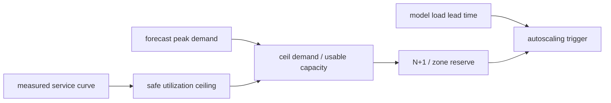

# 第 28 课 — 容量、成本与自动扩展

> **谜题：**平均流量舒适时，需要多少副本？SLO是不是？

[← 第 03 章](../README.md) · [项目主页](../../../README_ZH.md) · [执行的笔记本](../../../chapters/03-vllm-inference-serving/28-capacity-cost-autoscaling/lab.ipynb) · [RTX 5090 结果](../../../chapters/03-vllm-inference-serving/28-capacity-cost-autoscaling/artifacts/rtx5090-result.json)

## 为什么这个谜题重要

容量规划将测量的服务曲线转换为副本和预留。每秒平均token隐藏了突发性、请求/解码混合、故障储备以及接近饱和时的延迟悬崖。

## 阅读结果前，先做出预测

1. 在 50%、70% 和 85% 的利用率目标下计算副本。
2. 添加 N+1 预留。
3. 选择一个预饱和缩放信号。

## 1. 从具体的请求开始并陈述

实验室将一个队列/容量模型锚定到 RTX 5090 上的一个小的本地吞吐量测量值，然后计算三个需求场景下的副本数量，这些场景包括利用率和N+1储备。

### 三个推理锚点

| # | 本课需要牢记的判断 |
|---:|---|
| 1 | 饱和吞吐量不是一个SLO安全的操作点。 |
| 2 | 头程涵盖了突发、波动和失败——不仅仅是增长。 |
| 3 | 规模升级延迟必须与流量预测时间范围进行比较。 |

## 2. 推导机制

可用副本容量通过token throughput乘以安全利用率目标来衡量，而不是饱和最大值。所需副本是需求的上限除以可用容量，然后根据可用性和异构提示成本进行调整。自动缩放信号需要提前时间，因为新副本加载数以十亿计的权重。

### 机制概览



### 逐步拆解

1. **测量服务曲线。**找到仍然满足延迟要求的吞吐量SLO.
2. **选择操作余量。**预留容量以备变差和恢复。
3. **计算故障感知副本。**添加声明的可用性储备。
4.**触发在饱和之前。**考虑图像/模型加载及就绪延迟。

## 3. 把理论转化为实验

**实验：**测量一个原生 token 速率，并将其馈送到显式副本/自动扩展表中。

| 实验角色 | 固定定义 |
|---|---|
| 基准 | 从平均需求和峰值吞吐量中复制 |
| 候选方案 | SLO安全利用加上峰值需求，N+1，以及负载延迟 |
| 保持不变 | 测量模型/GPU速率，需求场景，利用率目标，以及可用性策略 |
| 测量 | 本地速率，可用速率，基础副本，保留副本，利用率，以及扩展触发器 |
| 证据标签 | `capacity-model` |

### 代码导读

测量和规划算术保持在不同的领域。一个场景不会改变测量的 RTX 5090 带宽值。

## 4. 解读仓库内的 RTX 5090 实测结果

**录制环境：**NVIDIA GeForce RTX 5090 计算能力12.0; PyTorch 2.13.0+cu130;CUDA 运行时13.0; vLLM 0.27.1.

| 实测字段 | 已提交值 |
|---|---:|
| 测得的输出 tok/s | 820.7/s |
| 安全使用 | 65.00% |
| 可用 tok/s | 533.4/s |
| 中等副本 | 4 |
| 峰值副本 | 6 |
| 规模扩展负责人 | 180.000000 |

### 这些数字说明了什么

本地封闭批次测量820.7输出tokens/s。在65%安全利用率下，中/高峰需要4/6副本包括N+1。在线服务曲线仍然需要。

## 5. 解答谜题并做出决策

> 副本算术必须锚定到一个SLO安全的服务曲线；当前的本地速率是实验室输入，不是生产容量。

### 验收与回滚门槛

在峰值跟踪回放确认选择的副本数量满足TTFT/ITL/错误门限，且有一个副本不可用后，才进行分配。

### 这个结论可能如何失效

离线率不包括在线排队和快速工作。成本因供应商、预订、电力和利用率而异；本课不引用货币价格。

## 复现

仓库内记录的固定版本为 vLLM 和 0.27.1，以及本地 Qwen2.5-1.5B-Instruct 检查点。在 Linux CUDA 主机上，创建一个干净的环境，并将 `CH3_MODEL` 指向你的本地检查点：

```bash
uv venv .venv --python 3.12
source .venv/bin/activate
uv pip install vllm==0.27.1 nbclient nbformat ipykernel requests pyyaml --torch-backend=auto
export CH3_MODEL=/path/to/Qwen2.5-1.5B-Instruct
jupyter lab chapters/03-vllm-inference-serving/28-capacity-cost-autoscaling/lab.ipynb
```

## 扩展实验

构建在线服务曲线，峰值时注入副本故障，测量启动时间，并在生产前验证预测或队列基于的自动扩展。

## 证据边界

**证据标签:** [`capacity-model`](../../../chapters/03-vllm-inference-serving/README.md#evidence-labels). 测量环境事实提供明确的规划算术。假设的拓扑、需求、带宽和预留字段在本地部署测试之前仍为假设。

## 参考资料

- [vLLM 基准测试命令行接口](https://docs.vllm.ai/en/latest/cli/bench/)
- [生产指标](https://docs.vllm.ai/en/latest/usage/metrics/)
