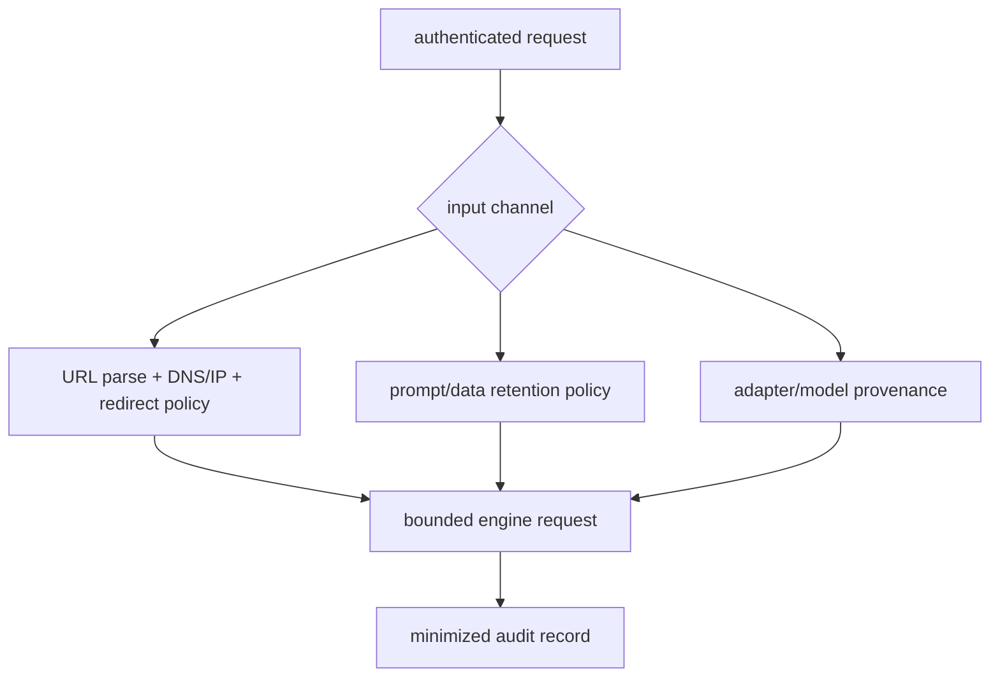

# Lesson 29 — 安全与合规边界

> **谜题：** 一个经过身份验证的生成请求是否仍然能够到达私有基础设施或泄露敏感数据？

[← 第 03 章](../README.md) · [项目主页](../../../README_ZH.md) · [执行的笔记本](../../../chapters/03-vllm-inference-serving/29-security-compliance/lab.ipynb) · [RTX 5090 结果](../../../chapters/03-vllm-inference-serving/29-security-compliance/artifacts/rtx5090-result.json)

## 为什么这个谜题重要

身份验证识别调用者；它不会使远程媒体URL、本地模型路径、自定义代码、提示、日志、适配器或生成的工具参数安全。每个输入通道都需要一个信任和保留决策。

## 阅读结果前，先做出预测

1. 将每个URL.fixture分类。
2. 查找缺失的数据策略字段。
3. 写一个远程代码或模型许可证的发布障碍。

## 1. 从具体的请求开始并陈述

实验室评估URL白名单/SSRF策略在公共、回环、链路本地、私有、格式错误和重定向类似情况下的表现；同时检查发布数据策略元数据中的秘密、提示日志和模型许可证字段。

### 三个推理锚点

| # | 本课需要牢记的判断 |
|---:|---|
| 1 | 身份验证和输入安全是独立的层次。 |
| 2 | DNS/redirect 重新验证在初始字符串检查后是必需的。 |
| 3 | 可观测性不能默然变成不定期提示存储。 |

## 2. 推导机制

SSRF防护解析URL，解析所有地址，拒绝非HTTP协议和私有/链路本地/环回范围，重新验证重定向，并限制大小/内容。提示和响应数据需要收集目的、加密、保留、删除和访问策略。模型许可证和`trust_remote_code`是供应链控制而非请求过滤器。

### 机制概览



### 逐步拆解

1. **列出输入通道。**包括URL，文件，提示，适配器，模式，以及自定义代码。
2. **解决后验证。**拒绝不安全的方案/地址，并重新检查重定向。
3.**最小化数据。**仅收集具有目的、保留、删除和访问规则的数据。
4. **防护供应链。**固定模型/适配器字节、许可证和可执行文件的信任。

## 3. 把理论转化为实验**实验：**运行确定性的 SSRF 政策测试用例，并检查服务数据/供应链清单。

| 实验角色 | 固定定义 |
|---|---|
| 基准 | 接受认证过的URL并记录完整的请求 |
| 候选方案 | 允许列表的目的地，解析的IP控制，有界的媒体，最小化的日志，以及来源门控 |
| 保持不变 | .fixture URLs, .simulated DNS map, .manifest schema, no external fetch, and .GPU identity |
| 测量 | 允许/禁止的案例，错误决策，政策检查，保留天数，以及发布阻止器 |
| 证据标签 | `numerical-model` |

### 代码导读

URL测试从未执行网络请求；冻结的DNS映射使得策略可审计且安全。清单语法检查器命名了所有缺失的控制。

## 4. 解读仓库内的 RTX 5090 实测结果

**录制环境：**NVIDIA GeForce RTX 5090 计算能力12.0; PyTorch 2.13.0+cu130;CUDA 运行时13.0; vLLM 0.27.1.

| 实测字段 | 已提交值 |
|---|---:|
| URL 案例 | 7 |
| URL 决策正确 | 7 |
| 私有阻塞 | 是的 |
| 本地链接被阻塞 | 是的 |
| 策略检查通过 | 7 |
| 政策检查总数 | 7 |
| 发布障碍 | 0 |

### 这些数字说明了什么

SSRF策略将7/7组件分类，并通过了7/7数据/供应链检查，留下了0拦截器。实际DNS/重定向测试仍需进行。

## 5. 解答谜题并做出决策

> 认证推理仍需严格的输入、供应链和数据生命周期控制；实验室验证政策逻辑，而非法律合规性。

### 验收与回滚门槛

在输入通道、密钥、远程代码、模型/许可证来源、数据保留、删除和事件所有权得到批准和测试之前，保持阻塞状态。

### 这个结论可能如何失效

模拟解析器不能暴露 DNS 重定向、代理行为、解析器不一致、解压缩炸弹或真实的重定向链。合规要求因司法管辖区和组织而异。

## 重现

仓库内记录的固定版本为 vLLM 和 0.27.1，以及本地 Qwen2.5-1.5B-Instruct 检查点。在 Linux CUDA 主机上，创建一个干净的环境，并将 `CH3_MODEL` 指向你的本地检查点：

```bash
uv venv .venv --python 3.12
source .venv/bin/activate
uv pip install vllm==0.27.1 nbclient nbformat ipykernel requests pyyaml --torch-backend=auto
export CH3_MODEL=/path/to/Qwen2.5-1.5B-Instruct
jupyter lab chapters/03-vllm-inference-serving/29-security-compliance/lab.ipynb
```

## 扩展实验

在隔离网络中测试网关获取器，使用重定向/重新绑定测试用例、恶意软件/媒体限制、审计访问、删除工作流程和法律审查。

## 证据边界

**证据标签:** [`numerical-model`](../../../chapters/03-vllm-inference-serving/README.md#evidence-labels). 一个透明的分配器、调度器、网关或策略模型被执行。它建立了声明的不变量，而不是原生的。vLLM 性能

## 参考资料

- [vLLM 安全策略](https://github.com/vllm-project/vllm/security/policy)
- [兼容OpenAI的服务器](https://docs.vllm.ai/en/latest/serving/openai_compatible_server/)
