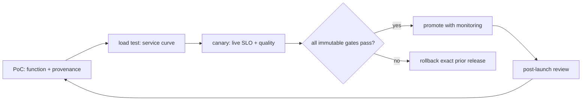

# Lesson 30 — 从PoC到 Canary：生产发布门

> **谜题：** 在成功演示成为可逆的服务发布之前，必须有哪些证据是真实的？

[← 第 03 章](../README.md) · [项目主页](../../../README_ZH.md) · [执行的笔记本](../../../chapters/03-vllm-inference-serving/30-production-launch/lab.ipynb) · [RTX 5090 结果](../../../chapters/03-vllm-inference-serving/30-production-launch/artifacts/rtx5090-result.json)

## 为什么这个谜题重要

生产发布是一个由文件支持的状态转换，而不是会议情绪。功能输出、质量、性能、容量、可观测性、安全、故障恢复和回滚必须统一到一个不可变的发布身份上。

## 阅读结果前，先做出预测

1. 预测哪些缺失的组件会阻塞状态机。
2. 检查每个上游证据哈希是否保留。
3. 写出确切的金丝雀回滚条件。

## 1. 从具体的请求开始并陈述

最终的笔记本在可用时读取早期章节 03 的数据块，验证其哈希值和所需的门控条件，创建发布清单，并运行一个确定性的 PoC→负载测试→金丝雀测试→推广状态机。缺失的证据块而不是默认通过。

### 三个推理锚点

| # | 本课需要牢记的判断 |
|---:|---|
| 1 | 发布身份包括代码、图像、模型、分词器、配置和环境。 |
| 2 | 每个阶段都有明确的证据和所有者。 |
| 3 | 回滚是在推广前测试的，而不是在事件中设计的。 |

## 2. 推导机制

每个阶段消耗证据并有退出标准。PoC（演示）建立原生功能和来源；负载测试建立服务曲线；金丝雀比较SLO/error/质量切片；推广需要监控和回滚准备。回滚触发器应从实时数据计算得出，并且之前的图像/模型/配置元组必须保持可部署。

### 机制概览



### 逐步拆解

1. **绑定发布身份。**哈希码，图像，模型，分词器，配置和证据。
2. **通过门控技术进步。**每个阶段需要功能、负载、安全性和恢复性证明。
3.**Canary with live comparators.**评估 SLO，错误、质量切片和饱和度。
4.**机械回滚。**保留并复述确切的先前可部署元组。

## 3. 把理论转化为实验**实验：**将选定的执行结果集中到一个不可变的发布门和状态机决策中。

| 实验角色 | 固定定义 |
|---|---|
| 基准 | 成功的演示和手动批准 |
| 候选方案 | 证据完备的 PoC、负载、金丝雀、推广和回滚闸门 |
| 保持不变 | 当前仓库的制品，所需课程集，阈值，发布ID，以及无虚构的通过项 |
| 测量 | artifact presence/hashes, 功能门限, 指标门限, 安全门限, 最终阶段, 阻塞项, 以及回滚准备 |
| 证据标签 | `capacity-model` |

### 代码导读

代码仅读取标准 JSON 文件，并计算其字节的哈希值。它拒绝从文字或缺失的指标中推断出通过。

## 4. 解读仓库内的 RTX 5090 实测结果

**录制环境：**NVIDIA GeForce RTX 5090 计算能力12.0; PyTorch 2.13.0+cu130;CUDA 运行时13.0; vLLM 0.27.1.

| 实测字段 | 已提交值 |
|---|---:|
| 所需文件 | 8 |
| 现有文件 | 8 |
| Artifact hashes | 8 |
| 门通过 | 8 |
| 门控总数 | 9 |
| 最终阶段 | blocked_before_promote |
| 发布就绪 | 否 |
| 阻塞 | 1 |

### 这些数字说明了什么

发现8/8文件并使用8哈希通过8/9检查点。最终阶段=blocked_before_promote，release_ready=False；故意回滚演习阻止实验室推广。

## 5. 解答谜题并做出决策

> 可逆释放是独立证据门的结合；任何缺失的必需证据正确地使候选者被阻塞。

### 验收与回滚门槛

只有所有必需的证据通过并且确切的上一个发布完成其恢复目标内的测试回滚后，才能进行推广。

### 这个结论可能如何失效

实验室的实验结果来自一个GPU，并且大多是合成流量。一个完整的清单在不同的区域、拓扑结构、模型、需求分布或合规范围下可能仍然无效。

## 复现

仓库内记录的固定版本为 vLLM 和 0.27.1，以及本地 Qwen2.5-1.5B-Instruct 检查点。在 Linux CUDA 主机上，创建一个干净的环境，并将 `CH3_MODEL` 指向你的本地检查点：

```bash
uv venv .venv --python 3.12
source .venv/bin/activate
uv pip install vllm==0.27.1 nbclient nbformat ipykernel requests pyyaml --torch-backend=auto
export CH3_MODEL=/path/to/Qwen2.5-1.5B-Instruct
jupyter lab chapters/03-vllm-inference-serving/30-production-launch/lab.ipynb
```

## 扩展实验

在预生产环境中运行manifest，并使用生产路由进行金丝雀测试，注入失败，排练回滚，记录审查所有者，并在任何输入哈希更改后重复此过程。

## 证据边界

**证据标签:** [`capacity-model`](../../../chapters/03-vllm-inference-serving/README.md#evidence-labels). 测量环境事实提供明确的规划算术。假设的拓扑、需求、带宽和预留字段在本地部署测试之前仍为假设。

## 参考资料

- [生产指标](https://docs.vllm.ai/en/latest/usage/metrics/)
- [vLLM 安全策略](https://github.com/vllm-project/vllm/security/policy)
