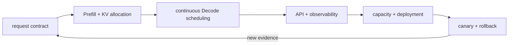

# 第 03 章 — vLLM 推理与服务

[← 中文首页](../../README_ZH.md) · [English chapter](../../chapters/03-vllm-inference-serving/README.md)

这 30 课沿着请求从 prompt 输入走向可逆的生产发布，涵盖 Prefill/Decode/KV state、PagedAttention、continuous batching、内存预算、离线与 OpenAI-compatible API、prefix caching、量化 KV、LoRA、speculative decoding、structured outputs、benchmark、metrics、容器、Kubernetes、多租户、诊断、容量、安全和 release gate。

本章围绕学习材料中的工程主题独立撰写，没有复制其 HTML 正文。每个实验都要求先做预测、固定比较条件、保留 RTX 5090 输出，并标明准确的证据类别。单 GPU 实验不会声称测量过八 GPU topology、Kubernetes cluster 或解耦式部署。



## 如何阅读一节课

1. 在打开保留结果之前，先提交预测。
2. 将Mermaid图表追踪到具体的请求、缓存状态和调度决策。
3. 在比较指标之前，请验证冻结的模型、采样、引擎和环境。
4. 在重用结论之前，请先应用证据标签并回滚门限。

## 证据标签

| 标签 | 它所建立的内容 |
|---|---|
| `native-backend` | 命名的 vLLM 运行时执行了记录的模型/工作负载 |
| `pytorch-gpu` | CUDA 通过 PyTorch 执行，无需声明未命名的运行时主张。 |
| `numerical-model` | 透明的机制/政策模型，而非原生服务性能 |
| `capacity-model` | 基于测量事实和明确假设的算术规划 |
| `compatibility-probe` | 已安装的API/配置及缺失本地执行的边界 |

## 第一阶段——服务基础：阶段、调度、内存和环境

| 课 | 核心决策 | 实验室 |
|---:|---|---|
| 01 | [推理服务瓶颈](01-inference-service-bottleneck/README.md) | [笔记本](../../chapters/03-vllm-inference-serving/01-inference-service-bottleneck/lab.ipynb) |
| 02 | [Prefill, Decode, 和 KV Cache](02-prefill-decode-kv-cache/README.md) | [笔记本](../../chapters/03-vllm-inference-serving/02-prefill-decode-kv-cache/lab.ipynb) |
| 03 | [PagedAttention 和 Block 表](03-pagedattention-block-tables/README.md) | [笔记本](../../chapters/03-vllm-inference-serving/03-pagedattention-block-tables/lab.ipynb) |
| 04 | [连续批次处理、吞吐量和公平性](04-continuous-batching/README.md) | [笔记本](../../chapters/03-vllm-inference-serving/04-continuous-batching/lab.ipynb) |
| 05 | [A KV-Cache Memory Budget](05-kv-memory-budget/README.md) | [笔记本](../../chapters/03-vllm-inference-serving/05-kv-memory-budget/lab.ipynb) |
| 06 | [安装可复现的 vLLM 环境](06-installation-compatibility/README.md) | [笔记本](../../chapters/03-vllm-inference-serving/06-installation-compatibility/lab.ipynb) |
## 第二阶段——核心API、请求合约、来源和并行放置

| 课 | 核心决策 | 实验室 |
|---:|---|---|
| 07 | [离线推理与LLM和SamplingParams](07-offline-llm-api/README.md) | [笔记本](../../chapters/03-vllm-inference-serving/07-offline-llm-api/lab.ipynb) |
| 08 | [OpenAI兼容的HTTP服务](08-openai-compatible-service/README.md) | [笔记本](../../chapters/03-vllm-inference-serving/08-openai-compatible-service/lab.ipynb) |
| 09 | [采样和输出控制](09-sampling-output-control/README.md) | [笔记本](../../chapters/03-vllm-inference-serving/09-sampling-output-control/lab.ipynb) |
| 10 | [模型加载，格式和来源](10-model-loading-provenance/README.md) | [笔记本](../../chapters/03-vllm-inference-serving/10-model-loading-provenance/lab.ipynb) |
| 11 | [张量，管道，数据，和专家并行计算](11-multi-gpu-parallelism/README.md) | [笔记本](../../chapters/03-vllm-inference-serving/11-multi-gpu-parallelism/lab.ipynb) |
## 第三阶段 — 缓存、量化、适配器、推测和模型能力

| 课 | 核心决策 | 实验室 |
|---:|---|---|
| 12 | [自动前缀缓存](12-automatic-prefix-caching/README.md) | [笔记本](../../chapters/03-vllm-inference-serving/12-automatic-prefix-caching/lab.ipynb) |
| 13 | [分段Prefill和Decode干扰](13-chunked-prefill/README.md) | [笔记本](../../chapters/03-vllm-inference-serving/13-chunked-prefill/lab.ipynb) |
| 14 | [权重量化部署合约](14-weight-quantization-deployment/README.md) | [笔记本](../../chapters/03-vllm-inference-serving/14-weight-quantization-deployment/lab.ipynb) |
| 15 | [FP8 KV Cache: 容量和忠实度](15-fp8-kv-cache/README.md) | [笔记本](../../chapters/03-vllm-inference-serving/15-fp8-kv-cache/lab.ipynb) |
| 16 | [提供 LoRA 适配器](16-lora-serving/README.md) | [笔记本](../../chapters/03-vllm-inference-serving/16-lora-serving/lab.ipynb) |
| 17 | [推测性解码和接受](17-speculative-decoding/README.md) | [笔记本](../../chapters/03-vllm-inference-serving/17-speculative-decoding/lab.ipynb) |
| 18 | [结构化输出和工具合约](18-structured-outputs-tools/README.md) | [笔记本](../../chapters/03-vllm-inference-serving/18-structured-outputs-tools/lab.ipynb) |
| 19 | [多模态、嵌入和重排序服务边界](19-multimodal-pooling-rerank/README.md) | [笔记本](../../chapters/03-vllm-inference-serving/19-multimodal-pooling-rerank/lab.ipynb) |
## 第四阶段 —— 基线测试、可观测性、部署、租户管理和诊断

| 课 | 核心决策 | 实验室 |
|---:|---|---|
| 20 | [基准测试延迟、吞吐量和工作负载](20-benchmarking-workloads/README.md) | [笔记本](../../chapters/03-vllm-inference-serving/20-benchmarking-workloads/lab.ipynb) |
| 21 | [生产指标和可报警信号](21-production-metrics/README.md) | [笔记本](../../chapters/03-vllm-inference-serving/21-production-metrics/lab.ipynb) |
| 22 | [一个可复现的单节点容器](22-docker-deployment/README.md) | [笔记本](../../chapters/03-vllm-inference-serving/22-docker-deployment/lab.ipynb) |
| 23 | [KubernetesGPU 调度与滚动](23-kubernetes-gpu-rollout/README.md) | [笔记本](../../chapters/03-vllm-inference-serving/23-kubernetes-gpu-rollout/lab.ipynb) |
| 24 | [网关准入、速率限制和多租户](24-gateway-multi-tenant/README.md) | [笔记本](../../chapters/03-vllm-inference-serving/24-gateway-multi-tenant/lab.ipynb) |
| 25 | [诊断OOM、CUDA 和Tokenizer故障](25-reliability-debugging/README.md) | [笔记本](../../chapters/03-vllm-inference-serving/25-reliability-debugging/lab.ipynb) |
## 第五阶段 — 调优、分解、容量、安全和发布

| 课 | 核心决策 | 实验室 |
|---:|---|---|
| 26 | [一个基于假设的调优循环](26-performance-tuning/README.md) | [笔记本](../../chapters/03-vllm-inference-serving/26-performance-tuning/lab.ipynb) |
| 27 | [解耦式 Prefill 与 Decode](27-disaggregated-prefill-decode/README.md) | [笔记本](../../chapters/03-vllm-inference-serving/27-disaggregated-prefill-decode/lab.ipynb) |
| 28 | [容量、成本与自动扩展](28-capacity-cost-autoscaling/README.md) | [笔记本](../../chapters/03-vllm-inference-serving/28-capacity-cost-autoscaling/lab.ipynb) |
| 29 | [安全与合规边界](29-security-compliance/README.md) | [笔记本](../../chapters/03-vllm-inference-serving/29-security-compliance/lab.ipynb) |
| 30 | [从PoC到金丝雀：生产发布门](30-production-launch/README.md) | [笔记本](../../chapters/03-vllm-inference-serving/30-production-launch/lab.ipynb) |

## 复现和验证

```bash
export CH3_MODEL=/path/to/Qwen2.5-1.5B-Instruct
python3 scripts/execute_chapter_notebooks.py --chapter 03 --start 1 --end 30
python3 scripts/build_chapter03_lessons.py
python3 scripts/validate_chapter.py 03
python3 scripts/audit_chapter03_delivery.py
```

已部署的环境使用 vLLM 和 0.27.1。请勿将它们替换为更新版本，并将数字视为软件栈未变进行比较。
