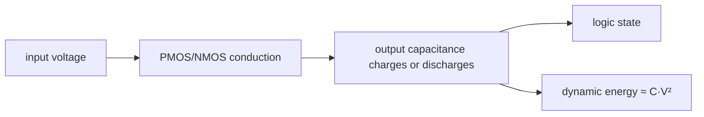
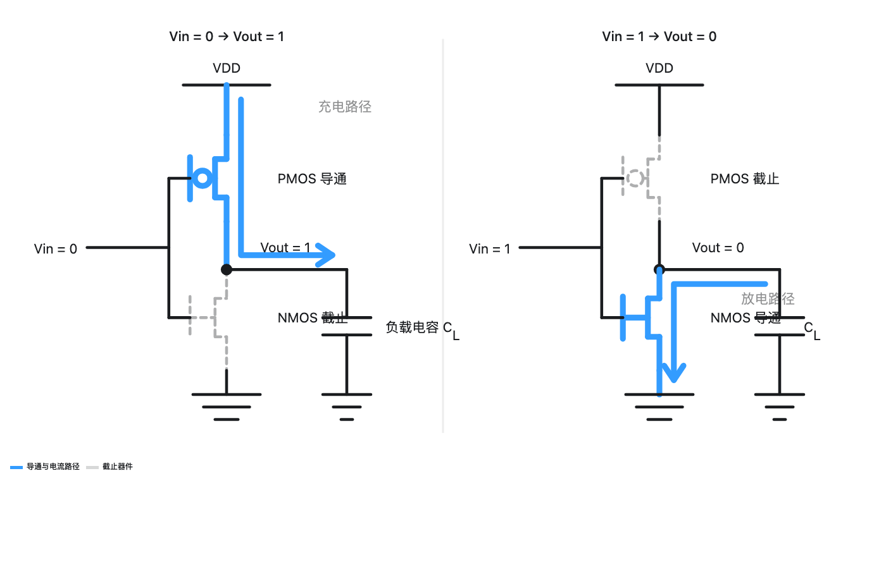

<!-- ai-infra-puzzles-header:start -->
<p align="center">
  
</p>

<h1 align="center">AI Infra Puzzles</h1>

<p align="center">
  <strong>Learn CUDA optimization and LLM inference through hands-on puzzles.</strong>
</p>
<!-- ai-infra-puzzles-header:end -->

# 第 01 课 — CMOS 开关、状态与动态功耗

> **问题：**晶体管并不保存 Python 变量，数十亿个开关如何组成状态？为什么电压会主导切换能耗？

[← 第 04 章](../README.md) · [English lesson](../../../chapters/04-gpu-hardware-foundations/01-cmos-switching-dynamic-power/README.md) · [实验 Notebook](../../../chapters/04-gpu-hardware-foundations/01-cmos-switching-dynamic-power/lab.ipynb) · [RTX 5090 结果](../../../chapters/04-gpu-hardware-foundations/01-cmos-switching-dynamic-power/artifacts/rtx5090-result.json)

## 为什么值得研究

GPU 性能的起点是一次真实的电压翻转。CMOS
反相器把输入电压映射到两个稳定输出区，两个反相器交叉耦合后便能保持一位状态。这里关心的不是背电路名词，而是建立系统直觉：每次时钟切换都要给电容充放电，活动率、电压、电容和频率共同构成功耗上限。

## 运行前先预测

1. 先判断输入为低、高电平时反相器的输出。
2. 在电容不变时，预测 1.0 V 与 0.8 V 的切换能量比。
3. 写出动态功耗模型没有覆盖的两个功耗来源。

## 1. 把机制放回物理空间

单个等效电容从 0 充到 1 时，电源提供的能量量级为 `C·V²`；常见的平均动态功耗模型是 `P_dynamic ≈
α·C·V²·f`。这是解释变量关系的一阶模型，不是显卡功耗计：漏电、短路电流、时钟树、片上存储、电源转换和任务放置都会增加额外项。实验固定其他变量，分别扫描电压、频率和活动率，让平方关系直接可见。

| # | 推理锚点 |
|---:|---|
| 1 | 逻辑状态由电压区间表示，不由软件类型表示。 |
| 2 | 交叉反馈形成可保持的状态；单个反相器只负责变换信号。 |
| 3 | 模型中的 `V²` 说明：相同比例下，电压变化比频率变化更敏感。 |

### 机制图



## 2. 读图



- [交互式反相器图](../../../chapters/04-gpu-hardware-foundations/assets/visualizations/cmos-inverter.html)

这些图用于解释数据路径，是概念性教学图，不是某款商业 GPU 的 die-accurate 电路图。

## 3. 把理论变成实验

**实验：**验证反相器真值表，并扫描透明的 `αCV²f` 模型。

| 实验角色 | 固定定义 |
|---|---|
| Baseline | 1.0 V、1 GHz，固定等效电容与活动率 |
| Candidate | 0.8 V，以及改变活动率或频率的场景 |
| 保持不变 | 电容、活动率及当前扫描之外的变量 |
| 测量内容 | 单次切换能量、动态功耗和电压能量比 |
| 证据标签 | `numerical-model` |

### 代码说明

代码直接用 SI 单位计算，再把结果转换为飞焦耳和毫瓦。它不会读取显卡板级功耗，也不会用这个公式反推 GPU 的电压—频率曲线。

## 4. 阅读仓库中的 RTX 5090 结果

**记录环境：**NVIDIA GeForce RTX 5090; compute capability 12.0; PyTorch 2.13.0+cu130; CUDA runtime 13.0; Python 3.12.3。

| 测量字段 | 仓库记录值 |
|---|---:|
| 1.0 V 切换能量 | 80.0000 |
| 0.8 V 切换能量 | 51.2000 |
| 能量比 | 1.562x |
| 基线动态功耗 | 0.0144 |

### 如何解释结果

本次记录的关键结果是：1.0 V 切换能量：80.0000，0.8 V 切换能量：51.2000，能量比：1.562x。这些数值只适用于上方记录的 GPU、软件栈、shape
与测量协议。结合本课的证据边界，结论是：用 `αCV²f` 判断方向和敏感度；判断真实 GPU 功耗时，必须回到硬件遥测与受控工作负载。

## 5. 得出有边界的结论

> 用 `αCV²f` 判断方向和敏感度；判断真实 GPU 功耗时，必须回到硬件遥测与受控工作负载。

### 结论可能失效的条件

等效电容和电压只是教学参数。真实 DVFS 会同时改变多个变量，不同工艺与温度下漏电占比也会变化。

## 复现

```bash
python3 -m pip install -r requirements-gpu-foundations.txt
python3 scripts/execute_chapter_notebooks.py --chapter 04 --start 1 --end 1
python3 scripts/build_chapter04_lessons.py
```

## 继续实验

对固定 CUDA 工作负载锁定多个频点采集板级功耗，只比较实测变化方向，不强求与一阶模型精确拟合。

## 证据边界

**证据标签：**[`numerical-model`](../README.md#证据标签)。运行的是透明机制模型。它只在打印出的假设下证明所述关系，不代表原生硬件延迟、能耗或拓扑。

## 参考资料

- [CUDA Programming Guide](https://docs.nvidia.com/cuda/cuda-programming-guide/)
- [NVIDIA A100 Tensor Core GPU Architecture Whitepaper](https://www.nvidia.com/content/dam/en-zz/Solutions/Data-Center/nvidia-ampere-architecture-whitepaper.pdf)
