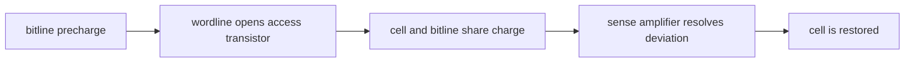
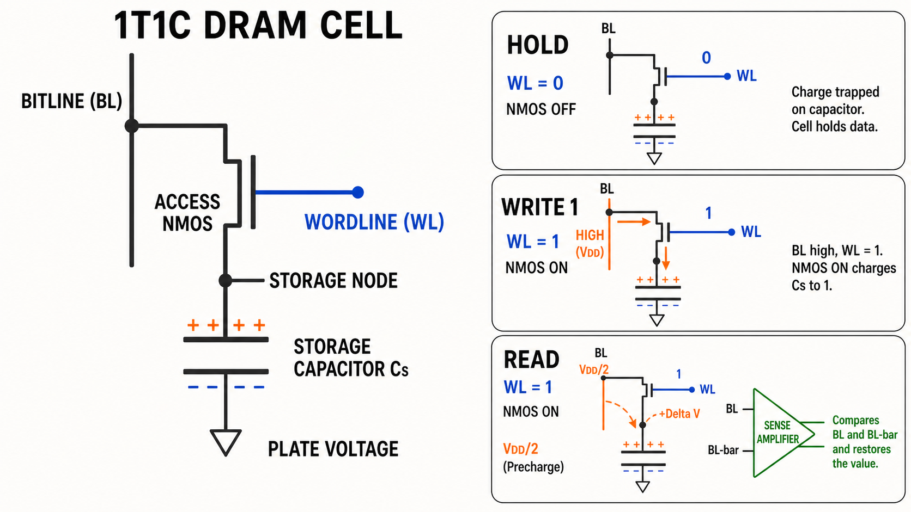
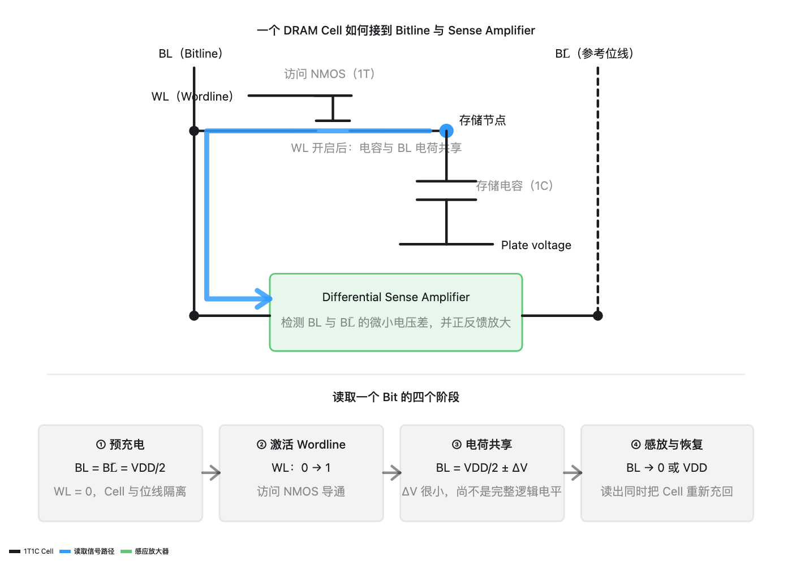

<!-- ai-infra-puzzles-header:start -->
<p align="center">
  
</p>

<h1 align="center">AI Infra Puzzles</h1>

<p align="center">
  <strong>Learn CUDA optimization and LLM inference through hands-on puzzles.</strong>
</p>
<!-- ai-infra-puzzles-header:end -->

# 第 02 课 — 1T1C DRAM：电荷共享、感放与恢复

> **问题：**DRAM 单元只有一个晶体管和一个微小电容，读取时电荷还会被扰动，它如何可靠恢复一位数据？

[← 第 04 章](../README.md) · [English lesson](../../../chapters/04-gpu-hardware-foundations/02-dram-1t1c-charge-sharing/README.md) · [实验 Notebook](../../../chapters/04-gpu-hardware-foundations/02-dram-1t1c-charge-sharing/lab.ipynb) · [RTX 5090 结果](../../../chapters/04-gpu-hardware-foundations/02-dram-1t1c-charge-sharing/artifacts/rtx5090-result.json)

## 为什么值得研究

1T1C 单元用更少的面积换来更复杂的读取流程。字线打开访问晶体管，单元电容与预充到 `VDD/2`
附近的位线发生电荷共享，感应放大器再把微小偏差放大成完整逻辑电平。读取改变了原有电荷，因此感放之后还必须恢复；电容漏电则要求周期性刷新。

## 运行前先预测

1. 判断存储 1 会让位线高于还是低于预充电压。
2. 预测位线电容增大 10 倍时感放裕量如何变化。
3. 解释为什么 DRAM 读取被称为破坏性读取。

## 1. 把机制放回物理空间

忽略寄生项时，共享后的电压为 `(Ccell·Vcell + Cbit·Vpre)/(Ccell +
Cbit)`，感放看到的信号就是它相对预充电压的偏移。位线电容越大，偏移越小；单元电压因漏电降低时，偏移也会减小。Notebook
同时扫描这两个因素，并记录恢复目标。它解释的是机制，不会声称还原某个商业 DRAM 的模拟电路参数。

| # | 推理锚点 |
|---:|---|
| 1 | 预充电在 `VDD/2` 附近建立中性参考。 |
| 2 | 电荷共享先产生微小模拟偏移，之后才得到数字位。 |
| 3 | 读取、感放和恢复是同一流程，缺少恢复就会丢失状态。 |

### 机制图



## 2. 读图





- [交互式 DRAM 读取图](../../../chapters/04-gpu-hardware-foundations/assets/visualizations/dram-1t1c-read-mechanism.html)

这些图用于解释数据路径，是概念性教学图，不是某款商业 GPU 的 die-accurate 电路图。

## 3. 把理论变成实验

**实验：**计算不同电容比与保持电压下的共享电压和感放裕量。

| 实验角色 | 固定定义 |
|---|---|
| Baseline | 新鲜的 1.0 V 单元，位线电容为单元电容的 10 倍 |
| Candidate | 更大的位线电容与发生漏电后的单元电压 |
| 保持不变 | VDD、预充电压及理想电荷守恒假设 |
| 测量内容 | 共享电压、感放裕量和裕量损失 |
| 证据标签 | `numerical-model` |

### 代码说明

实验用一个纯 Python 函数实现电荷守恒方程，显式扫描参数，并检查逻辑 1 在恢复后回到 VDD。模型不会凭空生成 DRAM 延迟。

## 4. 阅读仓库中的 RTX 5090 结果

**记录环境：**NVIDIA GeForce RTX 5090; compute capability 12.0; PyTorch 2.13.0+cu130; CUDA runtime 13.0; Python 3.12.3。

| 测量字段 | 仓库记录值 |
|---|---:|
| 新鲜单元裕量 | 45.4545 |
| 漏电后裕量 | 20.0000 |
| 保留的裕量 | 44.00% |
| 恢复目标 | 1.0000 |

### 如何解释结果

本次记录的关键结果是：新鲜单元裕量：45.4545，漏电后裕量：20.0000，保留的裕量：44.00%。这些数值只适用于上方记录的 GPU、软件栈、shape
与测量协议。结合本课的证据边界，结论是：把感放裕量看作电容物理与可靠数字位之间的桥梁；恢复与刷新都是存储协议的一部分。

## 5. 得出有边界的结论

> 把感放裕量看作电容物理与可靠数字位之间的桥梁；恢复与刷新都是存储协议的一部分。

### 结论可能失效的条件

模型省略了寄生电容、噪声、温度、工艺偏差、均衡电路和感放失调，只适合判断方向，不能用于芯片签核。

## 复现

```bash
python3 -m pip install -r requirements-gpu-foundations.txt
python3 scripts/execute_chapter_notebooks.py --chapter 04 --start 2 --end 2
python3 scripts/build_chapter04_lessons.py
```

## 继续实验

加入噪声与失调分布，把名义电压扩展为感放裕量失效概率。

## 证据边界

**证据标签：**[`numerical-model`](../README.md#证据标签)。运行的是透明机制模型。它只在打印出的假设下证明所述关系，不代表原生硬件延迟、能耗或拓扑。

## 参考资料

- [Micron Introduction to Memory](https://www.micron.com/content/dam/micron/educatorhub/intro-to-memory/MicronIntroduction-to-Memory-Presentation.pdf)
- [CUDA Programming Guide](https://docs.nvidia.com/cuda/cuda-programming-guide/)
