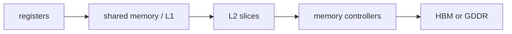

<!-- ai-infra-puzzles-header:start -->
<p align="center">
  
</p>

<h1 align="center">AI Infra Puzzles</h1>

<p align="center">
  <strong>Learn CUDA optimization and LLM inference through hands-on puzzles.</strong>
</p>
<!-- ai-infra-puzzles-header:end -->

# 第 03 课 — GPU 存储器的空间层级

> **问题：**同一个字节的数值没有变化，为什么放在寄存器里很便宜，放在外部显存里却很贵？

[← 第 04 章](../README.md) · [English lesson](../../../chapters/04-gpu-hardware-foundations/03-gpu-memory-spatial-hierarchy/README.md) · [实验 Notebook](../../../chapters/04-gpu-hardware-foundations/03-gpu-memory-spatial-hierarchy/lab.ipynb) · [RTX 5090 结果](../../../chapters/04-gpu-hardware-foundations/03-gpu-memory-spatial-hierarchy/artifacts/rtx5090-result.json)

## 为什么值得研究

GPU 的存储器名称同时说明物理位置和共享范围。寄存器与 shared memory 位于 SM 内部，L2 位于 GPU die 上并由多个 SM 共享，HBM 或 GDDR 位于
die 外，需要经过内存控制器和物理链路。越向外容量通常越大，但访问延迟、能耗和共享距离也会上升。CUDA 地址空间是这套物理层级之上的编程接口，并不等于逐电路映射。

## 运行前先预测

1. 按离 SM 从近到远排列寄存器、shared memory、L2 与 HBM/GDDR。
2. 预测复用次数为 1 和 32 时的外部显存字节数。
3. 解释为什么 CUDA local memory 不一定在片上。

## 1. 把机制放回物理空间

实验建立一个包含容量、示意延迟、共享范围和存储技术的层级表，再比较同一工作集在不同复用次数下的搬运成本。从外部显存取入一次、在片上重复使用多次，可以摊薄外层传输；只读一次的流式数据则不能。因此需要同时观察访问距离和复用次数，而不是只背一张延迟表。

| # | 推理锚点 |
|---:|---|
| 1 | 寄存器/shared memory、L2 与外部显存位于不同物理区域。 |
| 2 | 容量、共享范围、延迟与带宽是四个不同维度。 |
| 3 | 复用决定昂贵的外层路径要付多少次。 |

### 机制图



## 2. 读图


- [交互式存储布局](../../../chapters/04-gpu-hardware-foundations/assets/visualizations/gpu-memory-spatial-layout.html)

这些图用于解释数据路径，是概念性教学图，不是某款商业 GPU 的 die-accurate 电路图。

## 3. 把理论变成实验

**实验：**建立显式层级表，并用复用次数摊薄外部流量。

| 实验角色 | 固定定义 |
|---|---|
| Baseline | 固定工作集只流式读取一次 |
| Candidate | 同一工作集只搬入一次并在片上复用 |
| 保持不变 | 工作集大小与层级假设 |
| 测量内容 | 示意访问比与每次使用对应的外部字节 |
| 证据标签 | `capacity-model` |

### 代码说明

代码把层级写成可检查的数据，计算多种复用次数下每次逻辑使用对应的外部字节，并把 CUDA 设备显存容量作为真实环境事实打印出来。

## 4. 阅读仓库中的 RTX 5090 结果

**记录环境：**NVIDIA GeForce RTX 5090; compute capability 12.0; PyTorch 2.13.0+cu130; CUDA runtime 13.0; Python 3.12.3。

| 测量字段 | 仓库记录值 |
|---|---:|
| 设备显存 | 31.3583 |
| 流式场景每次字节 | 67,108,864 bytes |
| 32 次复用每次字节 | 2,097,152 bytes |
| 流量降低倍数 | 32.000x |

### 如何解释结果

本次记录的关键结果是：设备显存：31.3583，流式场景每次字节：67,108,864 bytes，32 次复用每次字节：2,097,152 bytes。这些数值只适用于上方记录的
GPU、软件栈、shape 与测量协议。结合本课的证据边界，结论是：只有明确共享范围和复用方式后才能讨论放置；脱离 tile 生命周期与共享契约的“更快内存”并不完整。

## 5. 得出有边界的结论

> 只有明确共享范围和复用方式后才能讨论放置；脱离 tile 生命周期与共享契约的“更快内存”并不完整。

### 结论可能失效的条件

延迟值只是教学比例，不是微基准结果。缓存替换、编译器决策、occupancy 与竞争都会改变实际路径。

## 复现

```bash
python3 -m pip install -r requirements-gpu-foundations.txt
python3 scripts/execute_chapter_notebooks.py --chapter 04 --start 3 --end 3
python3 scripts/build_chapter04_lessons.py
```

## 继续实验

用 Nsight Compute 采集 tiled kernel 的 DRAM、L2 与 L1/shared 流量，把实测复用率与模型对照。

## 证据边界

**证据标签：**[`capacity-model`](../README.md#证据标签)。实测环境事实进入显式容量或 Roofline 计算。层级和资源字段仍是声明的假设，需原生 counter 才能确认。

## 参考资料

- [CUDA Programming Guide](https://docs.nvidia.com/cuda/cuda-programming-guide/)
- [NVIDIA A100 Tensor Core GPU Architecture Whitepaper](https://www.nvidia.com/content/dam/en-zz/Solutions/Data-Center/nvidia-ampere-architecture-whitepaper.pdf)
