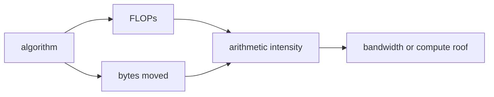

<!-- ai-infra-puzzles-header:start -->
<p align="center">
  
</p>

<h1 align="center">AI Infra Puzzles</h1>

<p align="center">
  <strong>Learn CUDA optimization and LLM inference through hands-on puzzles.</strong>
</p>
<!-- ai-infra-puzzles-header:end -->

# 第 04 课 — 为什么数据搬运可能比计算更贵

> **问题：**GPU 拥有很高的算力，为什么一个简单的逐元素操作仍可能很慢？

[← 第 04 章](../README.md) · [English lesson](../../../chapters/04-gpu-hardware-foundations/04-data-movement-roofline/README.md) · [实验 Notebook](../../../chapters/04-gpu-hardware-foundations/04-data-movement-roofline/lab.ipynb) · [RTX 5090 结果](../../../chapters/04-gpu-hardware-foundations/04-data-movement-roofline/artifacts/rtx5090-result.json)

## 为什么值得研究

执行单元拿到操作数之后才能计算。数据搬运会沿途激活连线、缓冲区、路由、标签、控制器和存储阵列；而一组已经靠近执行单元的数据可以被乘加多次。算术强度，即每搬运一个字节完成多少运算，把算法结构与这种物理差异连接起来。

## 运行前先预测

1. 判断哪种工作负载更接近带宽上限。
2. 按两次读取、一次写回计算向量加法强度。
3. 写出实测性能低于理论屋顶的一个原因。

## 1. 把机制放回物理空间

Roofline 上限为 `min(峰值算力, 带宽 × 算术强度)`。向量加法为一次加法读取两个数组、写回一个数组，算术强度很低；大矩阵乘利用 tile
复用数据，强度可高得多。Notebook 用同一套 CUDA Event 方法分别测量向量运算和 BF16 GEMM，同时保留分析字节数、FLOP 数、有效带宽与
TFLOP/s，不把这些指标混为一个排名。

| # | 推理锚点 |
|---:|---|
| 1 | 性能分析必须同时有运算量和字节量。 |
| 2 | 算术强度低时，带宽屋顶会先于算力屋顶限制性能。 |
| 3 | tiling 与 fusion 的价值在于减少或摊薄流量，而不是代码更复杂。 |

### 机制图



## 2. 读图

本课以 Mermaid 机制图和可执行测量为主。

## 3. 把理论变成实验

**实验：**在同一 GPU 上测量低强度向量表达式和高复用 BF16 GEMM。

| 实验角色 | 固定定义 |
|---|---|
| Baseline | 大张量上的逐元素 `a + b` |
| Candidate | 方形 BF16 矩阵乘 |
| 保持不变 | GPU、warm-up、重复次数、dtype 与 Event 计时方式 |
| 测量内容 | 算术强度、中位延迟、有效 GB/s 与 TFLOP/s |
| 证据标签 | `pytorch-gpu` |

### 代码说明

向量路径统计必要张量流量；GEMM 以 `2MNK` 计算 FLOP，并用输入输出字节估算算法强度。库内部实现与缓存流量留给 profiler 实测。

## 4. 阅读仓库中的 RTX 5090 结果

**记录环境：**NVIDIA GeForce RTX 5090; compute capability 12.0; PyTorch 2.13.0+cu130; CUDA runtime 13.0; Python 3.12.3。

| 测量字段 | 仓库记录值 |
|---|---:|
| 向量中位延迟 | 0.258 ms |
| 向量有效带宽 | 1,559.8007 |
| GEMM 中位延迟 | 0.104 ms |
| GEMM 吞吐 | 164.6843 |
| GEMM 算术强度 | 682.6667 |

### 如何解释结果

本次记录的关键结果是：向量中位延迟：0.258 ms，向量有效带宽：1,559.8007，GEMM 中位延迟：0.104 ms。这些数值只适用于上方记录的 GPU、软件栈、shape
与测量协议。结合本课的证据边界，结论是：先判断限制资源：带宽受限时优先减少流量，只有算力确实构成上限时才优先提高数学单元利用率。

## 5. 得出有边界的结论

> 先判断限制资源：带宽受限时优先减少流量，只有算力确实构成上限时才优先提高数学单元利用率。

### 结论可能失效的条件

有效带宽只按请求的张量字节计算，并不等于全部物理传输。GEMM 还会受到具体精度、kernel 与 shape 的影响。

## 复现

```bash
python3 -m pip install -r requirements-gpu-foundations.txt
python3 scripts/execute_chapter_notebooks.py --chapter 04 --start 4 --end 4
python3 scripts/build_chapter04_lessons.py
```

## 继续实验

用分层 Roofline counter 分析两种操作，再增加一个消除中间写回的 fused elementwise candidate。

## 证据边界

**证据标签：**[`pytorch-gpu`](../README.md#证据标签)。CUDA 工作通过 PyTorch 执行。没有额外 profiler 证据时，它不能定位内部指令、cache event 或私有硬件模块。

## 参考资料

- [NVIDIA Nsight Compute Roofline Analysis](https://developer.nvidia.com/blog/accelerating-hpc-applications-with-nsight-compute-roofline-analysis/)
- [CUDA C++ Best Practices Guide](https://docs.nvidia.com/cuda/cuda-c-best-practices-guide/)
