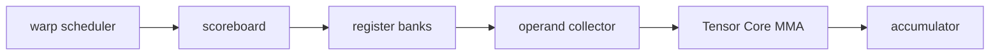

<!-- ai-infra-puzzles-header:start -->
<p align="center">
  
</p>

<h1 align="center">AI Infra Puzzles</h1>

<p align="center">
  <strong>Learn CUDA optimization and LLM inference through hands-on puzzles.</strong>
</p>
<!-- ai-infra-puzzles-header:end -->

# 第 05 课 — 向 SM 与 Tensor Core 喂数

> **问题：**GPU 明明有 Tensor Core，为什么矩阵形状稍微别扭就可能发挥不好？

[← 第 04 章](../README.md) · [English lesson](../../../chapters/04-gpu-hardware-foundations/05-sm-tensor-core-data-path/README.md) · [实验 Notebook](../../../chapters/04-gpu-hardware-foundations/05-sm-tensor-core-data-path/lab.ipynb) · [RTX 5090 结果](../../../chapters/04-gpu-hardware-foundations/05-sm-tensor-core-data-path/artifacts/rtx5090-result.json)

## 为什么值得研究

Tensor Core 是 SM 内部的执行单元，不是一台自动接单的矩阵服务器。指令需要被调度，操作数要从寄存器 bank 和 operand collector 送入，tile
还要符合支持的 dtype 与布局。访存、发射、依赖、寄存器压力和 tile 几何都可能让计算管线吃不饱。

## 运行前先预测

1. 预测哪个 shape 会被库更高效地执行。
2. 列出从 L2 返回数据到矩阵操作数的路径。
3. 写出证明 Tensor Core dispatch 所需的证据。

## 1. 把机制放回物理空间

实验比较一个对齐良好的 BF16 GEMM 与一个尺寸略不规则的 GEMM，两者保持相近的计算规模，记录延迟和实际吞吐，并读取 GPU compute
capability。即使对齐形状更快，也只能说明这两个库调度 shape 的差异；要证明执行了某条 Tensor Core 指令，还需要 kernel 或 profiler 证据。

| # | 推理锚点 |
|---:|---|
| 1 | SM 同时包含调度、存储、load/store、标量/向量与矩阵资源。 |
| 2 | Tensor Core 吞吐取决于受支持的指令以及持续供数。 |
| 3 | shape 对齐是需要实测的库契约，不是从文章里抄一个万能倍数。 |

### 机制图



## 2. 读图

本课以 Mermaid 机制图和可执行测量为主。

## 3. 把理论变成实验

**实验：**测量计算规模接近的对齐与非规则 BF16 GEMM。

| 实验角色 | 固定定义 |
|---|---|
| Baseline | 与常见库 tile 对齐的方形维度 |
| Candidate | 相邻但不规则的 M/N/K 维度 |
| 保持不变 | dtype、GPU、计时、warm-up 与近似 FLOP 量 |
| 测量内容 | 中位延迟、实际 TFLOP/s 与吞吐比 |
| 证据标签 | `pytorch-gpu` |

### 代码说明

两个候选都调用 `torch.mm`，由已安装的 PyTorch/cuBLAS 选择 tactic。代码用 Event 同步并校验输出 shape，不会在没有 trace
时给内部指令贴标签。

## 4. 阅读仓库中的 RTX 5090 结果

**记录环境：**NVIDIA GeForce RTX 5090; compute capability 12.0; PyTorch 2.13.0+cu130; CUDA runtime 13.0; Python 3.12.3。

| 测量字段 | 仓库记录值 |
|---|---:|
| 对齐形状中位延迟 | 0.104 ms |
| 非规则形状中位延迟 | 0.175 ms |
| 对齐形状吞吐 | 165.3437 |
| 非规则形状吞吐 | 97.7816 |
| 对齐/非规则吞吐比 | 1.691x |

### 如何解释结果

本次记录的关键结果是：对齐形状中位延迟：0.104 ms，非规则形状中位延迟：0.175 ms，对齐形状吞吐：165.3437。这些数值只适用于上方记录的 GPU、软件栈、shape
与测量协议。结合本课的证据边界，结论是：把对齐看作需要测量的性能变量，并随结果保留完整 shape、dtype 与 backend 身份。

## 5. 得出有边界的结论

> 把对齐看作需要测量的性能变量，并随结果保留完整 shape、dtype 与 backend 身份。

### 结论可能失效的条件

库 autotuning、频率、workspace 与架构都可能改变 kernel 选择。不规则 shape 也不一定更慢，尤其当总工作量更小时。

## 复现

```bash
python3 -m pip install -r requirements-gpu-foundations.txt
python3 scripts/execute_chapter_notebooks.py --chapter 04 --start 5 --end 5
python3 scripts/build_chapter04_lessons.py
```

## 继续实验

用 Nsight Compute 采集指令混合，并在多个 tile 边界附近分别扫描 M、N、K。

## 证据边界

**证据标签：**[`pytorch-gpu`](../README.md#证据标签)。CUDA 工作通过 PyTorch 执行。没有额外 profiler 证据时，它不能定位内部指令、cache event 或私有硬件模块。

## 参考资料

- [NVIDIA A100 Tensor Core GPU Architecture Whitepaper](https://www.nvidia.com/content/dam/en-zz/Solutions/Data-Center/nvidia-ampere-architecture-whitepaper.pdf)
- [CUDA C++ Best Practices Guide](https://docs.nvidia.com/cuda/cuda-c-best-practices-guide/)
