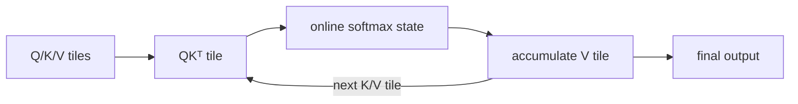

<!-- ai-infra-puzzles-header:start -->
<p align="center">
  
</p>

<h1 align="center">AI Infra Puzzles</h1>

<p align="center">
  <strong>Learn CUDA optimization and LLM inference through hands-on puzzles.</strong>
</p>
<!-- ai-infra-puzzles-header:end -->

# 第 06 课 — Attention 加速首先是 IO 问题

> **问题：**精确 attention 的数学结果没有改变，为什么只重排执行顺序就能降低内存与延迟？

[← 第 04 章](../README.md) · [English lesson](../../../chapters/04-gpu-hardware-foundations/06-attention-io-tiling/README.md) · [实验 Notebook](../../../chapters/04-gpu-hardware-foundations/06-attention-io-tiling/lab.ipynb) · [RTX 5090 结果](../../../chapters/04-gpu-hardware-foundations/06-attention-io-tiling/artifacts/rtx5090-result.json)

## 为什么值得研究

朴素 attention 先形成 `QKᵀ`，再做 softmax 并乘以 `V`。score/probability
张量随序列长度平方增长，往往要写入并读回外部显存。IO-aware attention 把 Q、K、V 分块送入片上存储，并维护 online softmax
统计量，从而避免完整物化，在浮点顺序误差范围内保持同一数学操作。

## 运行前先预测

1. 预测固定 shape 下 eager score 张量的大小。
2. 预测哪条路径的 peak allocated memory 更低。
3. 查看输出误差前先确定数值容差。

## 1. 把机制放回物理空间

Notebook 明确实现 eager baseline，并与 PyTorch scaled-dot-product attention 比较。每条路径都会重置 allocator
peak，记录输出误差、CUDA Event 延迟和峰值 allocated memory。PyTorch 会根据输入与软件构建选择 fused 或 math
backend，因此结果只声明 API 与环境；没有 backend 诊断时，不会擅自声称运行了某个 FlashAttention kernel。

| # | 推理锚点 |
|---:|---|
| 1 | 二次方规模的 score 张量是执行选择，不是最终输出 shape。 |
| 2 | tiling 用片上状态和少量重计算换取更少的外部读写。 |
| 3 | 数学上精确不代表浮点计算顺序逐位相同。 |

### 机制图



## 2. 读图

本课以 Mermaid 机制图和可执行测量为主。

## 3. 把理论变成实验

**实验：**在固定 BF16 shape 下比较显式 eager attention 与 PyTorch SDPA。

| 实验角色 | 固定定义 |
|---|---|
| Baseline | 显式物化 score、softmax probability，再计算输出 |
| Candidate | 由 PyTorch 选择 backend 的 `scaled_dot_product_attention` |
| 保持不变 | Q/K/V 张量、scale、dtype、shape、warm-up 与重复次数 |
| 测量内容 | score 字节数、延迟、峰值 allocated memory 与最大输出误差 |
| 证据标签 | `pytorch-gpu` |

### 代码说明

eager 函数刻意保持可读。两条测量路径分别重置峰值、执行、同步并保留输出用于误差检查，从而区分算法中间张量大小与 allocator 证据。

## 4. 阅读仓库中的 RTX 5090 结果

**记录环境：**NVIDIA GeForce RTX 5090; compute capability 12.0; PyTorch 2.13.0+cu130; CUDA runtime 13.0; Python 3.12.3。

| 测量字段 | 仓库记录值 |
|---|---:|
| Eager score 张量 | 32.000 MiB |
| Eager 中位延迟 | 0.226 ms |
| SDPA 中位延迟 | 0.041 ms |
| Eager 峰值内存 | 160.000 MiB |
| SDPA 峰值内存 | 2.063 MiB |
| 最大输出误差 | 0.0039 |

### 如何解释结果

本次记录的关键结果是：Eager score 张量：32.000 MiB，Eager 中位延迟：0.226 ms，SDPA 中位延迟：0.041 ms。这些数值只适用于上方记录的
GPU、软件栈、shape 与测量协议。结合本课的证据边界，结论是：只有在数值契约和 shape 支持都满足时才采用 IO-aware 路径；backend
或精度约束不满足时应显式回退。

## 5. 得出有边界的结论

> 只有在数值契约和 shape 支持都满足时才采用 IO-aware 路径；backend 或精度约束不满足时应显式回退。

### 结论可能失效的条件

allocator peak 不等于物理显存流量，单个 shape 也不能证明缩放规律。PyTorch、driver、mask、dropout、dtype 或 head
dimension 都可能改变 backend。

## 复现

```bash
python3 -m pip install -r requirements-gpu-foundations.txt
python3 scripts/execute_chapter_notebooks.py --chapter 04 --start 6 --end 6
python3 scripts/build_chapter04_lessons.py
```

## 继续实验

扫描 sequence length、causal 与 mask 模式，记录 SDPA backend 诊断，再用 Nsight Compute 测量 DRAM 字节。

## 证据边界

**证据标签：**[`pytorch-gpu`](../README.md#证据标签)。CUDA 工作通过 PyTorch 执行。没有额外 profiler 证据时，它不能定位内部指令、cache event 或私有硬件模块。

## 参考资料

- [FlashAttention: Fast and Memory-Efficient Exact Attention with IO-Awareness](https://arxiv.org/abs/2205.14135)
- [PyTorch scaled dot product attention](https://docs.pytorch.org/docs/stable/generated/torch.nn.functional.scaled_dot_product_attention.html)
