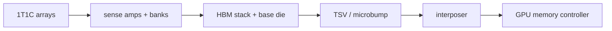

<!-- ai-infra-puzzles-header:start -->
<p align="center">
  
</p>

<h1 align="center">AI Infra Puzzles</h1>

<p align="center">
  <strong>Learn CUDA optimization and LLM inference through hands-on puzzles.</strong>
</p>
<!-- ai-infra-puzzles-header:end -->

# 第 07 课 — 从 DRAM 单元到 HBM 封装

> **问题：**HBM 单元仍然是 DRAM，它的高带宽究竟从哪里来？

[← 第 04 章](../README.md) · [English lesson](../../../chapters/04-gpu-hardware-foundations/07-hbm-circuit-to-package/README.md) · [实验 Notebook](../../../chapters/04-gpu-hardware-foundations/07-hbm-circuit-to-package/lab.ipynb) · [RTX 5090 结果](../../../chapters/04-gpu-hardware-foundations/07-hbm-circuit-to-package/artifacts/rtx5090-result.json)

## 为什么值得研究

HBM 把多层 DRAM die 堆叠起来，通过 TSV、microbump、base die 和 silicon interposer，在封装内靠近 GPU
建立大量并行信号。存储单元仍靠电荷保存数据，仍需要感放、行、bank 与刷新。高带宽主要来自更宽、更并行的接口与封装集成，而不是把 DRAM 变成 SRAM。

## 运行前先预测

1. 追踪一次读取从 cell array 到 GPU memory controller 的路径。
2. 计算 512-bit、每 pin 28 Gb/s 接口的理论带宽。
3. 预测 copy benchmark 为什么达不到精确理论值。

## 1. 把机制放回物理空间

理论接口带宽为 `总线位宽 × 每 pin 速率 / 8`。Notebook 先计算这条关系，再在 RTX 5090 上测量大张量 device-to-device copy；5090
使用的是 GDDR7，不是 HBM。这个对照是刻意的：带宽公式可以迁移，但实测环境必须如实标注外部显存技术。有效 copy 带宽按一次读取加一次写回统计字节。

| # | 推理锚点 |
|---:|---|
| 1 | HBM 是封装外部显存，不是 SM 本地缓存。 |
| 2 | TSV 与 interposer 建立宽通路，bank 提供内部并行。 |
| 3 | 理论接口带宽和应用实测带宽是两个量。 |

### 机制图



## 2. 读图


- [可打印 HBM 图](../../../chapters/04-gpu-hardware-foundations/assets/HBM_circuit_to_gpu_connection_A4_portrait.pdf)

这些图用于解释数据路径，是概念性教学图，不是某款商业 GPU 的 die-accurate 电路图。

## 3. 把理论变成实验

**实验：**计算宽接口理论带宽，并测量大规模 CUDA device copy。

| 实验角色 | 固定定义 |
|---|---|
| Baseline | 由接口宽度与 pin 速率计算的理论带宽 |
| Candidate | RTX 5090 device copy 有效带宽 |
| 保持不变 | 张量大小、dtype、warm-up、重复次数与 Event 计时 |
| 测量内容 | 理论 GB/s、copy 中位延迟、有效 GB/s 与理论占比 |
| 证据标签 | `pytorch-gpu` |

### 代码说明

预先分配 source 和 destination，避免把 allocator 时间算入。`copy_` 在 CUDA Event 之间重复执行，请求流量按 source read 加
destination write 统计。公式示例对应 5090 官方接口字段，但不会把 GDDR7 写成 HBM。

## 4. 阅读仓库中的 RTX 5090 结果

**记录环境：**NVIDIA GeForce RTX 5090; compute capability 12.0; PyTorch 2.13.0+cu130; CUDA runtime 13.0; Python 3.12.3。

| 测量字段 | 仓库记录值 |
|---|---:|
| 理论接口带宽 | 1,792.0000 |
| Copy 中位延迟 | 0.353 ms |
| 有效 copy 带宽 | 1,521.0532 |
| 实测/理论 | 84.88% |

### 如何解释结果

本次记录的关键结果是：理论接口带宽：1,792.0000，Copy 中位延迟：0.353 ms，有效 copy 带宽：1,521.0532。这些数值只适用于上方记录的
GPU、软件栈、shape 与测量协议。结合本课的证据边界，结论是：用宽接口公式给出上限，用受控 benchmark 给出实际值；始终注明显存技术和字节统计口径。

## 5. 得出有边界的结论

> 用宽接口公式给出上限，用受控 benchmark 给出实际值；始终注明显存技术和字节统计口径。

### 结论可能失效的条件

copy engine、cache、频率、温度、tensor 大小、ECC 与字节口径都会影响比例；不同产品和代际的 HBM 封装也不相同。

## 复现

```bash
python3 -m pip install -r requirements-gpu-foundations.txt
python3 scripts/execute_chapter_notebooks.py --chapter 04 --start 7 --end 7
python3 scripts/build_chapter04_lessons.py
```

## 继续实验

增加 streaming triad kernel 与 profiler DRAM counter，再用同一协议测量一块真实 HBM GPU。

## 证据边界

**证据标签：**[`pytorch-gpu`](../README.md#证据标签)。CUDA 工作通过 PyTorch 执行。没有额外 profiler 证据时，它不能定位内部指令、cache event 或私有硬件模块。

## 参考资料

- [Inside Pascal: NVIDIA's Newest Computing Platform](https://developer.nvidia.com/blog/inside-pascal/)
- [NVIDIA GeForce RTX 5090 specifications](https://www.nvidia.com/en-us/geforce/graphics-cards/50-series/rtx-5090/)
