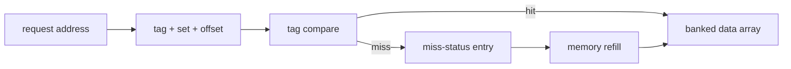

<!-- ai-infra-puzzles-header:start -->
<p align="center">
  
</p>

<h1 align="center">AI Infra Puzzles</h1>

<p align="center">
  <strong>Learn CUDA optimization and LLM inference through hands-on puzzles.</strong>
</p>
<!-- ai-infra-puzzles-header:end -->

# 第 08 课 — L2 Slice 内部：Tag、Bank 与 Miss 状态

> **问题：**L2 cache 由 SRAM 构成，为什么它的行为不只是“更快的数组”？

[← 第 04 章](../README.md) · [English lesson](../../../chapters/04-gpu-hardware-foundations/08-l2-slices-cache-locality/README.md) · [实验 Notebook](../../../chapters/04-gpu-hardware-foundations/08-l2-slices-cache-locality/lab.ipynb) · [RTX 5090 结果](../../../chapters/04-gpu-hardware-foundations/08-l2-slices-cache-locality/artifacts/rtx5090-result.json)

## 为什么值得研究

一个 cache slice 不只有 data SRAM，还包括 tag array、比较器、替换状态、队列和 miss-status tracking。地址被拆成
offset、set 与 tag；tag 判断 cache line 是否命中，bank 提供并行访问，MSHR 类状态记录尚未完成的 miss，直到 refill
返回。即使总容量足够，也可能因为映射、端口、bank、队列或下游显存产生冲突。

## 运行前先预测

1. 把一个示例字节地址拆成 offset、set 与 tag。
2. 预测 stride 增大时请求带宽如何变化。
3. 解释为什么本实验不能直接给出 L2 hit rate。

## 1. 把机制放回物理空间

实验用连续访问和逐渐增大的 stride 扫描大 CUDA 张量，按实际访问元素计算请求带宽。它是 locality probe，不是 L2 hit counter：stride
会改变每个 transaction 的有效字节和 cache line 复用，同时归约工作与编译器 kernel 仍然参与。概念图标出常见组件，但不声称是 NVIDIA 某芯片的
die-accurate 实现。

| # | 推理锚点 |
|---:|---|
| 1 | Tag lookup 与 data access 是两个不同操作。 |
| 2 | banking 提高服务并行度，但端口和队列仍然有限。 |
| 3 | miss 会占用状态直到 refill；未完成 miss 太多会对请求端形成反压。 |

### 机制图



## 2. 读图


- [可打印 L2 slice 图](../../../chapters/04-gpu-hardware-foundations/assets/L2_cache_slice_circuit_structure_A4_portrait.pdf)

这些图用于解释数据路径，是概念性教学图，不是某款商业 GPU 的 die-accurate 电路图。

## 3. 把理论变成实验

**实验：**扫描 CUDA 访问 stride，并保留透明的地址拆分示例。

| 实验角色 | 固定定义 |
|---|---|
| Baseline | 连续访问整个张量 |
| Candidate | stride 为 2、4、8、16、32 的访问 |
| 保持不变 | source allocation、dtype、访问元素计数与计时函数 |
| 测量内容 | 中位延迟、请求 GB/s 与地址 tag/set/offset |
| 证据标签 | `pytorch-gpu` |

### 代码说明

每个 view 都由同一个归约表达式消费。代码只统计有效值，并打印地址拆分假设；结果被标为 PyTorch locality probe，而不是 cache counter 测量。

## 4. 阅读仓库中的 RTX 5090 结果

**记录环境：**NVIDIA GeForce RTX 5090; compute capability 12.0; PyTorch 2.13.0+cu130; CUDA runtime 13.0; Python 3.12.3。

| 测量字段 | 仓库记录值 |
|---|---:|
| 连续访问中位延迟 | 0.506 ms |
| 连续请求带宽 | 530.2533 |
| Stride-8 请求带宽 | 183.9607 |
| Stride-32 请求带宽 | 128.8810 |
| 示例 cache set | 2,391 |

### 如何解释结果

本次记录的关键结果是：连续访问中位延迟：0.506 ms，连续请求带宽：530.2533，Stride-8 请求带宽：183.9607。这些数值只适用于上方记录的
GPU、软件栈、shape 与测量协议。结合本课的证据边界，结论是：用 stride 计时形成 cache 假设，再用硬件 counter 证明 L2 hit、sector 或
miss queue 归因。

## 5. 得出有边界的结论

> 用 stride 计时形成 cache 假设，再用硬件 counter 证明 L2 hit、sector 或 miss queue 归因。

### 结论可能失效的条件

大 stride 下元素数更少，归约调度会干扰比较；prefetch、cache 初始状态与频率波动也会改变曲线。

## 复现

```bash
python3 -m pip install -r requirements-gpu-foundations.txt
python3 scripts/execute_chapter_notebooks.py --chapter 04 --start 8 --end 8
python3 scripts/build_chapter04_lessons.py
```

## 继续实验

对等工作量 custom kernel 采集 L2 sector、hit rate 与 DRAM 字节，并让 working set 跨越 cache 容量。

## 证据边界

**证据标签：**[`pytorch-gpu`](../README.md#证据标签)。CUDA 工作通过 PyTorch 执行。没有额外 profiler 证据时，它不能定位内部指令、cache event 或私有硬件模块。

## 参考资料

- [CUDA Programming Guide](https://docs.nvidia.com/cuda/cuda-programming-guide/)
- [NVIDIA A100 Tensor Core GPU Architecture Whitepaper](https://www.nvidia.com/content/dam/en-zz/Solutions/Data-Center/nvidia-ampere-architecture-whitepaper.pdf)
