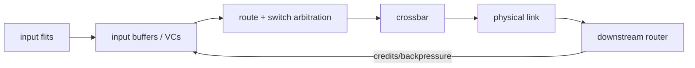

<!-- ai-infra-puzzles-header:start -->
<p align="center">
  
</p>

<h1 align="center">AI Infra Puzzles</h1>

<p align="center">
  <strong>Learn CUDA optimization and LLM inference through hands-on puzzles.</strong>
</p>
<!-- ai-infra-puzzles-header:end -->

# 第 09 课 — NoC 路由、缓冲与拥塞

> **问题：**每条片上链路都很快，为什么数据在芯片内部仍会堵塞？

[← 第 04 章](../README.md) · [English lesson](../../../chapters/04-gpu-hardware-foundations/09-noc-routing-contention/README.md) · [实验 Notebook](../../../chapters/04-gpu-hardware-foundations/09-noc-routing-contention/lab.ipynb) · [RTX 5090 结果](../../../chapters/04-gpu-hardware-foundations/09-noc-routing-contention/artifacts/rtx5090-result.json)

## 为什么值得研究

NoC 通过 router 与 link 连接 SM、L2 slice、memory controller 等单元。packet 被拆成 flit；router
依次完成输入缓冲、路由选择、virtual channel 与 switch arbitration、crossbar 传输和物理链路发送。多条 flow
同时争用同一输出时，链路容量被共享，队列增长，backpressure 再向上游传播。

## 运行前先预测

1. 预测哪种 traffic pattern 会形成更长队列。
2. 解释为什么增加 buffer 只改变突发容忍度，不改变稳定服务速率。
3. 写出进行原生 NoC 归因所需的硬件 counter。

## 1. 把机制放回物理空间

Notebook 运行一个确定性的离散时间排队模型。balanced pattern 把 source 分散到多个 destination；hotspot pattern
让它们集中争用同一输出。两者保持 offered traffic 与单链路服务能力不变，比较队列面积、最大队列、已交付 flit 与延迟。模型不会声称还原 NVIDIA
的私有拓扑、router 宽度或 arbitration policy。

| # | 推理锚点 |
|---:|---|
| 1 | 带宽属于路径与流量模式，不只属于一条 link。 |
| 2 | buffer 可以吸收突发，但无法解决持续超额流量。 |
| 3 | backpressure 会把局部 hotspot 变成上游 stall。 |

### 机制图



## 2. 读图


- [可打印 NoC 图](../../../chapters/04-gpu-hardware-foundations/assets/NoC_on_chip_network_circuit_structure_A4_portrait.pdf)

这些图用于解释数据路径，是概念性教学图，不是某款商业 GPU 的 die-accurate 电路图。

## 3. 把理论变成实验

**实验：**在有限队列模拟器中比较 balanced 与 hotspot traffic。

| 实验角色 | 固定定义 |
|---|---|
| Baseline | 四个 source 分散到四个 output |
| Candidate | 相同 source 集中到一个热点 output |
| 保持不变 | 到达计划、output 服务速率、tick 数与队列纪律 |
| 测量内容 | 已交付 flit、平均/最大队列与平均延迟 |
| 证据标签 | `numerical-model` |

### 代码说明

模拟器记录每个 flit 的入队时间，每个 output 每 tick 服务一个 flit，并在停止到达后排空。相同需求量使 destination concentration
成为唯一自变量。

## 4. 阅读仓库中的 RTX 5090 结果

**记录环境：**NVIDIA GeForce RTX 5090; compute capability 12.0; PyTorch 2.13.0+cu130; CUDA runtime 13.0; Python 3.12.3。

| 测量字段 | 仓库记录值 |
|---|---:|
| Balanced 平均延迟 | 1.0000 |
| Hotspot 平均延迟 | 241.0000 |
| Balanced 最大队列 | 0 |
| Hotspot 最大队列 | 480 |
| 延迟比 | 241.000x |

### 如何解释结果

本次记录的关键结果是：Balanced 平均延迟：1.0000，Hotspot 平均延迟：241.0000，Balanced 最大队列：0。这些数值只适用于上方记录的
GPU、软件栈、shape 与测量协议。结合本课的证据边界，结论是：把拥塞看作流量与放置问题；应先减少 hotspot 或改善 overlap，再考虑增加算力是否有效。

## 5. 得出有边界的结论

> 把拥塞看作流量与放置问题；应先减少 hotspot 或改善 overlap，再考虑增加算力是否有效。

### 结论可能失效的条件

真实 NoC 还包含多跳、自适应路由、优先级、virtual channel、credit 延迟和特定拓扑；本模型只证明排队机制。

## 复现

```bash
python3 -m pip install -r requirements-gpu-foundations.txt
python3 scripts/execute_chapter_notebooks.py --chapter 04 --start 9 --end 9
python3 scripts/build_chapter04_lessons.py
```

## 继续实验

加入带 hop 的 mesh 模型，再用受控多 SM kernel 的 fabric/L2/DRAM stall 证据检验预测。

## 证据边界

**证据标签：**[`numerical-model`](../README.md#证据标签)。运行的是透明机制模型。它只在打印出的假设下证明所述关系，不代表原生硬件延迟、能耗或拓扑。

## 参考资料

- [NVIDIA A100 Tensor Core GPU Architecture Whitepaper](https://www.nvidia.com/content/dam/en-zz/Solutions/Data-Center/nvidia-ampere-architecture-whitepaper.pdf)
- [CUDA Programming Guide](https://docs.nvidia.com/cuda/cuda-programming-guide/)
