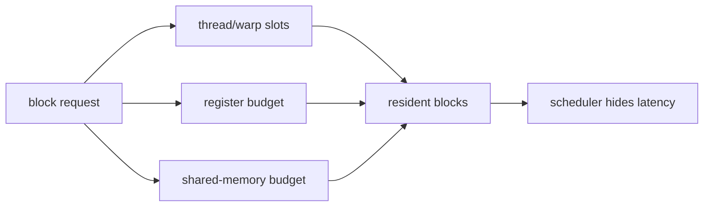
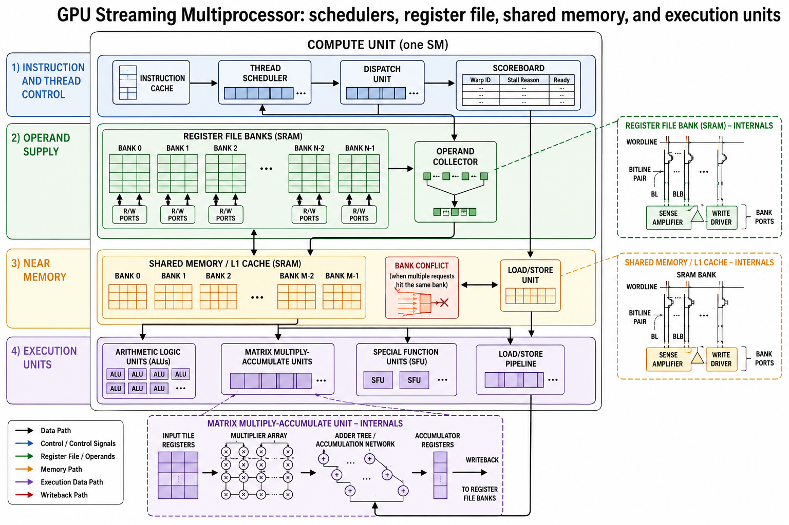

<!-- ai-infra-puzzles-header:start -->
<p align="center">
  
</p>

<h1 align="center">AI Infra Puzzles</h1>

<p align="center">
  <strong>Learn CUDA optimization and LLM inference through hands-on puzzles.</strong>
</p>
<!-- ai-infra-puzzles-header:end -->

# 第 10 课 — SM 资源：Occupancy、寄存器与 Bank

> **问题：**occupancy 拉满就一定快吗？数据已经在片上时，shared-memory bank conflict 还会影响性能吗？

[← 第 04 章](../README.md) · [English lesson](../../../chapters/04-gpu-hardware-foundations/10-sm-resources-occupancy-banks/README.md) · [实验 Notebook](../../../chapters/04-gpu-hardware-foundations/10-sm-resources-occupancy-banks/lab.ipynb) · [RTX 5090 结果](../../../chapters/04-gpu-hardware-foundations/10-sm-resources-occupancy-banks/artifacts/rtx5090-result.json)

## 为什么值得研究

SM 只有在寄存器、shared memory、warp slot 与 block slot 都有余额时才能接纳新的 block。occupancy 表示 resident warp
相对硬件上限的比例，有助于隐藏延迟，却不能保证指令有用、访存合并或管线均衡。shared memory 还被划分成 bank，同一 warp 的多个地址若映射到同一
bank，且不是受支持的 broadcast，就可能被串行处理。

## 运行前先预测

1. 判断每个候选 block 被哪项资源限制。
2. 预测 stride 1、2、32 的最大 bank 重数。
3. 解释为什么模型中的 100% occupancy 不是性能承诺。

## 1. 把机制放回物理空间

实验读取 CUDA 设备属性，用显式资源预算公式评估多个候选 kernel，并把 warp lane 在不同 stride 下映射到 32 个示意 bank。结果属于 capacity
与 address model，不会假装已经得到某个 kernel 的寄存器分配或原生 bank conflict；后者需要编译元数据与 profiler counter。

| # | 推理锚点 |
|---:|---|
| 1 | occupancy 由最紧张的 resident resource 决定。 |
| 2 | 更高 occupancy 可能以更少寄存器或 shared-memory 复用为代价。 |
| 3 | bank conflict 是 warp 内地址映射的属性。 |

### 机制图



## 2. 读图



- [可打印 NoC 与 SM 图](../../../chapters/04-gpu-hardware-foundations/assets/NoC_and_SM_circuit_structures_A4_portrait.pdf)

这些图用于解释数据路径，是概念性教学图，不是某款商业 GPU 的 die-accurate 电路图。

## 3. 把理论变成实验

**实验：**计算资源限制下的 occupancy 与 shared-memory bank 映射。

| 实验角色 | 固定定义 |
|---|---|
| Baseline | 每 block 使用中等 threads、registers 与 shared memory |
| Candidate | register-heavy、shared-heavy 与冲突 stride 场景 |
| 保持不变 | 显式资源上限、32-lane warp 与 32 个示意 bank |
| 测量内容 | resident block/warp、occupancy bound 与 bank 重数 |
| 证据标签 | `capacity-model` |

### 代码说明

计算分别由 threads、registers、shared memory 与 block slot 得到 block 上限，再取最小值；另一张表统计不同 stride 的 bank
ID。所有架构假设都会打印出来。

## 4. 阅读仓库中的 RTX 5090 结果

**记录环境：**NVIDIA GeForce RTX 5090; compute capability 12.0; PyTorch 2.13.0+cu130; CUDA runtime 13.0; Python 3.12.3。

| 测量字段 | 仓库记录值 |
|---|---:|
| Balanced occupancy 上限 | 100.00% |
| Register-heavy occupancy | 25.00% |
| Shared-heavy occupancy | 12.50% |
| Stride-1 bank 重数 | 1 |
| Stride-32 bank 重数 | 32 |

### 如何解释结果

本次记录的关键结果是：Balanced occupancy 上限：100.00%，Register-heavy occupancy：25.00%，Shared-heavy
occupancy：12.50%。这些数值只适用于上方记录的 GPU、软件栈、shape 与测量协议。结合本课的证据边界，结论是：用 occupancy 与 bank model
选择实验；只有原生 kernel 计时和 counter 证实限制后，才接受优化。

## 5. 得出有边界的结论

> 用 occupancy 与 bank model 选择实验；只有原生 kernel 计时和 counter 证实限制后，才接受优化。

### 结论可能失效的条件

模型使用显式教学资源上限，因为 PyTorch 不会统一暴露所有 SM 调度字段；broadcast 规则与 bank width 也可能改变简单重数解释。

## 复现

```bash
python3 -m pip install -r requirements-gpu-foundations.txt
python3 scripts/execute_chapter_notebooks.py --chapter 04 --start 10 --end 10
python3 scripts/build_chapter04_lessons.py
```

## 继续实验

编译两个 CUDA kernel，使用 `-Xptxas -v` 记录寄存器/shared memory，再采集 achieved occupancy 与 bank-conflict
counter。

## 证据边界

**证据标签：**[`capacity-model`](../README.md#证据标签)。实测环境事实进入显式容量或 Roofline 计算。层级和资源字段仍是声明的假设，需原生 counter 才能确认。

## 参考资料

- [CUDA C++ Best Practices Guide](https://docs.nvidia.com/cuda/cuda-c-best-practices-guide/)
- [CUDA Programming Guide](https://docs.nvidia.com/cuda/cuda-programming-guide/)
