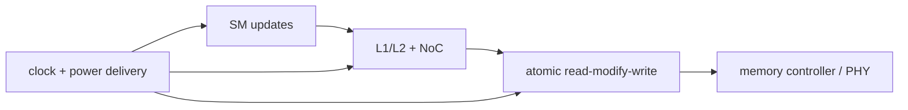
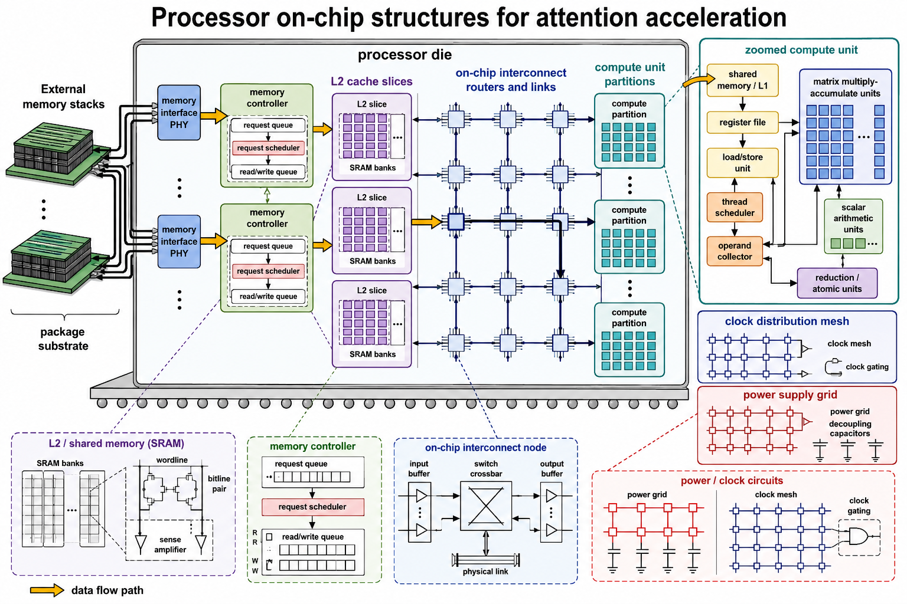

<!-- ai-infra-puzzles-header:start -->
<p align="center">
  
</p>

<h1 align="center">AI Infra Puzzles</h1>

<p align="center">
  <strong>Learn CUDA optimization and LLM inference through hands-on puzzles.</strong>
</p>
<!-- ai-infra-puzzles-header:end -->

# 第 11 课 — 控制器、原子操作与功耗/频率包络

> **问题：**数千个并行更新为什么会坍缩成一个串行热点？这与芯片其他结构有什么关系？

[← 第 04 章](../README.md) · [English lesson](../../../chapters/04-gpu-hardware-foundations/11-controllers-atomics-power-clock/README.md) · [实验 Notebook](../../../chapters/04-gpu-hardware-foundations/11-controllers-atomics-power-clock/lab.ipynb) · [RTX 5090 结果](../../../chapters/04-gpu-hardware-foundations/11-controllers-atomics-power-clock/artifacts/rtx5090-result.json)

## 为什么值得研究

完整 GPU 还需要 memory controller、PHY、atomic/reduction path、时钟分配、电源供给、错误处理与全局控制。atomic 在多个 thread
更新共享状态时维护 read-modify-write 契约，很多算法离不开它；但大量更新集中到少数地址会形成串行化，同时加重 fabric 与 cache 压力，即使执行 lane
仍有空闲。

## 运行前先预测

1. 预测哪种 index 分布更慢。
2. 解释为什么相同 update 数会产生不同竞争。
3. 把计时证据与功耗模型证据分开。

## 1. 把机制放回物理空间

Notebook 用 CUDA `scatter_add_` 构造 atomic-style 工作负载：一个候选把更新分散到大量 bin，另一个集中到少量 hotspot
bin。values、update 数、dtype、计时与归约结果保持一致。结果只说明 PyTorch GPU 上该操作的行为，不会声称定位到某个专用 atomic
unit。另一个一阶 `CV²f` 表用于连接活动率与有限功耗/频率包络，但不冒充遥测。

| # | 推理锚点 |
|---:|---|
| 1 | 控制器把请求转成外部显存命令并调度并行资源。 |
| 2 | atomic 为正确性付出的代价在地址碰撞时会表现为串行。 |
| 3 | CUDA 呈现逻辑并发，但时钟与供电网络仍约束所有单元。 |

### 机制图



## 2. 读图



- [四页可打印 GPU 电路图册](../../../chapters/04-gpu-hardware-foundations/assets/GPU_circuit_structures_from_L2_A4_landscape.pdf)

这些图用于解释数据路径，是概念性教学图，不是某款商业 GPU 的 die-accurate 电路图。

## 3. 把理论变成实验

**实验：**比较分散与热点式 CUDA scatter-add 更新。

| 实验角色 | 固定定义 |
|---|---|
| Baseline | index 分散到较大的 output |
| Candidate | index 集中到少量 bin |
| 保持不变 | update value/count、output 大小、dtype、warm-up 与 Event 计时 |
| 测量内容 | 中位延迟、碰撞率、checksum 与 slowdown |
| 证据标签 | `pytorch-gpu` |

### 代码说明

每次计时前都清零 destination；两个 index 张量包含相同数量的 update，checksum 验证总贡献相同。collision ratio 是工作负载属性，不是硬件
counter。

## 4. 阅读仓库中的 RTX 5090 结果

**记录环境：**NVIDIA GeForce RTX 5090; compute capability 12.0; PyTorch 2.13.0+cu130; CUDA runtime 13.0; Python 3.12.3。

| 测量字段 | 仓库记录值 |
|---|---:|
| 分散更新中位延迟 | 0.023 ms |
| 热点更新中位延迟 | 0.280 ms |
| 热点 slowdown | 11.935x |
| 分散碰撞率 | 93.75% |
| 热点碰撞率 | 100.00% |

### 如何解释结果

本次记录的关键结果是：分散更新中位延迟：0.023 ms，热点更新中位延迟：0.280 ms，热点 slowdown：11.935x。这些数值只适用于上方记录的
GPU、软件栈、shape 与测量协议。结合本课的证据边界，结论是：竞争占主导时，应减少地址集中或采用分层局部归约，同时保持原始更新语义。

## 5. 得出有边界的结论

> 竞争占主导时，应减少地址集中或采用分层局部归约，同时保持原始更新语义。

### 结论可能失效的条件

`scatter_add_` 的 kernel 选择依赖版本，cache 或内部聚合会改变缩放规律；功耗模型是独立的教学证据。

## 复现

```bash
python3 -m pip install -r requirements-gpu-foundations.txt
python3 scripts/execute_chapter_notebooks.py --chapter 04 --start 11 --end 11
python3 scripts/build_chapter04_lessons.py
```

## 继续实验

扫描 bin 数与 update skew，加入两阶段 local-reduce candidate，并分别采集 atomic/fabric stall 与板级功耗遥测。

## 证据边界

**证据标签：**[`pytorch-gpu`](../README.md#证据标签)。CUDA 工作通过 PyTorch 执行。没有额外 profiler 证据时，它不能定位内部指令、cache event 或私有硬件模块。

## 参考资料

- [CUDA Programming Guide](https://docs.nvidia.com/cuda/cuda-programming-guide/)
- [CUDA C++ Best Practices Guide](https://docs.nvidia.com/cuda/cuda-c-best-practices-guide/)
