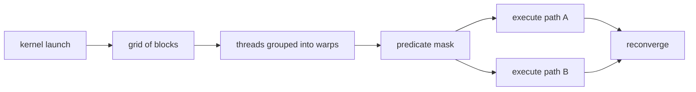

<!-- ai-infra-puzzles-header:start -->
<p align="center">
  
</p>

<h1 align="center">AI Infra Puzzles</h1>

<p align="center">
  <strong>Learn CUDA optimization and LLM inference through hands-on puzzles.</strong>
</p>
<!-- ai-infra-puzzles-header:end -->

# 第 12 课 — CUDA 执行模型：Grid、Block、Warp 与分支分歧

> **问题：**CUDA kernel 启动数千个 thread；哪些是编程抽象，哪些会在 warp 执行中产生真实后果？

[← 第 04 章](../README.md) · [English lesson](../../../chapters/04-gpu-hardware-foundations/12-cuda-execution-simt-divergence/README.md) · [实验 Notebook](../../../chapters/04-gpu-hardware-foundations/12-cuda-execution-simt-divergence/lab.ipynb) · [RTX 5090 结果](../../../chapters/04-gpu-hardware-foundations/12-cuda-execution-simt-divergence/artifacts/rtx5090-result.json)

## 为什么值得研究

一次 kernel launch 定义由 block 组成的 grid，每个 block 包含带索引的 thread，并可使用 block-scope shared memory 与
barrier。硬件按 warp 在 SIMT 模式下调度 thread。thread 拥有独立状态，但同一 warp 内的控制流分歧可能需要用不同 active mask
分别执行多条路径。除非明确使用更宽的同步机制，否则 block 之间必须相互独立。

## 运行前先预测

1. 计算问题长度不是 block 整数倍时的 grid size。
2. 预测 half-warp 与 alternating predicate 的 active mask。
3. 解释为什么 launch 返回时间不等于 kernel 完成时间。

## 1. 把机制放回物理空间

Notebook 先把一维问题映射到 grid 与 block，再统计三种 branch pattern 在每个 warp、每条路径上的 active
lane。uniform、half-warp 与 alternating predicate 可以有相同的 true/false 总数，却形成不同 active
mask。这里的指标是透明的 divergence-efficiency model，不是指令级计时；真实编译器可能使用 predication、化简或其他变换。

| # | 推理锚点 |
|---:|---|
| 1 | grid/block/thread 是软件层级，warp 是硬件调度单位。 |
| 2 | barrier 必须由要求参与的 thread 到达。 |
| 3 | 分支代价取决于执行路径、active mask 与编译器行为，不只看 branch 数。 |

### 机制图



## 2. 读图

本课以 Mermaid 机制图和可执行测量为主。

## 3. 把理论变成实验

**实验：**映射线程索引并比较三种显式 warp 分支 mask。

| 实验角色 | 固定定义 |
|---|---|
| Baseline | warp 内 branch outcome 一致 |
| Candidate | half-warp 与交替 outcome |
| 保持不变 | 问题规模、block size、warp size 与两路径假设 |
| 测量内容 | grid size、tail lane、active mask 与 lane efficiency 模型 |
| 证据标签 | `numerical-model` |

### 代码说明

代码直接构造 lane mask，按两条路径计算有效 lane 工作占发射 lane slot 的比例，并报告 tail block。理解这个不变量不需要 custom CUDA
compiler。

## 4. 阅读仓库中的 RTX 5090 结果

**记录环境：**NVIDIA GeForce RTX 5090; compute capability 12.0; PyTorch 2.13.0+cu130; CUDA runtime 13.0; Python 3.12.3。

| 测量字段 | 仓库记录值 |
|---|---:|
| Grid block 数 | 4 |
| 尾 block 活跃线程 | 232 |
| Uniform efficiency | 100.00% |
| Half-warp efficiency | 50.00% |
| Alternating efficiency | 50.00% |

### 如何解释结果

本次记录的关键结果是：Grid block 数：4，尾 block 活跃线程：232，Uniform efficiency：100.00%。这些数值只适用于上方记录的
GPU、软件栈、shape 与测量协议。结合本课的证据边界，结论是：先用 SIMT 模型识别高风险控制流，再检查生成代码和原生计时，之后才决定是否改写可读分支。

## 5. 得出有边界的结论

> 先用 SIMT 模型识别高风险控制流，再检查生成代码和原生计时，之后才决定是否改写可读分支。

### 结论可能失效的条件

两路径模型省略了指令数、reconvergence、predication、访存分歧和 independent thread scheduling，不能直接预测加速比。

## 复现

```bash
python3 -m pip install -r requirements-gpu-foundations.txt
python3 scripts/execute_chapter_notebooks.py --chapter 04 --start 12 --end 12
python3 scripts/build_chapter04_lessons.py
```

## 继续实验

实现等价的 uniform/divergent CUDA kernel，检查 SASS branch/predicate 指令，并扫描不同路径开销比例。

## 证据边界

**证据标签：**[`numerical-model`](../README.md#证据标签)。运行的是透明机制模型。它只在打印出的假设下证明所述关系，不代表原生硬件延迟、能耗或拓扑。

## 参考资料

- [CUDA Programming Guide](https://docs.nvidia.com/cuda/cuda-programming-guide/)
- [CUDA C++ Best Practices Guide](https://docs.nvidia.com/cuda/cuda-c-best-practices-guide/)
