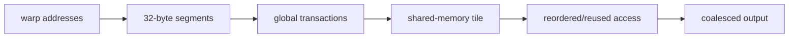

<!-- ai-infra-puzzles-header:start -->
<p align="center">
  
</p>

<h1 align="center">AI Infra Puzzles</h1>

<p align="center">
  <strong>Learn CUDA optimization and LLM inference through hands-on puzzles.</strong>
</p>
<!-- ai-infra-puzzles-header:end -->

# 第 13 课 — 合并访存、Stride 与 Shared-Memory 暂存

> **问题：**两个张量包含相同数量的值，为什么复制转置 view 可能比复制连续张量更慢？

[← 第 04 章](../README.md) · [English lesson](../../../chapters/04-gpu-hardware-foundations/13-coalescing-strides-shared-memory/README.md) · [实验 Notebook](../../../chapters/04-gpu-hardware-foundations/13-coalescing-strides-shared-memory/lab.ipynb) · [RTX 5090 结果](../../../chapters/04-gpu-hardware-foundations/13-coalescing-strides-shared-memory/artifacts/rtx5090-result.json)

## 为什么值得研究

一个 warp 的 global-memory request 会根据所触及的地址 segment 合并成 transaction。相邻 lane 访问相邻 word
通常能更充分利用传输字节；strided pattern 可能为相同有效字节发起更多 transaction。shared memory 可以暂存 tile 并改变访问顺序，但也会增加
load/store、同步、容量占用和潜在 bank conflict。

## 运行前先预测

1. 预测原 tensor 与 transpose view 的 stride。
2. 预测哪种 copy 的请求带宽更高。
3. 列出 shared-memory transpose tile 带来的成本。

## 1. 把机制放回物理空间

实验把一个连续二维 CUDA tensor 及其非连续转置 view 分别复制到新的连续输出。两者逻辑元素数与 dtype 相同，请求字节完全一致。CUDA Event
延迟和有效带宽显示 PyTorch copy kernel 对布局的响应；要声称具体硬件 transaction 数，仍需 global load/store sector
counter。

| # | 推理锚点 |
|---:|---|
| 1 | coalescing 针对一个 warp 指令请求的地址集合判断。 |
| 2 | view 可以只改变 stride，而不改变逻辑 shape 或底层 storage 所有权。 |
| 3 | shared-memory tiling 的价值在于把重复或跨步 global access 转成可复用、有组织的访问。 |

### 机制图



## 2. 读图

本课以 Mermaid 机制图和可执行测量为主。

## 3. 把理论变成实验

**实验：**复制大小相同的连续与转置 CUDA view。

| 实验角色 | 固定定义 |
|---|---|
| Baseline | 连续 source 到连续 destination |
| Candidate | 转置后的非连续 view 到连续 destination |
| 保持不变 | 逻辑元素数、dtype、destination layout、warm-up 与 Event 计时 |
| 测量内容 | source stride、中位延迟、有效 GB/s 与 slowdown |
| 证据标签 | `pytorch-gpu` |

### 代码说明

预分配 output 避免 allocator 计时。`copy_` 分别消费 base tensor 或 transpose view，并在考虑转置顺序后校验内容等价。

## 4. 阅读仓库中的 RTX 5090 结果

**记录环境：**NVIDIA GeForce RTX 5090; compute capability 12.0; PyTorch 2.13.0+cu130; CUDA runtime 13.0; Python 3.12.3。

| 测量字段 | 仓库记录值 |
|---|---:|
| 连续 copy 中位延迟 | 0.354 ms |
| 转置 copy 中位延迟 | 0.652 ms |
| 连续 copy 带宽 | 1,516.9273 |
| 转置 copy 带宽 | 823.4418 |
| 转置 slowdown | 1.842x |

### 如何解释结果

本次记录的关键结果是：连续 copy 中位延迟：0.354 ms，转置 copy 中位延迟：0.652 ms，连续 copy 带宽：1,516.9273。这些数值只适用于上方记录的
GPU、软件栈、shape 与测量协议。结合本课的证据边界，结论是：先修正 global access order，再考虑算术微优化；只有目标是复用或重排时才引入 shared
memory。

## 5. 得出有边界的结论

> 先修正 global access order，再考虑算术微优化；只有目标是复用或重排时才引入 shared memory。

### 结论可能失效的条件

PyTorch 可能使用专用 copy kernel，cache 状态与矩阵维度也会影响结果；请求带宽不等于物理总线流量。

## 复现

```bash
python3 -m pip install -r requirements-gpu-foundations.txt
python3 scripts/execute_chapter_notebooks.py --chapter 04 --start 13 --end 13
python3 scripts/build_chapter04_lessons.py
```

## 继续实验

实现 naive 与 tiled CUDA transpose kernel，比较 global sector、shared bank conflict 与端到端带宽。

## 证据边界

**证据标签：**[`pytorch-gpu`](../README.md#证据标签)。CUDA 工作通过 PyTorch 执行。没有额外 profiler 证据时，它不能定位内部指令、cache event 或私有硬件模块。

## 参考资料

- [CUDA Programming Guide](https://docs.nvidia.com/cuda/cuda-programming-guide/)
- [CUDA C++ Best Practices Guide](https://docs.nvidia.com/cuda/cuda-c-best-practices-guide/)
