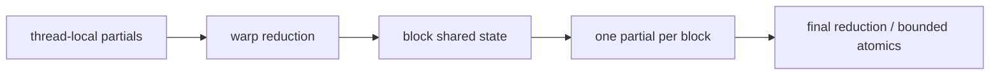

<!-- ai-infra-puzzles-header:start -->
<p align="center">
  
</p>

<h1 align="center">AI Infra Puzzles</h1>

<p align="center">
  <strong>Learn CUDA optimization and LLM inference through hands-on puzzles.</strong>
</p>
<!-- ai-infra-puzzles-header:end -->

# 第 14 课 — 归约、原子操作与 Warp 原语

> **问题：**大量值最终汇成一个结果时，哪些中间状态应该留在线程、warp、block 或全局范围？

[← 第 04 章](../README.md) · [English lesson](../../../chapters/04-gpu-hardware-foundations/14-reductions-atomics-warp-primitives/README.md) · [实验 Notebook](../../../chapters/04-gpu-hardware-foundations/14-reductions-atomics-warp-primitives/lab.ipynb) · [RTX 5090 结果](../../../chapters/04-gpu-hardware-foundations/14-reductions-atomics-warp-primitives/artifacts/rtx5090-result.json)

## 为什么值得研究

归约通过结合操作把许多值合成一个结果。高效 GPU reduction 通常分层进行：thread-local partial、warp exchange 或 shared
memory、block result，最后再合并。atomic 可以安全组合 block result，但如果每个输入都更新同一个全局
accumulator，就会形成最大竞争。warp shuffle 能在正确 active mask 下直接交换寄存器值，无需 shared memory。

## 运行前先预测

1. 预测得到一个标量 sum 的最快路径。
2. 比较 one-bin contention 与 many-bin scatter。
3. 说明 shared-memory tree 在哪里需要 block barrier。

## 1. 把机制放回物理空间

Notebook 比较原生 `torch.sum` 与两条 `scatter_add_` 路径：相同 values 分别写入一个 bin 或许多 bin。代码校验 checksum
并记录延迟。它不是 custom shuffle 实现，而是展示全局 update 数量与集中程度为什么重要；理论部分再把这个观察映射到分层 reduction 设计。

| # | 推理锚点 |
|---:|---|
| 1 | 同步范围应与共享状态的范围一致。 |
| 2 | 分层 partial reduction 可以减少 global update 数。 |
| 3 | warp primitive 必须使用正确的参与 lane mask。 |

### 机制图



## 2. 读图

本课以 Mermaid 机制图和可执行测量为主。

## 3. 把理论变成实验

**实验：**比较库归约、集中式与分散式 atomic-style update。

| 实验角色 | 固定定义 |
|---|---|
| Baseline | 优化过的 `torch.sum` reduction |
| Candidate | one-bin 与 many-bin `scatter_add_` |
| 保持不变 | values、dtype、元素数、warm-up 与计时方式 |
| 测量内容 | 中位延迟、checksum 与相对库归约的 slowdown |
| 证据标签 | `pytorch-gpu` |

### 代码说明

每个候选消费同一个 source tensor。scatter 路径在计时前分配 destination，每次重复前清零，并在浮点容差内检查 output sum。

## 4. 阅读仓库中的 RTX 5090 结果

**记录环境：**NVIDIA GeForce RTX 5090; compute capability 12.0; PyTorch 2.13.0+cu130; CUDA runtime 13.0; Python 3.12.3。

| 测量字段 | 仓库记录值 |
|---|---:|
| 库 sum 中位延迟 | 0.022 ms |
| One-bin 中位延迟 | 20.444 ms |
| Many-bin 中位延迟 | 0.134 ms |
| One-bin slowdown | 931.321x |
| Checksum 误差 | 0.2336 |

### 如何解释结果

本次记录的关键结果是：库 sum 中位延迟：0.022 ms，One-bin 中位延迟：20.444 ms，Many-bin 中位延迟：0.134 ms。这些数值只适用于上方记录的
GPU、软件栈、shape 与测量协议。结合本课的证据边界，结论是：优先使用可信的库归约；只有 shape、fusion 或输出结构确实需要时才写 custom
hierarchical kernel，并保留正确性 oracle。

## 5. 得出有边界的结论

> 优先使用可信的库归约；只有 shape、fusion 或输出结构确实需要时才写 custom hierarchical kernel，并保留正确性 oracle。

### 结论可能失效的条件

不同 kernel 的累加顺序可能不同，因此不能要求逐位相等；scatter 是机制 probe，不是所有 reduction 的公平替代。

## 复现

```bash
python3 -m pip install -r requirements-gpu-foundations.txt
python3 scripts/execute_chapter_notebooks.py --chapter 04 --start 14 --end 14
python3 scripts/build_chapter04_lessons.py
```

## 继续实验

实现 warp-shuffle 与 shared-memory block reduction，扫描 block size，并检查同步与 atomic counter。

## 证据边界

**证据标签：**[`pytorch-gpu`](../README.md#证据标签)。CUDA 工作通过 PyTorch 执行。没有额外 profiler 证据时，它不能定位内部指令、cache event 或私有硬件模块。

## 参考资料

- [CUDA Programming Guide](https://docs.nvidia.com/cuda/cuda-programming-guide/)
- [CUDA C++ Best Practices Guide](https://docs.nvidia.com/cuda/cuda-c-best-practices-guide/)
