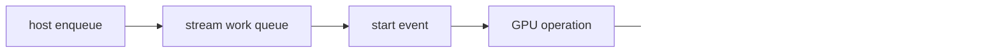

<!-- ai-infra-puzzles-header:start -->
<p align="center">
  
</p>

<h1 align="center">AI Infra Puzzles</h1>

<p align="center">
  <strong>Learn CUDA optimization and LLM inference through hands-on puzzles.</strong>
</p>
<!-- ai-infra-puzzles-header:end -->

# 第 15 课 — CUDA Event、Stream 与库基线

> **问题：**一个 GPU 操作明明要运行若干毫秒，为什么 host timer 却可能显示几乎免费？

[← 第 04 章](../README.md) · [English lesson](../../../chapters/04-gpu-hardware-foundations/15-events-streams-library-baselines/README.md) · [实验 Notebook](../../../chapters/04-gpu-hardware-foundations/15-events-streams-library-baselines/lab.ipynb) · [RTX 5090 结果](../../../chapters/04-gpu-hardware-foundations/15-events-streams-library-baselines/artifacts/rtx5090-result.json)

## 为什么值得研究

kernel launch 与许多 CUDA 操作相对 host 是异步的。只在 enqueue 调用外包一层 host timer，通常测到的是提交开销；在同一 stream 中记录
CUDA Event 并同步，才能测量 device work 的经过时间。stream 是有序工作队列，多 stream 只是表达潜在并发，只有依赖、engine
与资源都允许时才会重叠。

## 运行前先预测

1. 预测 host enqueue 与 Event 时间的比例。
2. 解释为什么同步要放在 stop event 之后。
3. 列出 copy/compute overlap 所需条件。

## 1. 把机制放回物理空间

Notebook 用两种方式测量同一个 BF16 GEMM：未同步的 host enqueue time，以及同步后的 CUDA Event 时间；同时报告库 GEMM
吞吐。两者差距直接暴露计时协议错误。本课不会承诺 multi-stream 必然加速，而是先给出依赖检查表，再让读者增加 pinned-memory copy 或独立 kernel。

| # | 推理锚点 |
|---:|---|
| 1 | enqueue 完成不等于 device 完成。 |
| 2 | 同一 stream 内操作有序；不同 stream 的正确性依赖必须显式表达。 |
| 3 | 库基线决定了替换成熟实现所要跨越的性能门槛。 |

### 机制图



## 2. 读图

本课以 Mermaid 机制图和可执行测量为主。

## 3. 把理论变成实验

**实验：**对同一 GEMM 比较未同步 host timer 与 CUDA Event 计时。

| 实验角色 | 固定定义 |
|---|---|
| Baseline | 异步 enqueue 外层的 host wall time |
| Candidate | 包围完整 device execution 的 CUDA Event |
| 保持不变 | operation、shape、dtype、stream、warm-up 与重复次数 |
| 测量内容 | enqueue 微秒、Event 毫秒、计时错觉比例与 TFLOP/s |
| 证据标签 | `pytorch-gpu` |

### 代码说明

host loop 刻意在全部 enqueue sample 之后才同步；Event helper 则每次记录 start/stop 并同步 stop event。最终
checksum 保证操作没有被无效化。

## 4. 阅读仓库中的 RTX 5090 结果

**记录环境：**NVIDIA GeForce RTX 5090; compute capability 12.0; PyTorch 2.13.0+cu130; CUDA runtime 13.0; Python 3.12.3。

| 测量字段 | 仓库记录值 |
|---|---:|
| Host enqueue 中位值 | 7.3244 |
| CUDA Event 中位值 | 0.639 ms |
| 计时错觉倍数 | 87.183x |
| 库 GEMM 吞吐 | 215.2326 |

### 如何解释结果

本次记录的关键结果是：Host enqueue 中位值：7.3244，CUDA Event 中位值：0.639 ms，计时错觉倍数：87.183x。这些数值只适用于上方记录的
GPU、软件栈、shape 与测量协议。结合本课的证据边界，结论是：device latency 使用 CUDA Event 或 profiler
timeline；host/service latency 必须作为另一个明确命名的指标。

## 5. 得出有边界的结论

> device latency 使用 CUDA Event 或 profiler timeline；host/service latency 必须作为另一个明确命名的指标。

### 结论可能失效的条件

Event 测量的是其 stream 上下文中的工作，也可能受无关任务干扰。host timer 对同步后的端到端问题仍然有效，关键是让计时器匹配问题。

## 复现

```bash
python3 -m pip install -r requirements-gpu-foundations.txt
python3 scripts/execute_chapter_notebooks.py --chapter 04 --start 15 --end 15
python3 scripts/build_chapter04_lessons.py
```

## 继续实验

构建 double-buffered pinned-memory pipeline，用 Event 验证依赖，并在 profiler timeline 上检查真实
copy/compute overlap。

## 证据边界

**证据标签：**[`pytorch-gpu`](../README.md#证据标签)。CUDA 工作通过 PyTorch 执行。没有额外 profiler 证据时，它不能定位内部指令、cache event 或私有硬件模块。

## 参考资料

- [PyTorch CUDA semantics](https://docs.pytorch.org/docs/stable/notes/cuda.html)
- [CUDA Programming Guide](https://docs.nvidia.com/cuda/cuda-programming-guide/)
