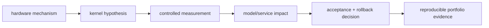

<!-- ai-infra-puzzles-header:start -->
<p align="center">
  
</p>

<h1 align="center">AI Infra Puzzles</h1>

<p align="center">
  <strong>Learn CUDA optimization and LLM inference through hands-on puzzles.</strong>
</p>
<!-- ai-infra-puzzles-header:end -->

# 第 16 课 — 从 Kernel 证据到推理工程

> **问题：**一个 GPU 优化结果怎样才能走出单个 notebook？什么样的证据能真正体现推理工程能力？

[← 第 04 章](../README.md) · [English lesson](../../../chapters/04-gpu-hardware-foundations/16-performance-evidence-portfolio/README.md) · [实验 Notebook](../../../chapters/04-gpu-hardware-foundations/16-performance-evidence-portfolio/lab.ipynb) · [RTX 5090 结果](../../../chapters/04-gpu-hardware-foundations/16-performance-evidence-portfolio/artifacts/rtx5090-result.json)

## 为什么值得研究

CUDA 算子与大模型推理工程有交集，但并不等同。kernel 工作更关注访存、指令选择、tiling、occupancy 与正确性；推理工程还要覆盖模型阶段、batching、KV
state、API、可观测性、容量与发布决策。高质量项目应把瓶颈假设、代码、受控测量、模型/服务影响和 rollback gate 连起来。

## 运行前先预测

1. 预测完整运行后有多少前置课程具备完整 artifact。
2. 把一课归类为 hardware model、kernel measurement 或 systems decision。
3. 写出你最强 benchmark 所支持的决策。

## 1. 把机制放回物理空间

实验把第四章前 15 课 artifact 当成一个 evidence portfolio 做审计，统计环境身份、证据标签、metrics、analysis 与 conclusion
是否完整，再把课程映射到 hardware、kernel 和 inference 三层。它是可执行的质量控制，不预测薪资或招聘市场；缺少的 artifact
会如实显示缺失，不会补造结果。

| # | 推理锚点 |
|---:|---|
| 1 | microbenchmark 只有明确服务于哪个系统决策时才更有价值。 |
| 2 | 证据必须保留环境、工作负载、比较条件与边界。 |
| 3 | 推理工程跨越算子、runtime、service 与 release 多个层次。 |

### 机制图



## 2. 读图

本课以 Mermaid 机制图和可执行测量为主。

### 岗位光谱与证据

| 岗位侧重点 | 主要工作对象 | 有说服力的项目证据 |
|---|---|---|
| CUDA / kernel 性能 | 指令、tile、访存、launch shape | 正确性 oracle、profiler trace、延迟分布、dispatch 证据 |
| 推理引擎优化 | Prefill/Decode、KV state、batching、runtime 集成 | 分阶段指标、内存预算、backend 对照、失效与 rollback gate |
| ML systems | 编译器、分布式执行、数据/模型流水线 | 端到端瓶颈定位、扩展曲线、可观测性、可复现环境 |
| 模型算法 | 目标函数、架构、数据、质量 | 任务指标、ablation、泛化与错误分析 |

双栈并不意味着每个方向都要声称同样深。更实际的能力结构是先选择一个深轴，例如 CUDA kernel 或推理
runtime，再补足相邻的模型与服务知识，把局部优化连接到用户可见结果。岗位名称与薪酬属于会变化的市场数据，不是 GPU
不变量；若要比较，应使用带日期的招聘信息，并分开记录地区、级别、公司类型与总包口径。

## 3. 把理论变成实验

**实验：**审计前置结构化 artifact，并生成证据覆盖矩阵。

| 实验角色 | 固定定义 |
|---|---|
| Baseline | 只有课程标题、没有机器可读证据的列表 |
| Candidate | 第 01–15 课执行后的 artifact |
| 保持不变 | artifact 必需字段与固定课程层级映射 |
| 测量内容 | artifact 完整率、evidence label 覆盖与层级覆盖 |
| 证据标签 | `compatibility-probe` |

### 代码说明

代码遍历相邻课程目录，验证最小 schema，统计 evidence class 并打印缺失字段。它不会修改前置证据，也不会把文件存在等同于结论正确。

## 4. 阅读仓库中的 RTX 5090 结果

**记录环境：**NVIDIA GeForce RTX 5090; compute capability 12.0; PyTorch 2.13.0+cu130; CUDA runtime 13.0; Python 3.12.3。

| 测量字段 | 仓库记录值 |
|---|---:|
| 找到的 artifact | 15 |
| 完整 artifact | 15 |
| 完整率 | 100.00% |
| 覆盖的证据标签 | 3 |
| 覆盖的项目层级 | 3 |

### 如何解释结果

本次记录的关键结果是：找到的 artifact：15，完整 artifact：15，完整率：100.00%。这些数值只适用于上方记录的 GPU、软件栈、shape
与测量协议。结合本课的证据边界，结论是：把性能工作组织成从机制、可复现实证到有边界系统决策的一条链。

## 5. 得出有边界的结论

> 把性能工作组织成从机制、可复现实证到有边界系统决策的一条链。

### 结论可能失效的条件

schema 完整不能发现实验设计错误或不受支持的解释，仍然需要人工审阅、复现与 profiler 证据。

## 复现

```bash
python3 -m pip install -r requirements-gpu-foundations.txt
python3 scripts/execute_chapter_notebooks.py --chapter 04 --start 16 --end 16
python3 scripts/build_chapter04_lessons.py
```

## 继续实验

增加因果控制、正确性容差、profiler trace、端到端影响与 rollback rehearsal 的审阅 rubric，并人工评审一个项目。

## 证据边界

**证据标签：**[`compatibility-probe`](../README.md#证据标签)。实验检查仓库 artifact 与已安装接口。schema 或 API 可用不等于实验因果结论已经成立。

## 参考资料

- [CUDA C++ Best Practices Guide](https://docs.nvidia.com/cuda/cuda-c-best-practices-guide/)
- [NVIDIA Nsight Compute Roofline Analysis](https://developer.nvidia.com/blog/accelerating-hpc-applications-with-nsight-compute-roofline-analysis/)
