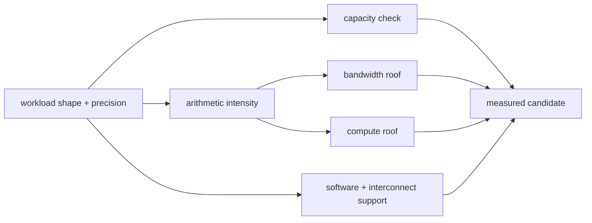

<!-- ai-infra-puzzles-header:start -->
<p align="center">
  
</p>

<h1 align="center">AI Infra Puzzles</h1>

<p align="center">
  <strong>Learn CUDA optimization and LLM inference through hands-on puzzles.</strong>
</p>
<!-- ai-infra-puzzles-header:end -->

# 第 17 课 — 审慎阅读 GPU 参数表

> **问题：**一个 TFLOPS、TOPS、显存容量或带宽数字，能直接说明哪块 GPU 更适合 LLM 吗？

[← 第 04 章](../README.md) · [English lesson](../../../chapters/04-gpu-hardware-foundations/17-gpu-spec-table-audit/README.md) · [实验 Notebook](../../../chapters/04-gpu-hardware-foundations/17-gpu-spec-table-audit/lab.ipynb) · [RTX 5090 结果](../../../chapters/04-gpu-hardware-foundations/17-gpu-spec-table-audit/artifacts/rtx5090-result.json)

## 为什么值得研究

参数只有连同精度、dense/sparse
口径、频率基础、形态、显存技术与工作负载一起才有意义。容量回答状态能否放下，带宽约束低强度流量，算力约束足够高强度的计算，互联只在通信跨设备时起作用。营销口径的 AI TOPS
不能自动映射到某个 dense BF16 工作负载。

## 运行前先预测

1. 把表中字段分类为容量、带宽、算力或连接。
2. 用位宽与 pin 速率复核 1792 GB/s。
3. 预测低、高算术强度下的 Roofline 上限。

## 1. 把机制放回物理空间

Notebook 审计一组固定的 RTX 5090 官方事实：32 GB GDDR7、512-bit 接口、1792 GB/s 带宽和 compute capability
12.0。代码验证宽度/速率带宽公式，对照设备实测容量，引入第 07 课 copy 结果，并计算多种算术强度下的示意 Roofline
上限。素材中的参数速查图只作为审计练习；任何数值在使用前都要回到产品页或架构指南复核。

| # | 推理锚点 |
|---:|---|
| 1 | 没有精度与稀疏口径的数字是不完整的。 |
| 2 | 容量、带宽、算力与互联约束不同工作负载区间。 |
| 3 | 官方理论参数与应用实测结果必须分列。 |

### 机制图



## 2. 读图


这些图用于解释数据路径，是概念性教学图，不是某款商业 GPU 的 die-accurate 电路图。

## 3. 把理论变成实验

**实验：**审计官方字段、设备实测事实与 copy 实验结果。

| 实验角色 | 固定定义 |
|---|---|
| Baseline | 把无口径截图直接当作权威参数 |
| Candidate | 带来源字段、公式复核与环境检查 |
| 保持不变 | 官方事实快照、单位口径与实测 GPU |
| 测量内容 | 容量一致性、带宽公式误差、实测占比与 Roofline 上限 |
| 证据标签 | `capacity-model` |

### 代码说明

source dictionary 连同单位和 URL 一起保存；assertion 检查带宽公式或显存技术是否漂移。Roofline 表将 compute roof
明确标为示意值，不会用 AI TOPS 冒充某精度峰值。

## 4. 阅读仓库中的 RTX 5090 结果

**记录环境：**NVIDIA GeForce RTX 5090; compute capability 12.0; PyTorch 2.13.0+cu130; CUDA runtime 13.0; Python 3.12.3。

| 测量字段 | 仓库记录值 |
|---|---:|
| 设备报告显存 | 31.3583 |
| 官方容量 | 32.0000 |
| 带宽公式误差 | 0.00% |
| 第 07 课实测占比 | 84.88% |
| 具有明确单位的字段 | 5 |

### 如何解释结果

本次记录的关键结果是：设备报告显存：31.3583，官方容量：32.0000，带宽公式误差：0.00%。这些数值只适用于上方记录的 GPU、软件栈、shape
与测量协议。结合本课的证据边界，结论是：用同时包含容量、算术强度、延迟/吞吐目标、软件支持与实测证据的 workload sheet 选择硬件。

## 5. 得出有边界的结论

> 用同时包含容量、算术强度、延迟/吞吐目标、软件支持与实测证据的 workload sheet 选择硬件。

### 结论可能失效的条件

产品页会更新，不同板卡变体也可能不同，理论峰值更不等于保证值；用于采购或发表前必须重新校准本章快照。

## 复现

```bash
python3 -m pip install -r requirements-gpu-foundations.txt
python3 scripts/execute_chapter_notebooks.py --chapter 04 --start 17 --end 17
python3 scripts/build_chapter04_lessons.py
```

## 继续实验

针对一个固定 workload 建立两块候选 GPU 的对比表，再在两者上运行相同 memory 与 GEMM probe。

## 证据边界

**证据标签：**[`capacity-model`](../README.md#证据标签)。实测环境事实进入显式容量或 Roofline 计算。层级和资源字段仍是声明的假设，需原生 counter 才能确认。

## 参考资料

- [NVIDIA GeForce RTX 5090 specifications](https://www.nvidia.com/en-us/geforce/graphics-cards/50-series/rtx-5090/)
- [NVIDIA Nsight Compute Roofline Analysis](https://developer.nvidia.com/blog/accelerating-hpc-applications-with-nsight-compute-roofline-analysis/)
