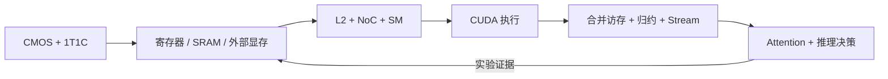

<!-- ai-infra-puzzles-header:start -->
<p align="center">
  
</p>

<h1 align="center">AI Infra Puzzles</h1>

<p align="center">
  <strong>Learn CUDA optimization and LLM inference through hands-on puzzles.</strong>
</p>
<!-- ai-infra-puzzles-header:end -->

# 第 04 章 — GPU 底层原理：从 CMOS 到 Attention

[← 中文首页](../../README_ZH.md) · [English chapter](../../chapters/04-gpu-hardware-foundations/README.md)

本章共 17 课，把电路直觉一直连接到 CUDA 与大模型推理。课程从 CMOS 开关和 1T1C DRAM 出发，经过 GPU 存储空间层级、HBM/GDDR 封装、L2
slice、NoC 和 SM 数据通路，最后把这些机制变成数据搬运、Attention IO、合并访存、原子操作、归约、 Event、Stream 与 GPU 参数审计实验。

视觉素材来自 Linnea Cai 的 GPU 底层原理学习笔记，并在本章逐一使用。图中结构是 概念性教学表达；不同商业 GPU 的拓扑、数量、电路细节与产品代际可能不同。每个实验
都会明确区分数值模型、容量计算与原生 PyTorch/CUDA 测量，并保留对应证据标签。



## 学习方法

1. 先写预测，再看 notebook 中保留的结果。
2. 沿图追踪 bit、request 与 partial result 的移动路径。
3. 判断当前证据是模型、容量计算，还是原生 GPU 执行。
4. 只有 shape、dtype、软件与硬件条件一致时，才复用结论。

## 证据标签

| 标签 | 能说明什么 |
|---|---|
| `pytorch-gpu` | 指定 PyTorch CUDA 操作在记录的 GPU 与软件栈上运行 |
| `numerical-model` | 透明方程、排队或 SIMT 模型证明一个机制不变量 |
| `capacity-model` | 实测环境事实进入显式层级、资源或 Roofline 计算 |
| `compatibility-probe` | 检查仓库/API 结构，不声称性能因果关系 |

## 阶段 I — 电路与存储物理

| 课 | 问题 | 实验 |
|---:|---|---|
| 01 | [CMOS 开关、状态与动态功耗](01-cmos-switching-dynamic-power/README.md) | [notebook](../../chapters/04-gpu-hardware-foundations/01-cmos-switching-dynamic-power/lab.ipynb) |
| 02 | [1T1C DRAM：电荷共享、感放与恢复](02-dram-1t1c-charge-sharing/README.md) | [notebook](../../chapters/04-gpu-hardware-foundations/02-dram-1t1c-charge-sharing/lab.ipynb) |
| 03 | [GPU 存储器的空间层级](03-gpu-memory-spatial-hierarchy/README.md) | [notebook](../../chapters/04-gpu-hardware-foundations/03-gpu-memory-spatial-hierarchy/lab.ipynb) |

## 阶段 II — 数据搬运与计算通路

| 课 | 问题 | 实验 |
|---:|---|---|
| 04 | [为什么数据搬运可能比计算更贵](04-data-movement-roofline/README.md) | [notebook](../../chapters/04-gpu-hardware-foundations/04-data-movement-roofline/lab.ipynb) |
| 05 | [向 SM 与 Tensor Core 喂数](05-sm-tensor-core-data-path/README.md) | [notebook](../../chapters/04-gpu-hardware-foundations/05-sm-tensor-core-data-path/lab.ipynb) |
| 06 | [Attention 加速首先是 IO 问题](06-attention-io-tiling/README.md) | [notebook](../../chapters/04-gpu-hardware-foundations/06-attention-io-tiling/lab.ipynb) |
| 07 | [从 DRAM 单元到 HBM 封装](07-hbm-circuit-to-package/README.md) | [notebook](../../chapters/04-gpu-hardware-foundations/07-hbm-circuit-to-package/lab.ipynb) |

## 阶段 III — 片上组织与竞争

| 课 | 问题 | 实验 |
|---:|---|---|
| 08 | [L2 Slice 内部：Tag、Bank 与 Miss 状态](08-l2-slices-cache-locality/README.md) | [notebook](../../chapters/04-gpu-hardware-foundations/08-l2-slices-cache-locality/lab.ipynb) |
| 09 | [NoC 路由、缓冲与拥塞](09-noc-routing-contention/README.md) | [notebook](../../chapters/04-gpu-hardware-foundations/09-noc-routing-contention/lab.ipynb) |
| 10 | [SM 资源：Occupancy、寄存器与 Bank](10-sm-resources-occupancy-banks/README.md) | [notebook](../../chapters/04-gpu-hardware-foundations/10-sm-resources-occupancy-banks/lab.ipynb) |
| 11 | [控制器、原子操作与功耗/频率包络](11-controllers-atomics-power-clock/README.md) | [notebook](../../chapters/04-gpu-hardware-foundations/11-controllers-atomics-power-clock/lab.ipynb) |

## 阶段 IV — CUDA 执行与优化

| 课 | 问题 | 实验 |
|---:|---|---|
| 12 | [CUDA 执行模型：Grid、Block、Warp 与分支分歧](12-cuda-execution-simt-divergence/README.md) | [notebook](../../chapters/04-gpu-hardware-foundations/12-cuda-execution-simt-divergence/lab.ipynb) |
| 13 | [合并访存、Stride 与 Shared-Memory 暂存](13-coalescing-strides-shared-memory/README.md) | [notebook](../../chapters/04-gpu-hardware-foundations/13-coalescing-strides-shared-memory/lab.ipynb) |
| 14 | [归约、原子操作与 Warp 原语](14-reductions-atomics-warp-primitives/README.md) | [notebook](../../chapters/04-gpu-hardware-foundations/14-reductions-atomics-warp-primitives/lab.ipynb) |
| 15 | [CUDA Event、Stream 与库基线](15-events-streams-library-baselines/README.md) | [notebook](../../chapters/04-gpu-hardware-foundations/15-events-streams-library-baselines/lab.ipynb) |

## 阶段 V — 工程证据与硬件决策

| 课 | 问题 | 实验 |
|---:|---|---|
| 16 | [从 Kernel 证据到推理工程](16-performance-evidence-portfolio/README.md) | [notebook](../../chapters/04-gpu-hardware-foundations/16-performance-evidence-portfolio/lab.ipynb) |
| 17 | [审慎阅读 GPU 参数表](17-gpu-spec-table-audit/README.md) | [notebook](../../chapters/04-gpu-hardware-foundations/17-gpu-spec-table-audit/lab.ipynb) |

## 视觉资料

全部素材保存在英文主章节的 [`assets/`](../../chapters/04-gpu-hardware-foundations/assets/) 目录。PNG
会直接嵌入相关课程，交互 HTML 和打印版 PDF 也会在对应位置提供入口。

- [交互式 CMOS 反相器](../../chapters/04-gpu-hardware-foundations/assets/visualizations/cmos-inverter.html)
- [交互式 1T1C DRAM 读取](../../chapters/04-gpu-hardware-foundations/assets/visualizations/dram-1t1c-read-mechanism.html)
- [交互式 GPU 存储布局](../../chapters/04-gpu-hardware-foundations/assets/visualizations/gpu-memory-spatial-layout.html)
- [HBM 打印版](../../chapters/04-gpu-hardware-foundations/assets/HBM_circuit_to_gpu_connection_A4_portrait.pdf)
- [L2 slice 打印版](../../chapters/04-gpu-hardware-foundations/assets/L2_cache_slice_circuit_structure_A4_portrait.pdf)
- [NoC 打印版](../../chapters/04-gpu-hardware-foundations/assets/NoC_on_chip_network_circuit_structure_A4_portrait.pdf)
- [NoC 与 SM 打印版](../../chapters/04-gpu-hardware-foundations/assets/NoC_and_SM_circuit_structures_A4_portrait.pdf)
- [四页 GPU 电路图册](../../chapters/04-gpu-hardware-foundations/assets/GPU_circuit_structures_from_L2_A4_landscape.pdf)

## 复现与验证

```bash
python3 -m pip install -r requirements-gpu-foundations.txt
python3 scripts/execute_chapter_notebooks.py --chapter 04 --start 1 --end 17
python3 scripts/build_chapter04_lessons.py --chapter-readme
python3 scripts/validate_chapter.py 04
python3 scripts/audit_chapter04_delivery.py
```
