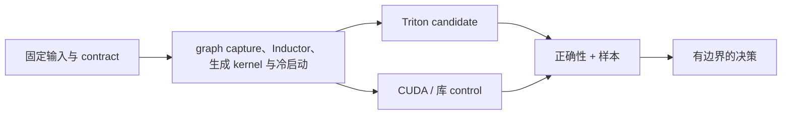

<!-- ai-infra-puzzles-header:start -->
<p align="center">
  
</p>

<h1 align="center">AI Infra Puzzles</h1>

<p align="center">
  <strong>Learn CUDA optimization and LLM inference through hands-on puzzles.</strong>
</p>
<!-- ai-infra-puzzles-header:end -->

# 第 22 课 — 通过 torch.compile 集成 PyTorch

> **问题：**当graph capture、Inductor、生成 kernel 与冷启动同时变化时，怎样判断原因来自 kernel、布局、工具链还是硬件边界？

[← 第 05 章](../README.md) · [English lesson](../../../chapters/05-triton-gpu-programming/22-torch-compile-integration/README.md) · [实验 Notebook](../../../chapters/05-triton-gpu-programming/22-torch-compile-integration/lab.ipynb) · [RTX 5090 结果](../../../chapters/05-triton-gpu-programming/22-torch-compile-integration/artifacts/rtx5090-result.json)

## 为什么值得研究

本课只隔离研究**graph capture、Inductor、生成 kernel 与冷启动**。目的不是把每个 PyTorch 操作都改成自定义代码，
而是把一个性能判断缩小到可以逐项检查：正确性、计时、布局、编译状态和对照路径都要 说清楚。理论材料提供问题边界，仓库中的实验则把它变成可以被推翻的判断。

## 运行前先预测

1. 预测哪条路径的 warm 中位延迟更低，并写出预期机制。
2. 预测最容易让结论失效的特殊 shape、dtype、stride 或工具链条件。
3. 写出什么观察会让你保留 baseline，而不是采用 candidate。

## 1. 建立机制

torch.compile 捕获 PyTorch graph，并让 Inductor 生成融合代码；在 CUDA 上常会使用 Triton。它可以避免手写 kernel，却把编译、graph
break、guard 与动态 shape 纳入系统。

推理时抓住三个锚点：

1. **地址与工作映射：**明确哪个 program 负责哪个输出、实际请求哪些字节。
2. **编译边界：**分开运行期值、编译期 meta-parameter 与 cache key。
3. **证据边界：**区分源码检查、原生执行、数值模型和 profiler counter。



## 2. 对比 Triton 与 CUDA 或库函数路径

| 问题 | Triton blocked program | CUDA / 库 control |
|---|---|---|
| 工作映射 | 一个 program 计算编译器可见的 tensor block | CUDA 显式映射标量 thread；库函数内部映射由实现维护 |
| 访存表达 | pointer tensor 与 mask 共同描述地址 | thread index 或文档化 library contract 确定地址 |
| 调优入口 | `BLOCK`、`num_warps`、stage、特化与 autotune | block 几何、template、库算法或架构专用代码 |
| 集成方式 | Python JIT，直接接收 tensor | 编译扩展，或通过 framework/library 调用 |
| 所需证据 | 正确性、warm 样本、target 身份与 profiler | 同样的证据；自定义 CUDA 还必须真正完成工具链构建 |

把 compiled 冷启动与 eager warm 时间相比，或把全部收益归因于一个生成 kernel，都会产生无效结论。

## 3. 把理论变成实验

**实验：**编译一个 pointwise PyTorch 子图，记录冷启动、compiled warm、eager warm 与误差。

| 实验角色 | 固定定义 |
|---|---|
| Baseline | 明确命名的 PyTorch CUDA/库函数或标准 grid 路径 |
| Candidate | 实验中明确描述的优化框架路径 |
| 保持不变 | 输入值、shape、dtype、输出 contract、计时 helper、warmup 策略与目标 GPU |
| 正确性 | 先与明确命名的 reference 对比，再解释 latency |
| 测量内容 | 两个本课字段、最大绝对误差、JSON 内完整样本和 Boolean gate |
| 证据标签 | `native-backend` |

Notebook 从 `scripts/chapter05_runtime.py` 导入已审阅 kernel。真正的 `@triton.jit` 函数 保存在这份共享文件中；Notebook
固定课号、记录环境、运行本课实验，并写出 canonical JSON artifact。这样既避免三十份 kernel 漂移，也保留逐课复现入口。

## 4. 阅读仓库中的 RTX 5090 结果

**记录环境：**NVIDIA GeForce RTX 5090; compute capability 12.0; PyTorch 2.13.0+cu130; CUDA runtime 13.0; Triton 3.7.1; Python 3.12.3。

| 测量字段 | 仓库记录值 |
|---|---:|
| Compiled 冷启动 | 1013.7197 ms |
| Compiled warm 中位延迟 | 0.0557 ms |
| 最大绝对误差 | 1.788e-07 |
| 验收 gate | true |

### 如何解释结果

torch.compile 冷启动为 1013.72 ms；warm 中位数 0.0557 ms，eager 为 0.0261 ms。编译成本与稳态性能分开记录。

表格刻意只保留最关键字段。完整计时样本、target 身份、辅助字节或 shape 字段，以及 验收结果都在
[`rtx5090-result.json`](../../../chapters/05-triton-gpu-programming/22-torch-compile-integration/artifacts/rtx5090-result.json)
中，读者可以重新计算摘要，而不是依赖一张四舍五入的截图。

## 5. 得出有边界的结论

> 当 graph 稳定且生成代码满足 gate 时，先尝试 compiler fusion，再决定是否维护手写 kernel。

如果部署 shape、dtype、stride、编译器版本、目标架构、并发或周边 graph 改变，本结论 就可能失效。把 compiled 冷启动与 eager warm
时间相比，或把全部收益归因于一个生成 kernel，都会产生无效结论。出现这些变化，或 profiler 与预期机制冲突时，应重新打开 决策，而不是沿用旧数字。

## 审阅清单

1. 先验证输出语义，再阅读速度。
2. baseline 必须明确命名，不能只写成含糊的“CUDA”。
3. cold 编译与 warm 设备执行必须分列。
4. 查看样本与 effect size，不能用单次最小值决策。
5. 明确哪些路径没有执行，尤其是自定义 CUDA 或另一种硬件 backend。
6. candidate 进入生产时，必须保留 rollback 路径。

## 复现

```bash
python3 -m pip install -r requirements-triton.txt
python3 scripts/execute_chapter_notebooks.py --chapter 05 --start 22 --end 22
python3 scripts/build_chapter05_lessons.py
```

## 继续实验

至少补测一个对齐 shape、一个特殊 tail 和一个 non-contiguous 布局。如果结果对性能 敏感，可在本地采集 profiler trace，但只把验证机制所需的派生
counter 写入结果。 正确性一旦失败就应停止，不要围绕未解释的数值或地址错误继续调参。

## 证据边界

**证据标签：**[`native-backend`](../README.md#证据标签)。指定 Triton 或 PyTorch CUDA 路径已经在记录的 GPU 上执行。结果只适用于打印出的 shape、dtype、实现和软件栈；内部硬件因果仍需 profiler 证据。

## 参考资料

- [torch.compile documentation](https://docs.pytorch.org/docs/stable/generated/torch.compile.html)
- [Triton Python API](https://triton-lang.org/main/python-api/triton.html)
