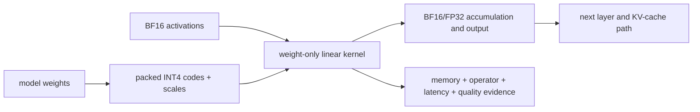

# Lesson 01 — Precision Formats: INT4, Smaller but Faster?

> **Puzzle:** Reducing model weights from BF16 to INT4 makes them smaller. Why
> can the resulting model still run more slowly?

[← Chapter 01](../README.md) · [Project homepage](../../../README.md) · [Executed notebook](lab.ipynb)

## Your prediction

Before looking at the measurements, predict what will happen when a
Qwen2.5-1.5B model is converted from BF16 to weight-only INT4:

1. How much will model storage decrease?
2. Will Prefill become faster at 128, 512, and 1,024 input tokens?
3. Will Decode throughput improve?
4. How will you prove that an INT4 kernel actually ran?

Write down your answers first. Then run the experiment or inspect the checked-in
result.

| Next step | File |
|---|---|
| Run both paths | [`support/run.sh`](support/run.sh) |
| Read the benchmark | [`support/benchmark.py`](support/benchmark.py) |
| Read the summarizer | [`support/summarize.py`](support/summarize.py) |
| Explore the result | [`lab.ipynb`](lab.ipynb) |
| Inspect the public artifact | [`artifacts/rtx5090-result.json`](artifacts/rtx5090-result.json) |

## 1. A precision format is not a speed ranking

Do not ask only which format uses fewer bits. Ask:

1. Which tensors use the format?
2. How are those tensors stored?
3. Which kernel consumes them?
4. What happens to memory, latency, and output behavior?

A single inference pass may contain all of the following:

```text
packed INT4 weights
        ↓ weight-only kernel or dequantization
BF16 activations
        ↓ matrix multiplication
BF16 / FP32 accumulation and output

The KV cache may use a separate format again.
```

Calling a model "INT4" does not mean every tensor or operation is 4-bit.

| Format | Typical storage per value | Practical meaning in this puzzle |
|---|---:|---|
| FP32 | 4 bytes | High-precision reference or sensitive operations |
| TF32 | Usually stored as FP32 | Tensor Core compute mode for eligible FP32 matrix multiplies |
| FP16 | 2 bytes | Compact floating point with less exponent range than BF16 |
| BF16 | 2 bytes | Common LLM baseline with FP32-like exponent range |
| FP8 | 1 byte | Low-precision float that depends on hardware and backend support |
| INT8 | About 1 byte + scales | Integer quantization with metadata and kernel requirements |
| INT4 | About 0.5 byte + scales | Stronger compression with stricter quality and kernel constraints |

TF32 mainly changes how eligible FP32 matrix multiplies execute inside Tensor
Cores. It does not normally shrink a stored FP32 checkpoint from four bytes per
parameter to two. INT4 changes how weights are mapped, packed, scaled, and read
by a quantized operator. They solve different problems.

### Mechanism at a glance



### Walk it step by step

1. **Start with the stored object.** Identify which weights are packed to INT4
   and which layers remain BF16.
2. **Follow the runtime data path.** Track packed codes, group scales, BF16
   activations, accumulation dtype, and any unpack or dequantization work.
3. **Read four evidence axes.** Evaluate memory, operator identity, latency, and
   quality independently under one frozen workload.
4. **Make a workload-specific decision.** Use INT4 for the tested path only when
   its capacity benefit and service gates justify the added kernel work.

## 2. Keep a memory ledger

The theoretical weight size is only the first entry:

```text
theoretical weight bytes = parameter count × storage bytes per parameter
```

For a 7B-parameter model, the rough idealized sizes are:

| Weight format | Theoretical size |
|---|---:|
| FP32 | ~28 GB |
| BF16 / FP16 | ~14 GB |
| INT8 | ~7 GB plus metadata |
| INT4 | ~3.5 GB plus metadata |

Real inference also includes unquantized layers, scales, packing metadata,
activations, KV cache, temporary workspaces, framework state, and allocator
behavior. This puzzle therefore records separate values for unique tensor
storage, CUDA allocated after load, runtime peak allocated, and CUDA reserved.

## 3. Experiment setup

### Environment

| Item | Measured configuration |
|---|---|
| GPU | NVIDIA GeForce RTX 5090, 32,607 MiB |
| Compute capability | 12.0 |
| Driver | 595.71.05 |
| Python | 3.12.13 |
| PyTorch / CUDA runtime | 2.12.0 / 13.0 |
| Transformers | 5.12.0 |
| TorchAO | 0.17.0 |
| Model | Qwen2.5-1.5B-Instruct |
| Model revision | `989aa7980e4cf806f80c7fef2b1adb7bc71aa306` |

### Controlled comparison

| BF16 baseline | INT4 candidate |
|---|---|
| BF16 weights and compute | TorchAO weight-only INT4 |
| Batch size 1 | Batch size 1 |
| Same checkpoint | Same checkpoint |
| Same prompts, warm-ups, and repetitions | Same conditions |
| No INT4 modules | Group size 128, BF16 input/compute |

Prefill uses sequence lengths 128, 512, and 1,024 with three warm-up runs and
ten recorded runs. Generation uses a 128-token prompt, greedy decoding for 64
new tokens, two warm-ups, and five recorded runs.

## 4. Did INT4 really run?

Yes, but the conversion was partial:

- 113 of 197 linear layers became `WeightOnlyInt4Linear`;
- `o_proj`, `gate_proj`, `up_proj`, `down_proj`, and `lm_head` were quantized;
- 84 `q_proj`, `k_proj`, and `v_proj` layers remained BF16;
- the profiler recorded `aten::_weight_int4pack_mm`.

This operator evidence matters. A small model file or an `int4` label alone
does not prove that the intended kernel executed.

## 5. Measurements

### Memory

| Metric | BF16 | INT4 | INT4 change |
|---|---:|---:|---:|
| Unique tensor storage | 2.875 GiB | 1.319 GiB | -54.12% |
| CUDA allocated after load | 2.876 GiB | 1.336 GiB | -53.54% |
| Runtime peak allocated | 3.228 GiB | 1.688 GiB | -47.71% |

INT4 clearly reduced stable active memory. However, this experiment first
loaded BF16 and then packed INT4 online. That conversion caused a higher
temporary peak and left more memory reserved by the caching allocator. Directly
loading an offline-quantized checkpoint may behave differently.

### Prefill

| Input length | BF16 median | INT4 median | Result |
|---:|---:|---:|---|
| 128 | 9.944 ms | 13.619 ms | INT4 was 36.97% slower |
| 512 | 11.318 ms | 43.963 ms | INT4 was 288.42% slower |
| 1,024 | 19.783 ms | 85.478 ms | INT4 was 332.08% slower |

Dispatching a real INT4 kernel does not guarantee that the kernel is faster for
the current batch size, matrix shapes, model, and software backend.

### Generation and approximate Decode

| Metric | BF16 | INT4 | Result |
|---|---:|---:|---|
| 64-token generation median | 643.123 ms | 673.642 ms | INT4 was 4.75% slower |
| Approx. Decode throughput | 101.077 tok/s | 96.966 tok/s | INT4 was 4.07% lower |

Decode here is an approximation: total generation median minus a separately
measured Prefill median. It is not a strict per-token CUDA-event decomposition.

### Small quality probe

| Metric | Result |
|---|---:|
| BF16 accuracy on 20 fixed questions | 90% |
| INT4 accuracy on 20 fixed questions | 85% |
| Generated-answer agreement | 95% |
| Final-position top-1 logit agreement | 95% |
| Mean logit cosine similarity | 0.955426 |

The 20 fixed Chinese multiple-choice questions are a regression probe, not a
general model-quality benchmark.

## 6. Solve the puzzle

The evidence supports four separate statements:

```text
Real INT4 kernel executed             yes
Stable active memory decreased        yes
Prefill became faster                 no
Decode became faster                  no
General quality is proven acceptable  not established
```

The bounded decision is therefore:

> Keep BF16 as the default performance path. Treat this TorchAO INT4 setup as a
> memory-capacity option for the tested configuration.

Why can smaller be slower? Weight compression reduces bytes, but performance is
determined by the complete execution path: packing and scale handling,
dequantization or fused-kernel efficiency, matrix shapes, Tensor Core
utilization, launch overhead, and the amount of work outside quantized linear
layers. In this experiment those costs outweighed the memory-traffic benefit.

This is not a universal claim that INT4 is slow on RTX 5090. A different INT4
backend, offline-packed checkpoint, model shape, batch size, sequence length, or
software version could reverse the result.

## 7. Reproduce it

To run the actual BF16 and INT4 GPU experiment in the Notebook:

```bash
python3 -m venv .venv
source .venv/bin/activate
pip install -r requirements-notebook.txt
pip install -r requirements.txt
jupyter lab chapters/01-mixed-precision-int4/01-precision-formats/lab.ipynb
```

Using **Run All** starts fresh BF16 and INT4 measurements and rebuilds the
comparison from that run. The saved outputs in the public Notebook were
generated on the recorded RTX 5090.

### Full GPU benchmark

Use a PyTorch/CUDA build that supports your GPU. The tested package versions are
recorded in [`requirements.txt`](../../../requirements.txt).

```bash
python3 -m venv .venv
source .venv/bin/activate
pip install -r requirements.txt
./chapters/01-mixed-precision-int4/01-precision-formats/support/run.sh
```

The default model is `Qwen/Qwen2.5-1.5B-Instruct`. To use a local checkpoint:

```bash
CH1_MODEL=/path/to/model CH1_LOCAL_FILES_ONLY=1 \
  ./chapters/01-mixed-precision-int4/01-precision-formats/support/run.sh
```

## Evidence boundary

- The compact public result is stored in [`artifacts/rtx5090-result.json`](artifacts/rtx5090-result.json).
- The benchmark and profiler were executed in the recorded RTX 5090 environment.
- The public runner is the path-parameterized version of that experiment code.
- Results apply only to the recorded model, hardware, versions, batch size, and
  shapes.

## References

- [CUDA Programming Guide: alternate floating-point formats](https://docs.nvidia.com/cuda/cuda-programming-guide/05-appendices/cpp-language-extensions.html#alternate-floating-point)
- [PyTorch automatic mixed precision](https://docs.pytorch.org/docs/stable/amp.html)
- [TensorRT quantized types and schemes](https://docs.nvidia.com/deeplearning/tensorrt/latest/inference-library/quantized-types-schemes.html)
