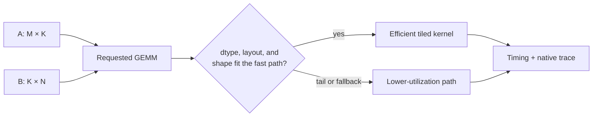

<!-- ai-infra-puzzles-header:start -->
<p align="center">
  
</p>

<h1 align="center">AI Infra Puzzles</h1>

<p align="center">
  <strong>Learn CUDA optimization and LLM inference through hands-on puzzles.</strong>
</p>
<!-- ai-infra-puzzles-header:end -->

# Lesson 02 — Tensor Core Constraints for Low-Precision GEMM

> **Puzzle:** A low-precision dtype is available, so will every matrix multiplication automatically become a fast Tensor Core operation?

[← Chapter 01](../README.md) · [Project homepage](../../../README.md) · [Executed notebook](lab.ipynb) · [RTX 5090 result](artifacts/rtx5090-result.json)

## Why this puzzle matters

A peak-TFLOPS table describes a capability of the chip, not the path selected for every
matrix multiplication. In an LLM, the same nominal BF16 operation can arrive with
different M, N, and K dimensions, strides, transpositions, and batch sizes. Those
details determine whether useful work fills the matrix-multiply tiles or whether edge
handling, memory traffic, and launch overhead dominate.

## Predict before reading the result

1. Predict whether BF16 will beat FP32 for both shapes, then predict which shape will lose more efficiency.
2. State what timing can prove and what extra trace would be required before naming a Tensor Core instruction.
3. Choose the shape information that must be preserved for another reader to reproduce the result.

## 1. Start from concrete tensors and state

A GEMM consumes `A[M,K]` and `B[K,N]`. Dtype, strides, transposition, leading
dimensions, and the three logical sizes travel together into dispatch; the word *BF16*
by itself is not a kernel description.

### Three reasoning anchors

| # | Lesson-specific claim to keep visible |
|---:|---|
| 1 | A dtype is only one dispatch condition; layout, dimensions, alignment, and backend policy also select the kernel. |
| 2 | Arithmetic intensity separates compute-bound GEMMs from shapes dominated by memory traffic or launch overhead. |
| 3 | Timing establishes performance for a shape; operator or kernel evidence establishes what ran. |

## 2. Derive the mechanism

A useful first model is `FLOPs ≈ 2MKN` and `arithmetic intensity = FLOPs / bytes moved`.
Large aligned tiles can amortize loads and feed matrix-multiply hardware; awkward
dimensions create edge tiles, padding, or a different implementation. Tensor Core
eligibility is therefore a conjunction of hardware, dtype, shape, layout, and library
support.

For `C[M,N] = A[M,K] @ B[K,N]`, the leading operation count is `2MKN`. That number is
only the numerator of the performance story. A first roofline estimate divides it by
bytes moved; a dispatch estimate also asks whether M, N, K, layout, alignment, and dtype
fit a library kernel's tiling rules. When `N=2055`, the mathematical work increases by
only about 0.34% relative to `N=2048`, yet the physical implementation may need a tail
tile or a different kernel. A large timing discontinuity is therefore evidence about
shape sensitivity, not proof of one particular instruction.

This distinction matters in attention and MLP layers because their matrices are not
interchangeable. Prefill creates large M dimensions, while Decode often presents
GEMV-like or very small-M work. A kernel that is excellent for one phase can leave
Tensor Cores under-filled in another. The useful unit of reasoning is consequently a
shape family plus an operator trace, not the model's advertised precision.

### Mechanism at a glance



### Walk it step by step

1. **Write the exact GEMM.** Record M, N, K, dtype, layout, and strides; a model-level precision label is not enough.
2. **Estimate the useful work.** Use 2MKN to see how little the awkward shape changes the mathematical workload.
3. **Check dispatch constraints.** Ask whether alignment, tile boundaries, and the Decode or Prefill shape family fit an efficient kernel.
4. **Separate observations.** Timing establishes application behavior; a native trace is required to name the instruction path.

## 3. Translate the theory into an experiment

**Experiment:** Time FP32 and BF16 matrix multiplications with aligned and deliberately awkward dimensions on the same GPU.

| Experimental role | Frozen definition |
|---|---|
| Baseline | FP32 GEMM for the exact aligned and awkward shapes |
| Candidate | BF16 GEMM for the same tensors and timing protocol |
| Held constant | GPU, M and K, random distribution, warm-up, repetitions, CUDA-event timing |
| Measurements | median and p90 latency for each dtype/shape pair |
| Evidence label | `pytorch-gpu` |

The lab changes dtype and one alignment condition while keeping the GPU and timing
method fixed; the output is shape evidence, not a native-kernel assertion.

### Code walk-through

The notebook allocates each shape once, warms the operation four times, and records
twelve CUDA-event samples. Synchronization happens inside the timing helper so host
launch latency is not mistaken for completed GPU work. The aligned and awkward cases
differ only in N; this keeps the comparison narrow enough to attribute a timing change
to shape and dispatch behavior.

The code deliberately does not parse native kernel names. PyTorch-level timing tells us
what the application observed, while Nsight Systems or Nsight Compute would be the next
evidence layer for `mma`/Tensor Core utilization, tile occupancy, memory throughput, and
tail effects.

## 4. Read the checked-in RTX 5090 result

**Recorded environment:** NVIDIA GeForce RTX 5090; compute capability 12.0; PyTorch 2.12.0; CUDA runtime 13.0.

| Measured field | Checked-in value |
|---|---:|
| Aligned BF16 median | 0.087632 ms |
| Aligned FP32 median | 0.262096 ms |
| Awkward BF16 median | 0.176048 ms |
| Awkward FP32 median | 0.319312 ms |
| Recorded samples per case | 12 |

### What the numbers mean

On the checked-in RTX 5090 run, aligned BF16 took 0.087632 ms versus 0.262096 ms for
FP32, a 2.99x ratio. Changing only N from 2048 to 2055 raised BF16 latency to 0.176048
ms—about 2.01x the aligned BF16 time—even though the arithmetic count barely changed.
FP32 also slowed, but by a smaller 1.22x ratio.

The correct conclusion is not that `2055` is universally bad or that one named Tensor
Core kernel was missed. It is that dtype speedups are conditional on shape, and that an
awkward boundary can erase a large fraction of the expected benefit. Native dispatch
identity remains an explicit follow-up measurement.

Open [`artifacts/rtx5090-result.json`](artifacts/rtx5090-result.json) when you need
every repeated sample or a field not selected for the tutorial table.

## 5. Solve the puzzle and make a decision

> Low precision creates an opportunity, not a guarantee. Preserve exact shapes and profiler evidence when deciding whether a Tensor Core path was reached.

### Acceptance and rollback gate

Keep the exact `M,N,K`, strides, dtype, warm-up, and repeated timing. Use an operator
trace to show dispatch and Nsight Compute/System metrics before naming a native Tensor
Core kernel.

### How this conclusion can fail

A misleading benchmark would compare different shapes, include first-call
initialization, report one sample, or infer Tensor Core use from a fast BF16 result.
Padding is also not automatically a fix: it may improve tile utilization while adding
FLOPs and temporary storage. Accept padding only after measuring the complete padded
operator and its downstream layout costs.

## Reproduce

From the repository root:

```bash
python3 -m venv .venv
source .venv/bin/activate
pip install -r requirements-notebook.txt
jupyter lab chapters/01-mixed-precision-int4/02-tensor-core-constraints/lab.ipynb
```

Use **Run All** and compare the regenerated result with the checked-in artifact.

## Extend the experiment

Profile both shapes with Nsight Compute and record the selected kernel, achieved
occupancy, tensor-pipe utilization, DRAM throughput, and wasted edge work. Then repeat
with Decode-like M values such as 1, 8, and 32. The exercise is successful when you can
explain a reversal using both the trace and the timing distribution rather than the
dtype label alone.

## Evidence boundary

**Evidence label:** [`pytorch-gpu`](../README.md#evidence-labels).

## References

- [CUDA Programming Guide](https://docs.nvidia.com/cuda/cuda-programming-guide/index.html)
- [PyTorch numerical accuracy notes](https://docs.pytorch.org/docs/stable/notes/numerical_accuracy.html)
- [Nsight Compute profiling guide](https://docs.nvidia.com/nsight-compute/ProfilingGuide/index.html)
