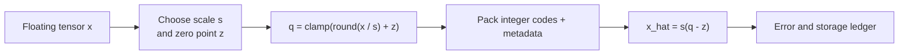

# Lesson 08 — Quantization Math: Scale, Zero Point, Group Size, and Error

> **Puzzle:** Why does changing group size alter both model size and reconstruction error?

[← Chapter 01](../README.md) · [Project homepage](../../../README.md) · [Executed notebook](lab.ipynb) · [RTX 5090 result](artifacts/rtx5090-result.json)

## Why this puzzle matters

The label INT4 hides the parameters that determine what four bits mean. Scale chooses
the real interval covered by the codes, zero point chooses where real zero lands, and
group size chooses how many values share one range estimate. Those choices change both
reconstruction error and metadata, even before a deployment kernel enters the picture.

## Predict before reading the result

1. Derive symmetric INT4 quantize and dequantize equations for code range [-8, 7].
2. Predict how RMSE, scale count, and effective bits per weight change as group size shrinks.
3. Explain why saturation fraction alone does not rank quantizers.

## 1. Start from concrete tensors and state

Uniform quantization stores integer codes plus scale metadata and, for asymmetric
schemes, zero points. Granularity may be per tensor, row/channel, or group/block.

### Three reasoning anchors

| # | Lesson-specific claim to keep visible |
|---:|---|
| 1 | Scale maps a floating-point interval to a finite code range. |
| 2 | Symmetric quantization fixes zero point at zero; asymmetric quantization can spend codes more efficiently on shifted data. |
| 3 | Smaller groups adapt to local ranges but require more scale metadata. |

## 2. Derive the mechanism

A common mapping is `q = clamp(round(x/s)+z, qmin, qmax)` and `x_hat = s(q-z)`.
Symmetric INT4 typically uses `z=0` and a signed range near `[-8,7]`. Smaller groups
estimate local ranges and reduce outlier sharing.

For symmetric signed b-bit quantization, let `qmax = 2^(b-1)-1`, `s = max(|x|)/qmax`, `q
= clamp(round(x/s), -qmax-1, qmax)`, and `x̂ = s·q`. With asymmetric quantization a zero
point z shifts the code grid: `q = clamp(round(x/s)+z, qmin, qmax)` and `x̂=s(q-z)`.
Grouping repeats this calculation over local slices rather than the whole tensor.

If each group stores one FP16 scale, its metadata cost is `16/group_size` bits per
weight. Nominal INT4 therefore becomes 5.0 effective bits at group size 16, 4.25 at 64,
and 4.125 at 128 before padding or zero-point metadata. Smaller groups can isolate
outliers but may be incompatible with the fastest backend kernels.

### Mechanism at a glance



### Walk it step by step

1. **Choose a quantization range.** Derive scale and, for asymmetric quantization, zero point from the calibration range.
2. **Map to integer codes.** Round and clamp each value into the available codebook.
3. **Reconstruct for comparison.** Dequantize with the same metadata and measure error against the original tensor.
4. **Change one granularity at a time.** Sweep group size while retaining metadata bytes so accuracy and effective storage remain comparable.

## 3. Translate the theory into an experiment

**Experiment:** Quantize an outlier-containing matrix with INT4 group sizes 16, 64, and 128 and compare error plus metadata overhead.

| Experimental role | Frozen definition |
|---|---|
| Baseline | one fixed outlier-containing 1024×1024 weight matrix |
| Candidate | symmetric INT4 with group sizes 16, 64, and 128 |
| Held constant | same codes, scale dtype assumption, grouping axis, seed, and error reference |
| Measurements | RMSE/cosine error, saturation fraction, scale count, effective bits per weight |
| Evidence label | `numerical-model` |

The notebook holds the weight matrix fixed, changes only group size, and records both
error and effective bits per weight.

### Code walk-through

The notebook holds the matrix and quantization formula fixed and changes only group
size. Each candidate is dequantized back to floating point before error is measured.
Metadata is computed from the number of scales, making the storage comparison honest
instead of repeating the nominal four-bit label.

This is a numerical model. It does not pack nibbles, instantiate a production quantized
linear layer, or time an INT4 kernel. That separation lets the lab answer the math
question without overstating backend performance.

## 4. Read the checked-in RTX 5090 result

**Recorded environment:** NVIDIA GeForce RTX 5090; compute capability 12.0; PyTorch 2.12.0; CUDA runtime 13.0.

| Measured field | Checked-in value |
|---|---:|
| Group 16 RMSE | 0.200316 |
| Group 16 effective bits | 5.000 bits/weight |
| Group 64 RMSE | 0.384361 |
| Group 64 effective bits | 4.250 bits/weight |
| Group 128 RMSE | 0.508112 |
| Group 128 effective bits | 4.125 bits/weight |

### What the numbers mean

Group size 16 produced the lowest RMSE, 0.200316, and cosine 0.992188, but required
65,536 scales and 5.0 effective bits per weight. At group size 128, scale count fell to
8,192 and effective storage to 4.125 bits, while RMSE rose to 0.508112 and cosine fell
to 0.950873. Group size 64 sat between them.

The saturation fraction decreased with larger groups because the shared maximum widened
each step size; fewer values landed on the extreme code, but reconstruction became
coarser. This is why a lower saturation count is not automatically a better quantizer.

Open [`artifacts/rtx5090-result.json`](artifacts/rtx5090-result.json) when you need
every repeated sample or a field not selected for the tutorial table.

## 5. Solve the puzzle and make a decision

> Group size is an error–metadata–kernel compatibility decision, not a cosmetic configuration value.

### Acceptance and rollback gate

Report nominal bits, scale/zero-point overhead, clipping rate, reconstruction error,
group axis, and kernel-compatible group size together.

### How this conclusion can fail

Comparing only weight RMSE ignores how inputs weight different columns. Comparing only
effective bits ignores alignment, padding, and scale loads. Finally, a group size with
good numerical behavior can lose in production if the backend does not provide a fused
kernel for that layout.

## Reproduce

From the repository root:

```bash
python3 -m venv .venv
source .venv/bin/activate
pip install -r requirements-notebook.txt
jupyter lab chapters/01-mixed-precision-int4/08-quantization-math/lab.ipynb
```

Use **Run All** and compare the regenerated result with the checked-in artifact.

## Extend the experiment

Add asymmetric zero points for shifted distributions, compare per-row and per-column
grouping, and weight the error by held-out activations. Then pack two INT4 codes per
byte and time a compatible native kernel so numerical, storage, and operator gates are
all represented.

## Evidence boundary

**Evidence label:** [`numerical-model`](../README.md#evidence-labels).

## References

- [TensorRT quantization schemes](https://docs.nvidia.com/deeplearning/tensorrt/latest/inference-library/quantized-types-schemes.html)
- [TensorRT quantization workflows](https://docs.nvidia.com/deeplearning/tensorrt/latest/inference-library/quantized-types-workflows.html)
- [PyTorch quantization fundamentals](https://docs.pytorch.org/ao/stable/contributing/quantization_overview.html)
