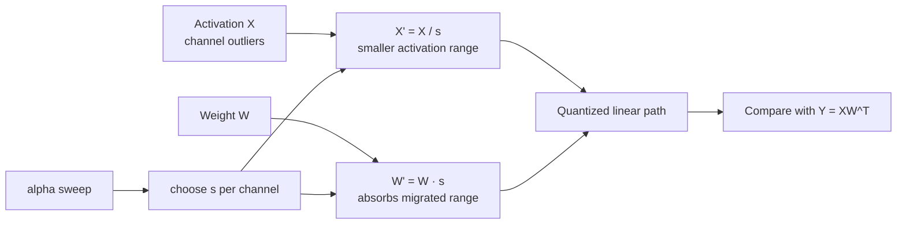

# Lesson 10 — INT8 SmoothQuant and Activation Outliers

> **Puzzle:** Can we make activations easier to quantize without changing the floating-point linear layer?

[← Chapter 01](../README.md) · [Project homepage](../../../README.md) · [Executed notebook](lab.ipynb) · [RTX 5090 result](artifacts/rtx5090-result.json)

## Why this puzzle matters

LLM activations often contain persistent channel outliers that make one tensor-wide INT8
scale waste most of its codes. SmoothQuant does not delete those outliers; it moves part
of their range into corresponding weight channels through an exactly equivalent
floating-point reparameterization, then quantizes the easier pair.

## Predict before reading the result

1. Prove that reciprocal channel scaling leaves `XWᵀ` unchanged before quantization.
2. Predict why alpha values near either endpoint can hurt combined W8A8 error.
3. Choose the validation metric that should select alpha after calibration.

## 1. Start from concrete tensors and state

SmoothQuant operates on matching input channels of activation `X` and weight `W` for a
linear layer `Y=XWᵀ`.

### Three reasoning anchors

| # | Lesson-specific claim to keep visible |
|---:|---|
| 1 | SmoothQuant applies reciprocal channel scaling to activations and weights, preserving the floating-point product. |
| 2 | The alpha parameter allocates quantization difficulty between activation and weight channels. |
| 3 | The best alpha depends on observed activation and weight ranges. |

## 2. Derive the mechanism

For positive channel scales `s`, `(X / s)(W · s)ᵀ = XWᵀ`. Choosing `s_j` from activation
and weight maxima moves channel difficulty without changing the floating-point function.
The exponent `alpha` decides how much range moves toward weights.

For positive channel scales s, define `X' = X / s` and `W' = W · s` along matching input
channels. Then `X'W'ᵀ = (X/s)(W·s)ᵀ = XWᵀ`. A common SmoothQuant form constructs s from
activation and weight maxima with an exponent alpha, so alpha controls how much range is
assigned to each side.

The equality holds before quantization. After W8A8 rounding, shrinking activation
outliers reduces activation step size while enlarged weight channels increase weight
step size. The objective is the error of the composed quantized linear output, not
activation amax in isolation.

### Mechanism at a glance



### Walk it step by step

1. **Measure channel ranges.** Collect activation and weight maxima on calibration data for matching input channels.
2. **Choose reciprocal scales.** Use alpha to decide how much range moves from each activation channel into its weight channel.
3. **Verify floating equivalence.** Before rounding, confirm that (X/s)(W·s)^T still equals XW^T.
4. **Quantize and validate.** Select alpha by held-out output or task quality, then verify a named W8A8 runtime path.

## 3. Translate the theory into an experiment

**Experiment:** Apply SmoothQuant-style channel scaling to an outlier-heavy linear layer, verify floating-point equivalence, and compare W8A8 reconstruction error over alpha values.

| Experimental role | Frozen definition |
|---|---|
| Baseline | W8A8 quantization without activation-to-weight migration (`alpha=0`) |
| Candidate | reciprocal channel scaling for alpha 0.25, 0.5, 0.75, and 1.0 |
| Held constant | same outlier-heavy X and W, per-tensor INT8 reference quantizer, held shapes |
| Measurements | floating-point equivalence max error and quantized output RMSE/cosine by alpha |
| Evidence label | `numerical-model` |

The notebook checks the algebraic invariant before quantizing both sides and comparing
output error across alpha values.

### Code walk-through

The notebook first evaluates the invariant in floating point for every alpha. Only after
that check does it quantize both transformed tensors and compare the output with the
original FP32 linear layer. This ordering prevents an algebra or broadcasting bug from
being mistaken for quantization error.

The sweep uses one calibration-like tensor and reports a numerical model, not a
TensorRT-LLM SmoothQuant kernel. A production experiment would freeze scales on
calibration data, evaluate held-out tasks, and measure a named W8A8 backend.

## 4. Read the checked-in RTX 5090 result

**Recorded environment:** NVIDIA GeForce RTX 5090; compute capability 12.0; PyTorch 2.12.0; CUDA runtime 13.0.

| Measured field | Checked-in value |
|---|---:|
| Alpha 0 RMSE | 3.298184 |
| Alpha 0.25 RMSE | 1.663379 |
| Alpha 0.5 RMSE | 1.151840 |
| Alpha 0.75 RMSE | 1.634807 |
| Alpha 1 RMSE | 3.224155 |
| Worst floating equivalence error | 0.000061 |

### What the numbers mean

Floating-point equivalence stayed within roughly `6.1e-5` for every alpha. Quantized
RMSE followed a U-shape: 3.298184 at alpha 0, 1.663379 at 0.25, a minimum of 1.151840 at
0.5, then 1.634807 at 0.75 and 3.224155 at 1.0. Cosine similarity peaked at 0.999785 for
alpha 0.5.

The middle value balanced activation and weight difficulty for this synthetic
distribution. The endpoints moved too much error to one side. This supports the
migration mechanism while leaving the best alpha model- and layer-dependent.

Open [`artifacts/rtx5090-result.json`](artifacts/rtx5090-result.json) when you need
every repeated sample or a field not selected for the tutorial table.

## 5. Solve the puzzle and make a decision

> Outlier migration is useful only when the combined activation-plus-weight quantized path improves under a frozen calibration protocol.

### Acceptance and rollback gate

Verify floating-point equivalence first, freeze calibration statistics, sweep alpha on
calibration data, and accept using held-out output/quality plus native W8A8 evidence.

### How this conclusion can fail

Choosing alpha from the same held-out set used for final quality reporting leaks the
test. Reducing activation range without quantizing weights can give a false victory.
Another failure is folding scales into weights but forgetting the corresponding
activation transform or its runtime/fusion cost.

## Reproduce

From the repository root:

```bash
python3 -m venv .venv
source .venv/bin/activate
pip install -r requirements-notebook.txt
jupyter lab chapters/01-mixed-precision-int4/10-smoothquant/lab.ipynb
```

Use **Run All** and compare the regenerated result with the checked-in artifact.

## Extend the experiment

Freeze channel statistics on one tensor set and select alpha on a separate validation
set, then report task quality on a third. Compare per-layer versus global alpha and
inspect which layers retain outliers. Finally run a native W8A8 backend and verify that
the scale transforms are folded or fused as intended.

## Evidence boundary

**Evidence label:** [`numerical-model`](../README.md#evidence-labels).

## References

- [SmoothQuant paper](https://arxiv.org/abs/2211.10438)
- [SmoothQuant paper implementation](https://github.com/mit-han-lab/smoothquant)
- [TensorRT quantization schemes](https://docs.nvidia.com/deeplearning/tensorrt/latest/inference-library/quantized-types-schemes.html)
