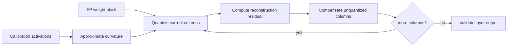

# Lesson 11 — GPTQ: Second-Order Intuition and Layer Reconstruction

> **Puzzle:** Why should two weights with the same magnitude receive different quantization treatment?

[← Chapter 01](../README.md) · [Project homepage](../../../README.md) · [Executed notebook](lab.ipynb) · [RTX 5090 result](artifacts/rtx5090-result.json)

## Why this puzzle matters

Nearest-weight quantization assumes every weight error matters equally. A linear layer
disproves that assumption: inputs can excite some columns strongly and barely touch
others, so the same weight perturbation can create very different output error. GPTQ
uses approximate second-order information to organize that sensitivity during one-shot
quantization.

## Predict before reading the result

1. Predict whether raw weight RMSE or held-out layer-output RMSE better matches the GPTQ objective.
2. Explain how input covariance makes two equal-magnitude weights differ in importance.
3. State why the notebook's sensitivity fallback is an intuition model rather than a GPTQ implementation.

## 1. Start from concrete tensors and state

GPTQ reconstructs one layer at a time using the layer weights and representative input
activations. It targets output distortion, not unweighted distance between original and
rounded weights.

### Three reasoning anchors

| # | Lesson-specific claim to keep visible |
|---:|---|
| 1 | Layer reconstruction minimizes output error under representative inputs, not raw weight error alone. |
| 2 | Input covariance approximates which directions are sensitive. |
| 3 | Production GPTQ uses structured second-order updates; a toy sensitivity model is not the library implementation. |

## 2. Derive the mechanism

For weight error `ΔW` and inputs `X`, layer error is approximately `||XΔWᵀ||²`; the
input Gram/Hessian approximation `XᵀX` weights sensitive directions. GPTQ uses
inverse-Hessian information to compensate remaining weights as columns are quantized.

For a layer `Y=XWᵀ`, a weight perturbation ΔW produces `ΔY=XΔWᵀ`. The squared
reconstruction loss is proportional to `||XΔWᵀ||²`, which can be written using the input
Gram matrix `XᵀX`. This matrix is the local curvature signal: errors along frequently
excited directions cost more than errors along quiet directions. GPTQ quantizes while
using an approximate inverse Hessian to compensate remaining weights.

The notebook does not reproduce that sequential update. It uses an input-weighted error
score to identify sensitive columns and preserves a fixed fraction in higher precision.
That smaller construction isolates the central idea—optimize layer behavior, not the
visual closeness of W—without claiming production GPTQ equivalence.

### Mechanism at a glance



### Walk it step by step

1. **Freeze one layer and its calibration inputs.** GPTQ reconstructs layer outputs under the distribution represented by those inputs.
2. **Estimate input curvature.** The activation Gram or Hessian approximation weights errors in directions that matter for the layer output.
3. **Quantize a block of columns.** Choose codes, compute the residual introduced by rounding, and keep the quantized columns fixed.
4. **Compensate the remaining columns.** Propagate the residual through the inverse-curvature approximation before moving to the next block.

## 3. Translate the theory into an experiment

**Experiment:** Compare naive INT4 weight quantization with a GPTQ-inspired sensitivity fallback that preserves columns with large input-weighted error.

| Experimental role | Frozen definition |
|---|---|
| Baseline | naive group-wise INT4 applied uniformly to the layer weights |
| Candidate | INT4 plus a 12.5% input-sensitive column fallback |
| Held constant | same layer, calibration inputs, held-out inputs, quantizer, and fallback budget |
| Measurements | held-out output RMSE, MAE, cosine, max error, preserved fraction |
| Evidence label | `numerical-model` |

The lab is deliberately GPTQ-inspired: it uses input-weighted sensitivity and a fallback
to expose the objective, while clearly not claiming GPTQModel execution.

### Code walk-through

The experiment forms representative inputs, computes a naive quantized layer, estimates
which columns create the largest input-weighted reconstruction cost, and restores only
the highest-ranked columns. Both candidates are then evaluated on held-out inputs rather
than on the calibration tensor used for ranking.

This makes the causal variable the allocation of a fixed precision budget. It still
omits blockwise Hessian inversion, error propagation, act-order variants, packing, and a
GPTQ runtime kernel, all of which are required for an end-to-end backend claim.

## 4. Read the checked-in RTX 5090 result

**Recorded environment:** NVIDIA GeForce RTX 5090; compute capability 12.0; PyTorch 2.12.0; CUDA runtime 13.0.

| Measured field | Checked-in value |
|---|---:|
| Naive INT4 RMSE | 2.324805 |
| Sensitivity fallback RMSE | 1.597145 |
| Naive cosine | 0.994488 |
| Fallback cosine | 0.997389 |
| Preserved columns | 12.5000% |

### What the numbers mean

Naive INT4 produced output RMSE 2.324805 and cosine 0.994488. Preserving 12.5% of
columns selected by input-weighted sensitivity reduced RMSE to 1.597145 and raised
cosine to 0.997389; MAE fell from 1.842271 to 1.269206.

The reduction demonstrates that equal storage bits can be allocated more intelligently
when activation evidence is available. It does not show that this heuristic matches GPTQ
quality, quantization time, or inference speed. Its value is to make the second-order
objective observable in a small lab.

Open [`artifacts/rtx5090-result.json`](artifacts/rtx5090-result.json) when you need
every repeated sample or a field not selected for the tutorial table.

## 5. Solve the puzzle and make a decision

> Second-order information changes the objective from nearest weights to faithful layer outputs.

### Acceptance and rollback gate

Record calibration activations, damping, block/group size, ordering, layer
reconstruction loss, end-task regression, and the deployed operator.

### How this conclusion can fail

Ranking on the final test inputs leaks evaluation and exaggerates robustness. Preserving
columns also changes average bit width, so a fair comparison must report the precision
budget. A low layer RMSE can still fail after nonlinearities or across a full model, and
a good checkpoint can still be slow without a compatible packed kernel.

## Reproduce

From the repository root:

```bash
python3 -m venv .venv
source .venv/bin/activate
pip install -r requirements-notebook.txt
jupyter lab chapters/01-mixed-precision-int4/11-gptq/lab.ipynb
```

Use **Run All** and compare the regenerated result with the checked-in artifact.

## Extend the experiment

Replace the heuristic with a small sequential Hessian-aware quantizer and compare
quantization order, damping, and block size. Then evaluate error layer by layer and
after stacking several layers. Finally load a GPTQModel-compatible checkpoint in a
serving backend and keep quantization quality separate from operator throughput.

## Evidence boundary

**Evidence label:** [`numerical-model`](../README.md#evidence-labels).

## References

- [GPTQ paper](https://arxiv.org/abs/2210.17323)
- [GPTQ reference implementation](https://github.com/IST-DASLab/gptq)
- [GPTQModel documentation](https://github.com/ModelCloud/GPTQModel)
